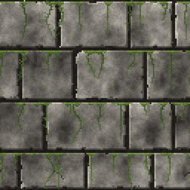

# hex-tex-gen documentation

hex-tex-gen generates Hexen/Doom-like 2D bitmap textures: stone walls, natural fieldstone, bricks, wooden planks, metal plates, doors, moss, banners... It is
a TypeScript library, with a command line tool writing PNG files.



Textures are described in JSON files: a texture places **patches** on a canvas, and each
patch is a **template** (a generator) with its parameters. Every parameter has a default,
so a patch can be as short as `{ "template": "ashlar" }`.

## Quick start

```sh
npm install @laboralphy/hex-tex-gen
npx hex-tex-gen ashlar -o wall.png                 # a template with its defaults
npx hex-tex-gen ashlar -p age=0.8 -o ruin.png      # a parameter changed
npx hex-tex-gen render examples/mossy-castle-wall.json
```

## Guides

| Page                              | What it covers                                                               |
| --------------------------------- | ---------------------------------------------------------------------------- |
| [Concepts](concepts.md)           | textures and patches, own size and resizing, layout and detail, seeds, aging |
| [Patch files](patch-files.md)     | writing patch files, `extends`, validation, editor completion                |
| [Texture files](texture-files.md) | placing patches: positions in percent, seeds, opacity, anchors, overlays     |
| [Command line](cli.md)            | the `hex-tex-gen` commands and options                                       |
| [Library](library.md)             | using hex-tex-gen from TypeScript, writing a new template                    |

## Reference

These pages are generated from the parameter schemas by `npm run docs`, so they always
match the code.

| Page                                          | What it covers                                           |
| --------------------------------------------- | -------------------------------------------------------- |
| [Templates](templates/README.md)              | every template and every parameter: type, default, range |
| [File reference](reference/file-reference.md) | every key of texture files, placements, anchors, patches |

Examples live in [`examples/`](../examples): [`mossy-castle-wall.json`](../examples/mossy-castle-wall.json)
eight [moss variants](../examples/moss-variants), and variants of [bricks](../examples/brick-variants), [planks](../examples/plank-variants) and [fieldstone](../examples/fieldstone-variants).
