<!-- generated by "npm run docs" from the template categories: do not edit -->

# Catalog

Every template, by category, with the example textures using it, and ideas of patches still to make. Decorations come first, grouped by the ambiance they belong to; then the wall surfaces they are laid over, which suit any ambiance; then the grounds, for floors and ceilings.

- [Natural](#natural)
- [Civilized](#civilized)
- [Dungeon](#dungeon)
- [Architecture](#architecture)
- [Surfaces](#surfaces)
- [Grounds](#grounds)

## Natural

What grows, spreads and settles on walls left alone.

| Template                        | Preview                                               | Description                                                                   | Example textures                                                                                                                                                                                                                                                                                                                                                                                                                                                                                                   |
| ------------------------------- | ----------------------------------------------------- | ----------------------------------------------------------------------------- | ------------------------------------------------------------------------------------------------------------------------------------------------------------------------------------------------------------------------------------------------------------------------------------------------------------------------------------------------------------------------------------------------------------------------------------------------------------------------------------------------------------------ |
| [`moss`](templates/moss.md)     | 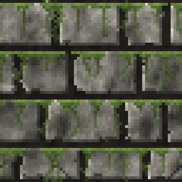     | Transparent overlay of greenish vines hanging from the top edge               | [brick-anchor-ratio/ratio-0.25](../examples/brick-anchor-ratio/ratio-0.25.json), [brick-anchor-ratio/ratio-0.5](../examples/brick-anchor-ratio/ratio-0.5.json), [brick-anchor-ratio/ratio-0.75](../examples/brick-anchor-ratio/ratio-0.75.json), [brick-anchor-ratio/ratio-1](../examples/brick-anchor-ratio/ratio-1.json), [brick-variants/10-mossy-bricks](../examples/brick-variants/10-mossy-bricks.json), [brick-variants/11-mossy-ruin](../examples/brick-variants/11-mossy-ruin.json), and 15 more          |
| [`cobweb`](templates/cobweb.md) | 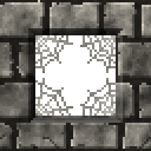 | Spider web in a corner, torn and dusty with age: anchor it on opening corners | [arch-variants/5-cobwebbed-arch](../examples/arch-variants/5-cobwebbed-arch.json), [bookshelf-variants/5-abandoned](../examples/bookshelf-variants/5-abandoned.json), [cobweb-variants/1-four-corners](../examples/cobweb-variants/1-four-corners.json), [cobweb-variants/2-top-corners](../examples/cobweb-variants/2-top-corners.json), [cobweb-variants/3-abandoned](../examples/cobweb-variants/3-abandoned.json), [cobweb-variants/4-behind-bars](../examples/cobweb-variants/4-behind-bars.json), and 4 more |

**Ideas, not made yet:** ivy and creepers, roots breaking through, mushrooms, lichen patches, water seeping down, icicles.

## Civilized

Signs of people living there: furniture, decorations, openings to the outside.

| Template                              | Preview                                                     | Description                                                                        | Example textures                                                                                                                                                                                                                                                                                                                                                                                                                                                                                                   |
| ------------------------------------- | ----------------------------------------------------------- | ---------------------------------------------------------------------------------- | ------------------------------------------------------------------------------------------------------------------------------------------------------------------------------------------------------------------------------------------------------------------------------------------------------------------------------------------------------------------------------------------------------------------------------------------------------------------------------------------------------------------ |
| [`door`](templates/door.md)           | 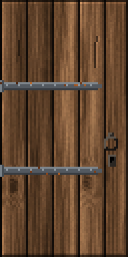           | Door: single, double or lifting; wooden or metal, with iron bands and a handle     | [slot-variants/2-beside-sliding-door](../examples/slot-variants/2-beside-sliding-door.json), [slot-variants/3-double-sliding-door](../examples/slot-variants/3-double-sliding-door.json), [slot-variants/4-lift-door](../examples/slot-variants/4-lift-door.json)                                                                                                                                                                                                                                                  |
| [`bookshelf`](templates/bookshelf.md) | 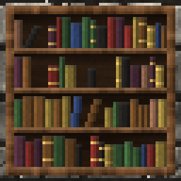 | Wooden bookcase filled with books of every tint, from empty to packed              | [bookshelf-variants/1-default](../examples/bookshelf-variants/1-default.json), [bookshelf-variants/2-empty](../examples/bookshelf-variants/2-empty.json), [bookshelf-variants/3-half-empty](../examples/bookshelf-variants/3-half-empty.json), [bookshelf-variants/4-packed](../examples/bookshelf-variants/4-packed.json), [bookshelf-variants/5-abandoned](../examples/bookshelf-variants/5-abandoned.json), [bookshelf-variants/6-library-wall](../examples/bookshelf-variants/6-library-wall.json), and 2 more |
| [`window`](templates/window.md)       | 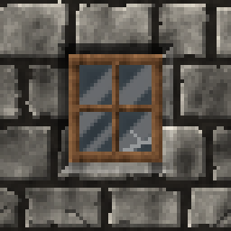       | Glazed window: a wooden or metal frame around translucent panes of glass           | [arch-variants/4-gothic-window](../examples/arch-variants/4-gothic-window.json), [window-variants/1-cut-opening](../examples/window-variants/1-cut-opening.json), [window-variants/2-dark-room](../examples/window-variants/2-dark-room.json), [window-variants/3-new](../examples/window-variants/3-new.json), [window-variants/4-abandoned](../examples/window-variants/4-abandoned.json), [window-variants/5-broken-panes](../examples/window-variants/5-broken-panes.json), and 3 more                         |
| [`parchment`](templates/parchment.md) | 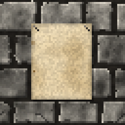 | Sheet of parchment pinned on a wall, blank or aged, room for decals                | [stoneslab-variants/5-notice-on-metal](../examples/stoneslab-variants/5-notice-on-metal.json)                                                                                                                                                                                                                                                                                                                                                                                                                      |
| [`banner`](templates/banner.md)       | 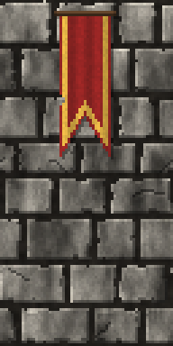       | Banner of fabric hanging from a rod, with a shaped lower end and bordering stripes | [banners/1-flat](../examples/banners/1-flat.json), [banners/2-point](../examples/banners/2-point.json), [banners/3-swallowtail](../examples/banners/3-swallowtail.json), [banners/4-tails](../examples/banners/4-tails.json), [banners/5-aged-oriflamme](../examples/banners/5-aged-oriflamme.json), [banners/6-tattered](../examples/banners/6-tattered.json), and 2 more                                                                                                                                         |
| [`tapestry`](templates/tapestry.md)   | 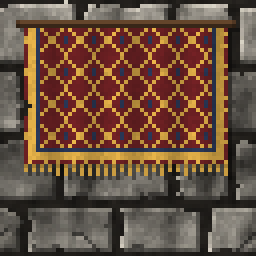   | Woven tapestry hanging from a rod: a patterned field, a border and a fringe        | [tapestry-variants/1-lozenge](../examples/tapestry-variants/1-lozenge.json), [tapestry-variants/2-checky](../examples/tapestry-variants/2-checky.json), [tapestry-variants/3-semy-blue](../examples/tapestry-variants/3-semy-blue.json), [tapestry-variants/4-green-stripes](../examples/tapestry-variants/4-green-stripes.json), [tapestry-variants/5-moth-eaten](../examples/tapestry-variants/5-moth-eaten.json), [tapestry-variants/6-great-hall](../examples/tapestry-variants/6-great-hall.json)             |
| [`shield`](templates/shield.md)       | 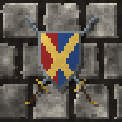       | Heraldic shield, maybe over two crossed swords, its paint fading with age          | [shield-variants/1-heater-cross](../examples/shield-variants/1-heater-cross.json), [shield-variants/2-round-boss](../examples/shield-variants/2-round-boss.json), [shield-variants/3-kite-chevron](../examples/shield-variants/3-kite-chevron.json), [shield-variants/4-trophy](../examples/shield-variants/4-trophy.json), [shield-variants/5-hall-of-arms](../examples/shield-variants/5-hall-of-arms.json), [shield-variants/6-battered](../examples/shield-variants/6-battered.json), and 1 more               |

**Ideas, not made yet:** paintings and portraits, candles and candelabra, weapon racks, statues in niches, amphorae, notice boards, stained glass.

## Dungeon

Prisons, cellars and torture chambers.

| Template                            | Preview                                                   | Description                                                                                 | Example textures                                                                                                                                                                                                                                                                                                                                                                                                                                                                                                     |
| ----------------------------------- | --------------------------------------------------------- | ------------------------------------------------------------------------------------------- | -------------------------------------------------------------------------------------------------------------------------------------------------------------------------------------------------------------------------------------------------------------------------------------------------------------------------------------------------------------------------------------------------------------------------------------------------------------------------------------------------------------------- |
| [`bars`](templates/bars.md)         | 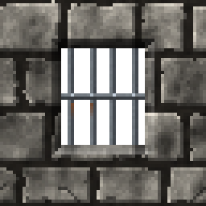         | Vertical metal bars held by rails: prison windows and grates, rusting and breaking with age | [arch-variants/3-barred-round-window](../examples/arch-variants/3-barred-round-window.json), [bars-variants/1-prison-window](../examples/bars-variants/1-prison-window.json), [bars-variants/2-new](../examples/bars-variants/2-new.json), [bars-variants/3-ruined](../examples/bars-variants/3-ruined.json), [bars-variants/4-broken](../examples/bars-variants/4-broken.json), [bars-variants/5-square-grate](../examples/bars-variants/5-square-grate.json), and 4 more                                           |
| [`chain`](templates/chain.md)       | 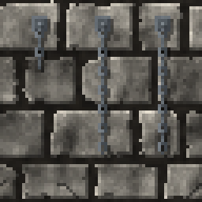       | Iron chain hanging from a wall plate, ending by chance with a manacle                       | [chain-variants/1-single](../examples/chain-variants/1-single.json), [chain-variants/2-row-of-chains](../examples/chain-variants/2-row-of-chains.json), [chain-variants/3-shackles](../examples/chain-variants/3-shackles.json), [chain-variants/4-rusted](../examples/chain-variants/4-rusted.json), [chain-variants/5-prison-cell](../examples/chain-variants/5-prison-cell.json), [chain-variants/6-long-chains](../examples/chain-variants/6-long-chains.json), and 1 more                                       |
| [`splatter`](templates/splatter.md) | 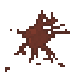 | Splash of blood, or of any liquid: a ragged pool, streaks and droplets                      | [splatter-variants/1-blood-on-ashlar](../examples/splatter-variants/1-blood-on-ashlar.json), [splatter-variants/2-thrown-on-bricks](../examples/splatter-variants/2-thrown-on-bricks.json), [splatter-variants/3-slime-on-fieldstone](../examples/splatter-variants/3-slime-on-fieldstone.json), [splatter-variants/4-dry-blood-on-floor](../examples/splatter-variants/4-dry-blood-on-floor.json), [splatter-variants/5-water-on-metal](../examples/splatter-variants/5-water-on-metal.json)                        |
| [`glyph`](templates/glyph.md)       |        | Glyph written on a wall: pentagram, grid of runes, alchemical circle or tally               | [glyph-variants/1-pentagram-in-blood](../examples/glyph-variants/1-pentagram-in-blood.json), [glyph-variants/2-rune-grid](../examples/glyph-variants/2-rune-grid.json), [glyph-variants/3-alchemical-circle](../examples/glyph-variants/3-alchemical-circle.json), [glyph-variants/4-faded-alchemy](../examples/glyph-variants/4-faded-alchemy.json), [glyph-variants/5-prison-tally](../examples/glyph-variants/5-prison-tally.json), [glyph-variants/6-tally-three](../examples/glyph-variants/6-tally-three.json) |

**Ideas, not made yet:** shackles on a short bar, skulls and bones, sewer grates.

## Architecture

Pieces of the building itself, cut into or laid over any wall, whatever the ambiance.

| Template                                  | Preview                                                         | Description                                                                        | Example textures                                                                                                                                                                                                                                                                                                                                                                                                                                                                                                                                                                             |
| ----------------------------------------- | --------------------------------------------------------------- | ---------------------------------------------------------------------------------- | -------------------------------------------------------------------------------------------------------------------------------------------------------------------------------------------------------------------------------------------------------------------------------------------------------------------------------------------------------------------------------------------------------------------------------------------------------------------------------------------------------------------------------------------------------------------------------------------- |
| [`opening`](templates/opening.md)         | 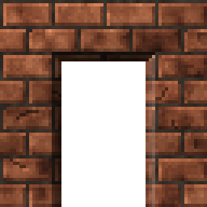         | Rectangular opening dug into the wall below, for windows, bars or arches           | [arch-variants/1-round-niche](../examples/arch-variants/1-round-niche.json), [arch-variants/2-pointed-doorway](../examples/arch-variants/2-pointed-doorway.json), [arch-variants/3-barred-round-window](../examples/arch-variants/3-barred-round-window.json), [arch-variants/4-gothic-window](../examples/arch-variants/4-gothic-window.json), [arch-variants/5-cobwebbed-arch](../examples/arch-variants/5-cobwebbed-arch.json), [bars-variants/1-prison-window](../examples/bars-variants/1-prison-window.json), and 25 more                                                              |
| [`stoneslab`](templates/stoneslab.md)     | 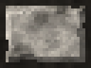     | Large stone slab set in mortar, over any wall: room for an inscription or a switch | [fieldstone-variants/10-slab](../examples/fieldstone-variants/10-slab.json), [stoneslab-variants/1-on-ashlar](../examples/stoneslab-variants/1-on-ashlar.json), [stoneslab-variants/2-on-bricks](../examples/stoneslab-variants/2-on-bricks.json), [stoneslab-variants/3-on-planks](../examples/stoneslab-variants/3-on-planks.json), [stoneslab-variants/4-ruined-mossy](../examples/stoneslab-variants/4-ruined-mossy.json), [stoneslab-variants/5-notice-on-metal](../examples/stoneslab-variants/5-notice-on-metal.json)                                                                 |
| [`column`](templates/column.md)           | 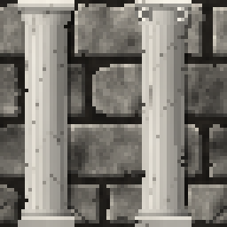           | Marble column of a classical order: doric, ionic or tuscan                         | [column-variants/1-doric-pair](../examples/column-variants/1-doric-pair.json), [column-variants/2-ionic-pair](../examples/column-variants/2-ionic-pair.json), [column-variants/3-tuscan-plain](../examples/column-variants/3-tuscan-plain.json), [column-variants/4-ruins](../examples/column-variants/4-ruins.json), [column-variants/5-portico-doorway](../examples/column-variants/5-portico-doorway.json), [column-variants/6-dark-marble](../examples/column-variants/6-dark-marble.json), and 5 more                                                                                   |
| [`entablature`](templates/entablature.md) | 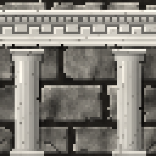 | Classical entablature: cornice, carved frieze and architrave, in marble            | [entablature-variants/1-meander-portico](../examples/entablature-variants/1-meander-portico.json), [entablature-variants/2-doric-triglyphs](../examples/entablature-variants/2-doric-triglyphs.json), [entablature-variants/3-cornice-band](../examples/entablature-variants/3-cornice-band.json), [entablature-variants/4-ruined-temple](../examples/entablature-variants/4-ruined-temple.json), [entablature-variants/5-temple-front](../examples/entablature-variants/5-temple-front.json), [entablature-variants/6-ionic-meander](../examples/entablature-variants/6-ionic-meander.json) |
| [`slot`](templates/slot.md)               | 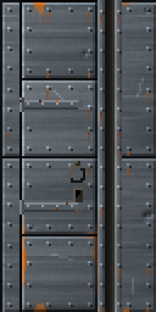               | Door slot: a dark recess between metal strips, where a sliding door disappears     | [slot-variants/1-metal-wall](../examples/slot-variants/1-metal-wall.json), [slot-variants/2-beside-sliding-door](../examples/slot-variants/2-beside-sliding-door.json), [slot-variants/3-double-sliding-door](../examples/slot-variants/3-double-sliding-door.json), [slot-variants/4-lift-door](../examples/slot-variants/4-lift-door.json), [slot-variants/5-bricks](../examples/slot-variants/5-bricks.json), [slot-variants/6-rusted](../examples/slot-variants/6-rusted.json)                                                                                                           |
| [`beam`](templates/beam.md)               | 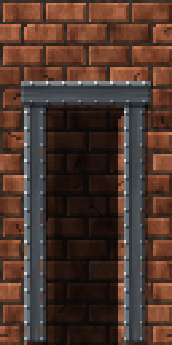               | Metal support beam, horizontal or vertical: a riveted girder or strap              | —                                                                                                                                                                                                                                                                                                                                                                                                                                                                                                                                                                                            |
| [`woodbeam`](templates/woodbeam.md)       | 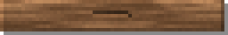       | Wooden support beam, horizontal or vertical: a sawn timber or a round log          | [woodbeam-variants/1-mine-gallery](../examples/woodbeam-variants/1-mine-gallery.json), [woodbeam-variants/2-log-props](../examples/woodbeam-variants/2-log-props.json), [woodbeam-variants/3-abandoned-mine](../examples/woodbeam-variants/3-abandoned-mine.json), [woodbeam-variants/4-dark-timbers](../examples/woodbeam-variants/4-dark-timbers.json)                                                                                                                                                                                                                                     |

**Ideas, not made yet:** keystones and voussoirs around arches, pilasters, pediments, pipes, vent grilles.

## Surfaces

Base textures, the walls every decoration above is laid over. They suit any ambiance: their palette, their age and their moss make them a castle, a cellar or a ruin.

| Template                                | Preview                                                       | Description                                                                 | Example textures                                                                                                                                                                                                                                                                                                                                                                                                                                                                                                                         |
| --------------------------------------- | ------------------------------------------------------------- | --------------------------------------------------------------------------- | ---------------------------------------------------------------------------------------------------------------------------------------------------------------------------------------------------------------------------------------------------------------------------------------------------------------------------------------------------------------------------------------------------------------------------------------------------------------------------------------------------------------------------------------- |
| [`ashlar`](templates/ashlar.md)         | 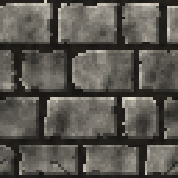         | Dressed stone wall: rows of stones of random width                          | [arch-variants/1-round-niche](../examples/arch-variants/1-round-niche.json), [arch-variants/3-barred-round-window](../examples/arch-variants/3-barred-round-window.json), [arch-variants/5-cobwebbed-arch](../examples/arch-variants/5-cobwebbed-arch.json), [banners/1-flat](../examples/banners/1-flat.json), [banners/2-point](../examples/banners/2-point.json), [banners/3-swallowtail](../examples/banners/3-swallowtail.json), and 76 more                                                                                        |
| [`bricks`](templates/bricks.md)         | 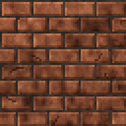         | Brick wall: equal bricks in running bond, with every ashlar parameter       | [arch-variants/2-pointed-doorway](../examples/arch-variants/2-pointed-doorway.json), [banners/7-bricks-pair](../examples/banners/7-bricks-pair.json), [bars-variants/5-square-grate](../examples/bars-variants/5-square-grate.json), [bars-variants/6-cell-door](../examples/bars-variants/6-cell-door.json), [bookshelf-variants/6-library-wall](../examples/bookshelf-variants/6-library-wall.json), [brick-anchor-ratio/ratio-0.25](../examples/brick-anchor-ratio/ratio-0.25.json), and 26 more                                      |
| [`fieldstone`](templates/fieldstone.md) | 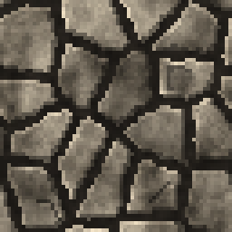 | Natural stone wall: irregular stones laid as the cells of a Voronoi diagram | [arch-variants/4-gothic-window](../examples/arch-variants/4-gothic-window.json), [cavewall-variants/8-rounded-fieldstone](../examples/cavewall-variants/8-rounded-fieldstone.json), [chain-variants/6-long-chains](../examples/chain-variants/6-long-chains.json), [column-variants/4-ruins](../examples/column-variants/4-ruins.json), [entablature-variants/4-ruined-temple](../examples/entablature-variants/4-ruined-temple.json), [fieldstone-variants/01-default](../examples/fieldstone-variants/01-default.json), and 17 more    |
| [`cavewall`](templates/cavewall.md)     | 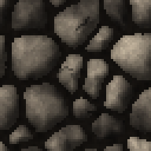     | Cave wall: a chaotic heap of rounded boulders of every size                 | [cavewall-variants/1-default](../examples/cavewall-variants/1-default.json), [cavewall-variants/2-large-boulders](../examples/cavewall-variants/2-large-boulders.json), [cavewall-variants/3-pebbles](../examples/cavewall-variants/3-pebbles.json), [cavewall-variants/4-mossy-cave](../examples/cavewall-variants/4-mossy-cave.json), [cavewall-variants/5-wet-dark](../examples/cavewall-variants/5-wet-dark.json), [cavewall-variants/6-ruined](../examples/cavewall-variants/6-ruined.json), and 5 more                             |
| [`metal`](templates/metal.md)           | 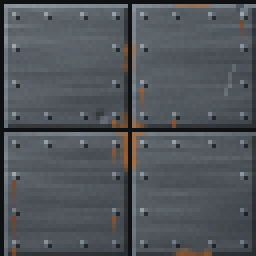           | Metal wall of riveted plates, rusting and dented with age                   | [chain-variants/7-heavy-on-metal](../examples/chain-variants/7-heavy-on-metal.json), [glyph-variants/3-alchemical-circle](../examples/glyph-variants/3-alchemical-circle.json), [slot-variants/1-metal-wall](../examples/slot-variants/1-metal-wall.json), [slot-variants/2-beside-sliding-door](../examples/slot-variants/2-beside-sliding-door.json), [slot-variants/3-double-sliding-door](../examples/slot-variants/3-double-sliding-door.json), [slot-variants/4-lift-door](../examples/slot-variants/4-lift-door.json), and 3 more |
| [`planks`](templates/planks.md)         | 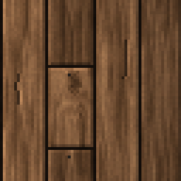         | Wall of vertical wooden planks of variable length                           | [banners/8-planks](../examples/banners/8-planks.json), [plank-variants/01-default](../examples/plank-variants/01-default.json), [plank-variants/02-full-height](../examples/plank-variants/02-full-height.json), [plank-variants/03-short-planks](../examples/plank-variants/03-short-planks.json), [plank-variants/04-wide-planks](../examples/plank-variants/04-wide-planks.json), [plank-variants/05-new](../examples/plank-variants/05-new.json), and 10 more                                                                        |

**Ideas, not made yet:** plaster over stone, wattle and daub, marble slabs, mosaics.

## Grounds

Floor and ceiling materials, seen from above: no bevel, no mortar, no light direction but for small stones. They tile in both directions.

| Template                        | Preview                                               | Description                                                              | Example textures                                                                                                                                                                                                                                                                                                                                                                                                |
| ------------------------------- | ----------------------------------------------------- | ------------------------------------------------------------------------ | --------------------------------------------------------------------------------------------------------------------------------------------------------------------------------------------------------------------------------------------------------------------------------------------------------------------------------------------------------------------------------------------------------------- |
| [`dirt`](templates/dirt.md)     | 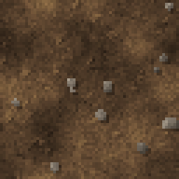     | Bare earth for floors and ceilings: blotches of soil, clods and pebbles  | [ground-variants/01-dirt](../examples/ground-variants/01-dirt.json), [ground-variants/02-mud](../examples/ground-variants/02-mud.json), [ground-variants/03-cave-floor](../examples/ground-variants/03-cave-floor.json), [splatter-variants/4-dry-blood-on-floor](../examples/splatter-variants/4-dry-blood-on-floor.json)                                                                                      |
| [`grass`](templates/grass.md)   | 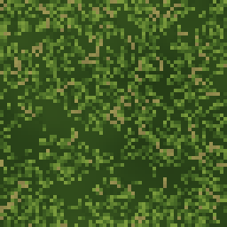   | Grass for floors: blades over a dark ground, worn to bare earth with age | [ground-variants/04-lush-grass](../examples/ground-variants/04-lush-grass.json), [ground-variants/05-grass-and-dirt](../examples/ground-variants/05-grass-and-dirt.json), [ground-variants/06-trampled](../examples/ground-variants/06-trampled.json), [ground-variants/07-meadow](../examples/ground-variants/07-meadow.json), [ground-variants/08-dry-steppe](../examples/ground-variants/08-dry-steppe.json) |
| [`sand`](templates/sand.md)     | 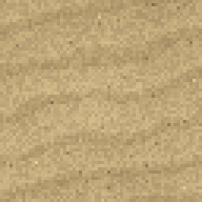     | Sand for floors: fine grains rippled by the wind                         | [ground-variants/09-dunes](../examples/ground-variants/09-dunes.json), [ground-variants/10-wet-beach](../examples/ground-variants/10-wet-beach.json)                                                                                                                                                                                                                                                            |
| [`gravel`](templates/gravel.md) | 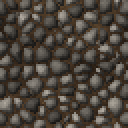 | Gravel for floors: small rounded stones packed on earth                  | [ground-variants/11-gravel](../examples/ground-variants/11-gravel.json), [ground-variants/12-coarse-gravel](../examples/ground-variants/12-coarse-gravel.json), [ground-variants/13-pebble-beach](../examples/ground-variants/13-pebble-beach.json)                                                                                                                                                             |

**Ideas, not made yet:** mud and puddles, snow, straw, wooden floorboards, flagstone floors, ice, lava, water.
