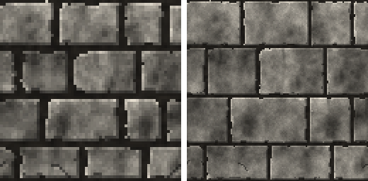
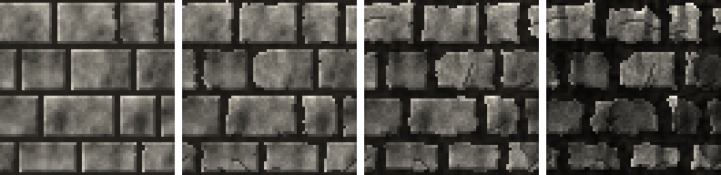

# Concepts

## Textures and patches

Doom and Hexen build their wall textures from **patches**: small images placed at an
offset on a canvas, reused by many textures. hex-tex-gen works the same way:

- a **texture** is a canvas of a given size, with patches placed on it and drawn in order
  (see [Texture files](texture-files.md));
- a **patch** is a **template** (a generator such as [`ashlar`](templates/ashlar.md) or
  [`moss`](templates/moss.md)) and its parameters, written in its own file and reusable
  (see [Patch files](patch-files.md)).

A patch can also be rendered alone, without a texture: `hex-tex-gen patch castle.json`.

## Own size and resizing

Every template has an **own size**, the `size` parameter, in pixels: 64 × 64 for `ashlar`,
64 × 16 for `moss`. A patch renders at its own size unless it is placed at another size.

A patch placed at another size is **regenerated** at that size, never stretched: it stays
sharp at any resolution, and odd sizes such as 37 × 53 work too. The width and the height
scale independently: a 64 × 64 `ashlar` placed as a 128 × 32 strip gets stones twice as
wide and half as tall.

## Layout and detail

Pixel values in parameters come in two kinds, shown in the **Scale** column of the
[template pages](templates/README.md):

- **layout** values are expressed at the own size and **scale** with the patch: stone
  widths, row count, vine length. A patch rendered twice as large keeps the same number of
  stones, twice as large;
- **detail** values are real pixels and **never scale**: mortar thickness, bevel, cracks.
  A 2-pixel mortar looks the same on every texture, whatever the size of its patch.



The same patch at 64 × 64 and 128 × 128: the stones are the same, twice as large on the
right, while the mortar is still 2 pixels thick. Larger renders also get more octaves of
surface noise, so they gain detail instead of looking blurry.

## Seeds and randomness

Every render has a **seed**: the same seed always gives the same texture. Seeds come from,
by priority:

1. the `seed` of the placement,
2. the `seed` of the patch file,
3. the `seed` of the texture file (0 by default), which `hex-tex-gen render -s` overrides.

Randomness is **position-based**: the look of a stone is computed from the seed and its
position (row, column), not drawn in sequence. Resizing a patch therefore never reshuffles
it: stone (3, 2) keeps its shade, its cracks and its chips at any size.

## Tiling

Every texture tiles seamlessly, horizontally and vertically:

- templates wrap their content around the edges: a stone crossing the right edge continues
  on the left edge, and noise is periodic;
- placements crossing an edge of the texture wrap around too: a patch placed at `x: 80`
  with `width: 50` covers 80–100% and 0–30%.

## Overlays and anchors

Some templates, such as [`moss`](templates/moss.md), are **overlays**: transparent outside
their content, meant to be laid over another patch.

Templates can report **anchors**: named points computed while rendering, such as the top
of each row of stones, just below the mortar. A placement can be repeated on the anchor
points of a previous placement, so that moss always hangs right under the joints, whatever
the seed, the size or the number of rows. See [Anchors](texture-files.md#anchors).

## Aging

[`ashlar`](templates/ashlar.md) has an `age` parameter, from 0 (new) to 1 (ruined), 0.3
by default:



`age` sets every **wear parameter** left unset:

| Effect                           | Parameters                                                               |
| -------------------------------- | ------------------------------------------------------------------------ |
| broken corners and cracks        | `chips.*`, `cracks.*`                                                    |
| irregular outlines, surface wear | `edges.roughness`, `stone.grain`, `stone.shadeVariation`, `mortar.noise` |
| rounded corners, worn edges      | `erosion.corners`, `erosion.edges`                                       |
| hollowed joints                  | `mortar.erosion`                                                         |
| streaks of rainwater, grime      | `stains.*`                                                               |
| flaked stone faces               | `spalling.*`                                                             |

Values set explicitly always win: `age` gives the overall look, and individual parameters
fine-tune it. `{ "age": 0.8, "stains": { "ratio": 0 } }` is a ruined wall without streaks,
and `{ "age": 0 }` a brand new one. The [ashlar page](templates/ashlar.md#aging) lists the
value of every wear parameter at each age.

## Validation

Every file and every parameter is validated before rendering: types, ranges, `[min, max]`
pairs, CSS colors, unknown keys. Errors name the file and the path of each problem:

```
patches/castle-stone.json: unknown parameter "blocks.widht"; mortar.size: Invalid input: expected int, received number
```

The same rules are published as JSON Schemas, for completion and validation in editors:
see [Editor support](patch-files.md#editor-support).
