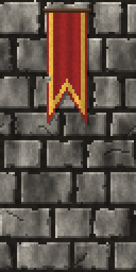
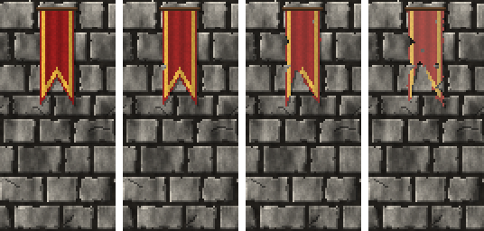

<!-- generated by "npm run docs" from the template schema: do not edit -->

# `banner`

Banner of fabric hanging from a rod, with a shaped lower end and bordering stripes. This template is an **overlay**: transparent by design, meant to be laid over another patch.



Own size: 24 × 56 pixels. Parameters marked **layout** are expressed at this size and scale with the patch; **detail** parameters are real pixels and never scale. See [Layout and detail](../concepts.md#layout-and-detail).

## Parameters

### General

| Parameter | Type                            | Default    | Scale | Description                                                                       |
| --------- | ------------------------------- | ---------- | ----- | --------------------------------------------------------------------------------- |
| `size`    | [width, height] of integers > 0 | `[24, 56]` | —     | own size of the banner, its rod and its shadow included                           |
| `age`     | number in [0, 1]                | `0.3`      | —     | overall aging, from 0 (new) to 1 (tattered): sets every wear parameter left unset |
| `fading`  | number in [0, 1]                | from `age` | —     | colors faded by light, in [0, 1]                                                  |
| `stains`  | number in [0, 1]                | from `age` | —     | coverage of the stains, in [0, 1]                                                 |
| `holes`   | number ≥ 0                      | from `age` | —     | moth holes per 32 × 32 pixels                                                     |

### `shape`

Shape of the banner.

| Parameter     | Type             | Default  | Scale  | Description                                                                                                      |
| ------------- | ---------------- | -------- | ------ | ---------------------------------------------------------------------------------------------------------------- |
| `shape.base`  | string           | `"flat"` | —      | lower end: flat; point, a triangle; swallowtail, forked like an oriflamme; tails, several points like a gonfalon |
| `shape.depth` | number in [0, 1] | `0.2`    | layout | height of the shaped lower end, in fraction of the banner height                                                 |
| `shape.tails` | integer ≥ 1      | `3`      | —      | number of points of the tails base                                                                               |

### `fabric`

The fabric.

| Parameter      | Type             | Default     | Scale  | Description                                           |
| -------------- | ---------------- | ----------- | ------ | ----------------------------------------------------- |
| `fabric.color` | CSS color        | `"#8a1a1a"` | —      | color of the fabric                                   |
| `fabric.weave` | number in [0, 1] | `0.06`      | detail | random brightness variation between pixels, the weave |

### `border`

Stripes bordering the banner.

| Parameter        | Type            | Default                            | Scale  | Description                                                      |
| ---------------- | --------------- | ---------------------------------- | ------ | ---------------------------------------------------------------- |
| `border.inset`   | integer ≥ 0     | `1`                                | detail | distance of the first stripe from the edge, in pixels            |
| `border.stripes` | array of object | `[{"color":"#d4a53a", "width":2}]` | —      | stripes along the sides and the lower end, from the edge inwards |

### `folds`

Soft vertical folds of the hanging fabric.

| Parameter     | Type             | Default | Scale  | Description                                |
| ------------- | ---------------- | ------- | ------ | ------------------------------------------ |
| `folds.count` | number ≥ 0       | `3`     | layout | number of vertical folds across the banner |
| `folds.depth` | number in [0, 1] | `0.25`  | —      | shading of the folds, in [0, 1]            |

### `rod`

Rod the banner hangs from.

| Parameter      | Type        | Default     | Scale  | Description                                                 |
| -------------- | ----------- | ----------- | ------ | ----------------------------------------------------------- |
| `rod.enabled`  | boolean     | `true`      | —      | a rod across the top                                        |
| `rod.size`     | integer ≥ 1 | `2`         | detail | rod thickness, in pixels                                    |
| `rod.overhang` | integer ≥ 0 | `2`         | detail | length of the rod beyond each side of the fabric, in pixels |
| `rod.color`    | CSS color   | `"#4a3320"` | —      | rod color                                                   |

### `shadow`

Shadow of the banner on the wall, the light coming from the top-left.

| Parameter        | Type             | Default | Scale  | Description                                             |
| ---------------- | ---------------- | ------- | ------ | ------------------------------------------------------- |
| `shadow.offset`  | integer ≥ 0      | `1`     | detail | shadow cast on the wall, to the bottom-right, in pixels |
| `shadow.opacity` | number in [0, 1] | `0.4`   | —      | darkness of the shadow, in [0, 1]                       |

### `rips`

Torn edges.

| Parameter        | Type                      | Default    | Scale  | Description                                           |
| ---------------- | ------------------------- | ---------- | ------ | ----------------------------------------------------- |
| `rips.count`     | integer ≥ 0               | from `age` | —      | number of notches torn into the edges                 |
| `rips.depth`     | [min, max] of numbers ≥ 0 | from `age` | detail | [min, max] depth of the notches, in pixels            |
| `rips.roughness` | number ≥ 0                | from `age` | detail | maximum displacement of the frayed outline, in pixels |

## Anchors

| Anchor   | Points                                                              |
| -------- | ------------------------------------------------------------------- |
| `field`  | top-left corner of the field, inside the border, below the rod      |
| `emblem` | center of the field, above the shaped lower end: room for an emblem |

## Usage

`banner` is an overlay: a banner of fabric hanging from a rod, placed a few percent from
the top of a wall, and hanging down to its own height. The whole patch is the banner, its
rod and its shadow:

```json
{
  "size": [64, 128],
  "patches": [
    { "patch": { "template": "ashlar", "size": [64, 128], "rows": { "count": 8 } } },
    {
      "id": "banner",
      "patch": {
        "template": "banner",
        "shape": { "base": "swallowtail", "depth": 0.3 },
        "fabric": { "color": "#b01818" },
        "border": {
          "stripes": [
            { "color": "#e8c34a", "width": 1 },
            { "color": "#2a1a0a", "width": 1 }
          ]
        }
      },
      "x": 31.25,
      "y": 3,
      "width": 37.5,
      "height": 43.75
    }
  ]
}
```

- `shape.base` shapes the lower end: `flat`, `point` (a triangle), `swallowtail` (forked,
  like the oriflamme) or `tails` (`shape.tails` points, like a gonfalon);
  `shape.depth` is its height, in fraction of the banner height.
- `border.stripes` lists the stripes along the sides and the lower end, from the edge
  inwards; they follow the intact outline, so that tears cut through them.
- As it ages, the fabric fades, gets stains, rips (notches torn into its edges), a frayed
  outline and moth holes, through which the wall shows.
- The `emblem` anchor, at the center of the field, and `field`, its top-left corner
  inside the border, leave room for a coat of arms.

## Aging

`age`, from 0 (new) to 1 (ruined), sets every wear parameter left unset. Values in
between are interpolated linearly between age 0, 0.3 (the default) and 1. Parameters set
explicitly always win: `{ "age": 0.8, "stains": { "ratio": 0 } }` is a ruined wall
without streaks. See [Aging](../concepts.md#aging).



With its default parameters, `banner` derives:

| Parameter        | age 0  | age 0.3 | age 0.6      | age 1  |
| ---------------- | ------ | ------- | ------------ | ------ |
| `fading`         | 0      | 0.1     | 0.27         | 0.5    |
| `stains`         | 0      | 0.1     | 0.23         | 0.4    |
| `rips.count`     | 0      | 1       | 3            | 6      |
| `rips.depth`     | [1, 2] | [2, 4]  | [2.43, 5.71] | [3, 8] |
| `rips.roughness` | 0.1    | 0.4     | 0.74         | 1.2    |
| `holes`          | 0      | 0       | 1.29         | 3      |

## Example

```json
{
  "$schema": "../../schemas/patch.schema.json",
  "template": "banner",
  "size": [24, 56]
}
```
