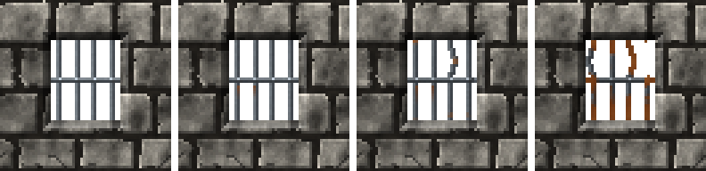

<!-- generated by "npm run docs" from the template schema: do not edit -->

# `bars`

Vertical metal bars held by rails: prison windows and grates, rusting and breaking with age. This template is an **overlay**: transparent by design, meant to be laid over another patch.


Own size: 32 × 48 pixels. Parameters marked **layout** are expressed at this size and scale with the patch; **detail** parameters are real pixels and never scale. See [Layout and detail](../concepts.md#layout-and-detail).

## Parameters

### General

| Parameter | Type                            | Default    | Scale | Description                                                                          |
| --------- | ------------------------------- | ---------- | ----- | ------------------------------------------------------------------------------------ |
| `size`    | [width, height] of integers > 0 | `[32, 48]` | —     | own size of the barred area, in pixels                                               |
| `age`     | number in [0, 1]                | `0.3`      | —     | overall weathering, from 0 (new) to 1 (ruined): sets every wear parameter left unset |
| `tarnish` | number in [0, 1]                | from `age` | —     | dulled, darkened metal, in [0, 1]                                                    |

### `bars`

Vertical bars, lit from the top-left.

| Parameter        | Type        | Default   | Scale  | Description                                                                                   |
| ---------------- | ----------- | --------- | ------ | --------------------------------------------------------------------------------------------- |
| `bars.count`     | integer ≥ 1 | `5`       | layout | number of bars across the patch, evenly spaced                                                |
| `bars.thickness` | integer ≥ 1 | `2`       | detail | width of a bar, in pixels                                                                     |
| `bars.profile`   | string      | `"round"` | —      | round: a rod, its highlight a third across; square: a flat face between a lit and a dark edge |

### `rails`

Horizontal flat rails holding the bars.

| Parameter         | Type        | Default | Scale  | Description                                           |
| ----------------- | ----------- | ------- | ------ | ----------------------------------------------------- |
| `rails.count`     | integer ≥ 0 | `1`     | layout | number of horizontal rails, evenly spaced; 0 for none |
| `rails.thickness` | integer ≥ 1 | `2`     | detail | height of a rail, in pixels                           |
| `rails.rivets`    | boolean     | `true`  | —      | a rivet where each bar crosses a rail                 |

### `metal`

Metal of the bars.

| Parameter       | Type                            | Default                                        | Scale  | Description                                           |
| --------------- | ------------------------------- | ---------------------------------------------- | ------ | ----------------------------------------------------- |
| `metal.palette` | array of CSS colors, at least 2 | `["#2b2f33", "#474d53", "#687077", "#8f979e"]` | —      | metal colors, from darkest to lightest                |
| `metal.grain`   | number in [0, 1]                | `0.04`                                         | detail | random brightness variation between pixels, in [0, 1] |

### `shadow`

Shadow of the bars on the back of what they close, the light coming from the top-left; none by default, set an offset over an opening whose back is shaded or colored.

| Parameter        | Type             | Default | Scale  | Description                                             |
| ---------------- | ---------------- | ------- | ------ | ------------------------------------------------------- |
| `shadow.offset`  | integer ≥ 0      | `0`     | detail | shadow cast on the wall, to the bottom-right, in pixels |
| `shadow.opacity` | number in [0, 1] | `0.45`  | —      | darkness of the shadow, in [0, 1]                       |

### `rust`

Rust.

| Parameter       | Type                            | Default                                        | Scale  | Description                                                |
| --------------- | ------------------------------- | ---------------------------------------------- | ------ | ---------------------------------------------------------- |
| `rust.coverage` | number in [0, 1]                | from `age`                                     | —      | share of the bars rusted, spreading from their broken ends |
| `rust.palette`  | array of CSS colors, at least 2 | `["#3a1c0c", "#6b3314", "#9a4e1e", "#bf6e2e"]` | —      | rust colors, from darkest to lightest                      |
| `rust.streaks`  | number in [0, 1]                | from `age`                                     | —      | ratio of rivets with a rust streak running down            |
| `rust.length`   | [min, max] of numbers ≥ 0       | from `age`                                     | detail | [min, max] length of the rust streaks, in pixels           |

### `dents`

Dents, shaded against the light.

| Parameter       | Type                      | Default    | Scale  | Description                       |
| --------------- | ------------------------- | ---------- | ------ | --------------------------------- |
| `dents.density` | number ≥ 0                | from `age` | —      | dents per 32 × 32 pixels          |
| `dents.size`    | [min, max] of numbers ≥ 0 | from `age` | detail | [min, max] dent radius, in pixels |

### `bends`

Bars bent sideways in a smooth bulge.

| Parameter      | Type             | Default    | Scale  | Description                                     |
| -------------- | ---------------- | ---------- | ------ | ----------------------------------------------- |
| `bends.ratio`  | number in [0, 1] | from `age` | —      | ratio of bent bars, in [0, 1]                   |
| `bends.amount` | number ≥ 0       | from `age` | detail | maximum sideways bulge of a bent bar, in pixels |

### `broken`

Broken bars: a part is missing between two rails, or the bar is gone down to an edge of the patch.

| Parameter       | Type                      | Default    | Scale  | Description                                             |
| --------------- | ------------------------- | ---------- | ------ | ------------------------------------------------------- |
| `broken.ratio`  | number in [0, 1]          | from `age` | —      | ratio of broken bars, a part of them missing, in [0, 1] |
| `broken.length` | [min, max] of numbers ≥ 0 | from `age` | layout | [min, max] length of the missing part                   |

## Anchors

| Anchor   | Points                                 |
| -------- | -------------------------------------- |
| `bars`   | top of each bar, at its left edge      |
| `rails`  | left end of each rail, at its top edge |
| `center` | center of the barred area              |

## Usage

`bars` is an overlay: vertical metal bars held by horizontal rails, the whole patch being
the barred area. Lay it over an [`opening`](opening.md), anchored on the back of the
opening, for a prison window or a grate:

```json
{
  "size": [64, 64],
  "patches": [
    { "patch": { "template": "ashlar" }, "width": 100, "height": 100 },
    {
      "id": "hole",
      "patch": { "template": "opening", "depth": 3 },
      "x": 25,
      "y": 18.75,
      "width": 50,
      "height": 56.25
    },
    {
      "patch": { "template": "bars", "size": [26, 30], "bars": { "count": 4 } },
      "anchor": { "to": "hole", "at": "opening" },
      "width": 40.6,
      "height": 46.9
    }
  ]
}
```

- The bars run from the top to the bottom of the patch, `bars.count` of them evenly
  spaced, so that the patch tiles horizontally: placed across a whole texture, it makes a
  fence or a masked texture of bars. `bars.profile` draws `round` rods or `square` bars.
- `rails.count` flat rails cross them, evenly spaced, with a rivet at each crossing.
- The opening cuts the wall out, so the space between the bars is transparent (alpha 0),
  like the masked textures Doom uses for bars and fences. Over an opening whose back is
  shaded or colored instead, give the bars a shadow on it with `shadow.offset`: they
  cast none by default, since a cut-out back has nothing to cast it on.
- As they age, the bars rust, rust streaks running down from the crossings, get tarnish and
  dents, bulge sideways between two rails (`bends`), and break (`broken`): a part of a
  bar is missing between two rails, its jagged ends rusting first, or the bar is gone down
  to the top or the bottom of the patch. Rails never break.

## Aging

`age`, from 0 (new) to 1 (ruined), sets every wear parameter left unset. Values in
between are interpolated linearly between age 0, 0.3 (the default) and 1. Parameters set
explicitly always win: `{ "age": 0.8, "stains": { "ratio": 0 } }` is a ruined wall
without streaks. See [Aging](../concepts.md#aging).



With its default parameters, `bars` derives:

| Parameter       | age 0    | age 0.3 | age 0.6       | age 1    |
| --------------- | -------- | ------- | ------------- | -------- |
| `rust.coverage` | 0        | 0.1     | 0.31          | 0.6      |
| `rust.streaks`  | 0        | 0.25    | 0.44          | 0.7      |
| `rust.length`   | [2, 4]   | [3, 8]  | [4.29, 12.29] | [6, 18]  |
| `tarnish`       | 0        | 0.1     | 0.21          | 0.35     |
| `dents.density` | 0        | 1       | 3.14          | 6        |
| `dents.size`    | [1, 1.5] | [1, 2]  | [1.21, 2.43]  | [1.5, 3] |
| `bends.ratio`   | 0        | 0.1     | 0.27          | 0.5      |
| `bends.amount`  | 0.5      | 1       | 1.64          | 2.5      |
| `broken.ratio`  | 0        | 0.05    | 0.2           | 0.4      |
| `broken.length` | [4, 8]   | [4, 10] | [5.71, 16]    | [8, 24]  |

## Example

```json
{
  "$schema": "../../schemas/patch.schema.json",
  "template": "bars",
  "size": [32, 48]
}
```
