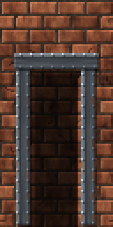
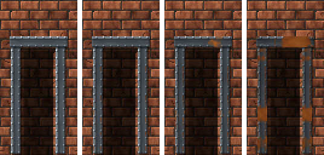

<!-- generated by "npm run docs" from the template schema: do not edit -->

# `beam`

Metal support beam, horizontal or vertical: a riveted girder or strap. This template is an **overlay**: transparent by design, meant to be laid over another patch.



Own size: 64 × 9 pixels. Parameters marked **layout** are expressed at this size and scale with the patch; **detail** parameters are real pixels and never scale. See [Layout and detail](../concepts.md#layout-and-detail).

## Parameters

### General

| Parameter   | Type                            | Default        | Scale  | Description                                                                                                                  |
| ----------- | ------------------------------- | -------------- | ------ | ---------------------------------------------------------------------------------------------------------------------------- |
| `size`      | [width, height] of integers > 0 | `[64, 9]`      | —      | own size of the beam, its shadow included: [length, thickness] for a horizontal beam, [thickness, length] for a vertical one |
| `direction` | string                          | `"horizontal"` | —      | direction of the beam                                                                                                        |
| `profile`   | string                          | `"girder"`     | —      | girder: an I-beam seen from the front, flanges along its edges and a recessed web; flat: a flat strap                        |
| `flange`    | integer ≥ 1                     | `2`            | detail | thickness of the flanges of a girder, in pixels                                                                              |
| `age`       | number in [0, 1]                | `0.3`          | —      | overall weathering, from 0 (new) to 1 (ruined): sets every wear parameter left unset                                         |
| `scratches` | number ≥ 0                      | from `age`     | —      | scratches per 32 × 32 pixels                                                                                                 |
| `tarnish`   | number in [0, 1]                | from `age`     | —      | dulled, darkened metal, in [0, 1]                                                                                            |

### `metal`

Metal of the beam.

| Parameter       | Type                            | Default                                        | Scale  | Description                                           |
| --------------- | ------------------------------- | ---------------------------------------------- | ------ | ----------------------------------------------------- |
| `metal.palette` | array of CSS colors, at least 2 | `["#2b2f33", "#474d53", "#687077", "#8f979e"]` | —      | metal colors, from darkest to lightest                |
| `metal.brushed` | number in [0, 1]                | `0.12`                                         | —      | streaks along the beam, in [0, 1]                     |
| `metal.grain`   | number in [0, 1]                | `0.03`                                         | detail | random brightness variation between pixels, in [0, 1] |

### `rivets`

Rivets, lit from the top-left.

| Parameter        | Type        | Default | Scale  | Description                                                       |
| ---------------- | ----------- | ------- | ------ | ----------------------------------------------------------------- |
| `rivets.enabled` | boolean     | `true`  | —      | rivets along each flange of a girder, along the middle of a strap |
| `rivets.spacing` | integer ≥ 2 | `6`     | detail | distance between rivets, in pixels                                |

### `shadow`

Shadow of the beam on the wall, the light coming from the top-left.

| Parameter        | Type             | Default | Scale  | Description                                             |
| ---------------- | ---------------- | ------- | ------ | ------------------------------------------------------- |
| `shadow.offset`  | integer ≥ 0      | `1`     | detail | shadow cast on the wall, to the bottom-right, in pixels |
| `shadow.opacity` | number in [0, 1] | `0.45`  | —      | darkness of the shadow, in [0, 1]                       |

### `rust`

Rust.

| Parameter       | Type                            | Default                                        | Scale  | Description                                      |
| --------------- | ------------------------------- | ---------------------------------------------- | ------ | ------------------------------------------------ |
| `rust.coverage` | number in [0, 1]                | from `age`                                     | —      | share of the surface rusted                      |
| `rust.palette`  | array of CSS colors, at least 2 | `["#3a1c0c", "#6b3314", "#9a4e1e", "#bf6e2e"]` | —      | rust colors, from darkest to lightest            |
| `rust.streaks`  | number in [0, 1]                | from `age`                                     | —      | ratio of rivets with a rust streak running down  |
| `rust.length`   | [min, max] of numbers ≥ 0       | from `age`                                     | detail | [min, max] length of the rust streaks, in pixels |

## Anchors

| Anchor   | Points                      |
| -------- | --------------------------- |
| `start`  | top-left corner of the beam |
| `center` | center of the beam          |

## Usage

`beam` is an overlay: a metal support beam laid over a wall, the whole patch being the
beam and its shadow. Several beams frame an alcove, a door or a panel, or reinforce a
plank wall:

```json
{
  "size": [64, 128],
  "patches": [
    { "patch": { "template": "bricks", "size": [64, 128], "rows": { "count": 16 } } },
    {
      "patch": { "template": "opening", "back": { "mode": "shade" }, "open": ["bottom"] },
      "x": 25,
      "y": 31.25,
      "width": 50,
      "height": 68.75
    },
    {
      "patch": { "template": "beam", "direction": "vertical", "size": [9, 96] },
      "x": 14,
      "y": 25,
      "width": 14.06,
      "height": 75
    },
    {
      "patch": { "template": "beam", "direction": "vertical", "size": [9, 96] },
      "x": 72,
      "y": 25,
      "width": 14.06,
      "height": 75
    },
    {
      "patch": { "template": "beam", "size": [64, 10] },
      "x": 12.5,
      "y": 23.4,
      "width": 76,
      "height": 7.8
    }
  ]
}
```

- `direction`: a vertical beam is a horizontal one transposed, so that its lighting stays
  top-left; give it a `[thickness, length]` size.
- `profile`: `girder`, an I-beam seen from the front, with lit flanges along its edges
  (`flange` pixels thick) and a recessed web in their shadow; `flat`, a flat strap.
- Rivets run along each flange of a girder, or along the middle of a strap, every
  `rivets.spacing` pixels. As it ages, the beam rusts, its rivets bleed rust streaks
  running down, whatever its direction, and it gets scratches and tarnish.

## Aging

`age`, from 0 (new) to 1 (ruined), sets every wear parameter left unset. Values in
between are interpolated linearly between age 0, 0.3 (the default) and 1. Parameters set
explicitly always win: `{ "age": 0.8, "stains": { "ratio": 0 } }` is a ruined wall
without streaks. See [Aging](../concepts.md#aging).



With its default parameters, `beam` derives:

| Parameter       | age 0  | age 0.3 | age 0.6       | age 1   |
| --------------- | ------ | ------- | ------------- | ------- |
| `rust.coverage` | 0      | 0.1     | 0.29          | 0.55    |
| `rust.streaks`  | 0      | 0.2     | 0.37          | 0.6     |
| `rust.length`   | [2, 4] | [3, 8]  | [4.29, 12.29] | [6, 18] |
| `scratches`     | 0      | 0.5     | 1.36          | 2.5     |
| `tarnish`       | 0      | 0.1     | 0.21          | 0.35    |

## Example

```json
{
  "$schema": "../../schemas/patch.schema.json",
  "template": "beam",
  "size": [64, 9]
}
```
