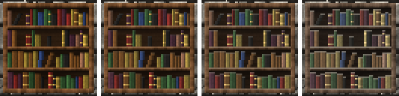

<!-- generated by "npm run docs" from the template schema: do not edit -->

# `bookshelf`

Wooden bookcase filled with books of every tint, from empty to packed. This template is an **overlay**: transparent by design, meant to be laid over another patch.


Category: [civilized](../catalog.md#civilized).

Own size: 64 × 64 pixels. Parameters marked **layout** are expressed at this size and scale with the patch; **detail** parameters are real pixels and never scale. See [Layout and detail](../concepts.md#layout-and-detail).

## Parameters

### General

| Parameter    | Type                            | Default    | Scale  | Description                                                                          |
| ------------ | ------------------------------- | ---------- | ------ | ------------------------------------------------------------------------------------ |
| `size`       | [width, height] of integers > 0 | `[64, 64]` | —      | own size of the bookcase, margin included                                            |
| `margin`     | integer ≥ 0                     | `2`        | detail | transparent margin around the bookcase, showing the wall below, in pixels            |
| `frame`      | integer ≥ 1                     | `3`        | detail | width of the case: its sides, top and bottom, in pixels                              |
| `age`        | number in [0, 1]                | `0.3`      | —      | overall weathering, from 0 (new) to 1 (ruined): sets every wear parameter left unset |
| `weathering` | number in [0, 1]                | from `age` | —      | wood turned silver-grey, in [0, 1]                                                   |
| `fading`     | number in [0, 1]                | from `age` | —      | book colors faded towards grey, in [0, 1]                                            |
| `dust`       | number in [0, 1]                | from `age` | —      | dust on the shelves and the tops of the books, in [0, 1]                             |

### `shelves`

Shelves, separated by boards.

| Parameter           | Type        | Default | Scale  | Description                              |
| ------------------- | ----------- | ------- | ------ | ---------------------------------------- |
| `shelves.count`     | integer ≥ 1 | `4`     | layout | shelves from top to bottom               |
| `shelves.thickness` | integer ≥ 1 | `2`     | detail | thickness of the shelf boards, in pixels |

### `columns`

Vertical partitions.

| Parameter           | Type        | Default | Scale  | Description                                        |
| ------------------- | ----------- | ------- | ------ | -------------------------------------------------- |
| `columns.count`     | integer ≥ 1 | `1`     | layout | compartments side by side, separated by partitions |
| `columns.thickness` | integer ≥ 1 | `2`     | detail | thickness of the partitions, in pixels             |

### `wood`

Wood of the case, its edges lit from the top-left.

| Parameter      | Type                            | Default                                        | Scale  | Description                                           |
| -------------- | ------------------------------- | ---------------------------------------------- | ------ | ----------------------------------------------------- |
| `wood.palette` | array of CSS colors, at least 2 | `["#3a2412", "#5e3b1f", "#7d5230", "#9c6b40"]` | —      | wood colors, from darkest to lightest                 |
| `wood.back`    | number in [0, 1]                | `0.4`                                          | —      | brightness of the back panel, in [0, 1]               |
| `wood.grain`   | number in [0, 1]                | `0.05`                                         | detail | random brightness variation between pixels, in [0, 1] |

### `books`

Books standing on the shelves, their spines lit from the left.

| Parameter              | Type                            | Default                                                                                    | Scale  | Description                                                                                                    |
| ---------------------- | ------------------------------- | ------------------------------------------------------------------------------------------ | ------ | -------------------------------------------------------------------------------------------------------------- |
| `books.fill`           | number in [0, 1]                | `0.85`                                                                                     | —      | share of the shelves filled with books, in [0, 1]: 0 for none, 1 for no space left; raising it only adds books |
| `books.colors`         | array of CSS colors, at least 1 | `["#6b1f1a", "#2c4a28", "#23335a", "#5a3818", "#7a6526", "#40222e", "#1c1a18", "#6e4a36"]` | —      | tints of the books, picked at random                                                                           |
| `books.width`          | [min, max] of numbers > 0       | `[2, 4]`                                                                                   | layout | [min, max] thickness of a book spine                                                                           |
| `books.height`         | [min, max] of numbers in [0, 1] | `[0.6, 0.95]`                                                                              | —      | [min, max] height of a book, as a share of the shelf height                                                    |
| `books.shadeVariation` | number in [0, 1]                | `0.2`                                                                                      | —      | random brightness variation between books, in [0, 1]                                                           |
| `books.bands`          | number in [0, 1]                | `0.35`                                                                                     | —      | ratio of books with gilt bands across their spine, in [0, 1]                                                   |
| `books.bandColor`      | CSS color                       | `"#a8843c"`                                                                                | —      | color of the gilt bands                                                                                        |
| `books.lean`           | number in [0, 1]                | `0.6`                                                                                      | —      | chance of a book standing next to a gap to lean into it, in [0, 1]                                             |

## Anchors

| Anchor         | Points                                                                                                      |
| -------------- | ----------------------------------------------------------------------------------------------------------- |
| `compartments` | top-left corner of the inside of each compartment, row by row                                               |
| `corners`      | corners of the inside of each compartment, as corner points: top-left, top-right, bottom-left, bottom-right |
| `center`       | center of the bookcase                                                                                      |

## Usage

`bookshelf` is a wooden bookcase filling the patch, but for a transparent `margin`
showing the wall below: place it over a wall, at full size.

```json
{
  "size": [64, 64],
  "patches": [
    { "patch": { "template": "ashlar" }, "width": 100, "height": 100 },
    { "patch": { "template": "bookshelf", "books": { "fill": 0.7 } }, "width": 100, "height": 100 }
  ]
}
```

- The case, `frame` pixels wide, holds `shelves.count` shelves, and
  `columns.count` compartments side by side. Its back panel is in the shadow of the
  boards above and of the side on the left, the light coming from the top-left.
- Books stand on the shelves, spines of `books.width` and heights of `books.height`,
  tinted with `books.colors`, some with gilt bands. `books.fill` sets how many: 0 for
  none, 1 for no space left. Books go missing in runs, as on a real shelf, and raising the
  fill only adds books, so that it can be tuned without the others moving. A book standing
  next to a gap leans into it (`books.lean`).
- As it ages, the wood weathers, the books fade, and dust settles on the shelves and the
  tops of the books.
- `compartments` anchors the top-left corner of each compartment, `corners` its corners,
  as corner points: a [`cobweb`](cobweb.md) anchored on them with `mirror` grows in the
  corners of the shelves.

## Aging

`age`, from 0 (new) to 1 (ruined), sets every wear parameter left unset. Values in
between are interpolated linearly between age 0, 0.3 (the default) and 1. Parameters set
explicitly always win: `{ "age": 0.8, "stains": { "ratio": 0 } }` is a ruined wall
without streaks. See [Aging](../concepts.md#aging).



With its default parameters, `bookshelf` derives:

| Parameter    | age 0 | age 0.3 | age 0.6 | age 1 |
| ------------ | ----- | ------- | ------- | ----- |
| `weathering` | 0     | 0.05    | 0.22    | 0.45  |
| `fading`     | 0     | 0.15    | 0.34    | 0.6   |
| `dust`       | 0     | 0.15    | 0.39    | 0.7   |

## Example

```json
{
  "$schema": "../../schemas/patch.schema.json",
  "template": "bookshelf",
  "size": [64, 64]
}
```
