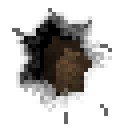

<!-- generated by "npm run docs" from the template schema: do not edit -->

# `breach`

Hole broken through a wall: a jagged outline, a beveled rim and earth behind. This template is an **overlay**: transparent by design, meant to be laid over another patch.



Category: [architecture](../catalog.md#architecture).

Own size: 32 × 32 pixels. Parameters marked **layout** are expressed at this size and scale with the patch; **detail** parameters are real pixels and never scale. See [Layout and detail](../concepts.md#layout-and-detail).

## Parameters

### General

| Parameter | Type                            | Default    | Scale  | Description                                                       |
| --------- | ------------------------------- | ---------- | ------ | ----------------------------------------------------------------- |
| `size`    | [width, height] of integers > 0 | `[32, 32]` | —      | own size of the patch, cracks included                            |
| `depth`   | integer ≥ 0                     | `4`        | detail | thickness of the broken wall seen inside the hole, in pixels      |
| `bevel`   | integer ≥ 0                     | `1`        | detail | width of the worn lip of the wall face around the hole, in pixels |

### `hole`

The outline of the hole.

| Parameter         | Type             | Default   | Scale | Description                                                                                                                                                                                                                                                                                                                                                                                                                                                                        |
| ----------------- | ---------------- | --------- | ----- | ---------------------------------------------------------------------------------------------------------------------------------------------------------------------------------------------------------------------------------------------------------------------------------------------------------------------------------------------------------------------------------------------------------------------------------------------------------------------------------- |
| `hole.shape`      | string           | `"burst"` | —     | burst: a jagged hole, from round, punched by a ram, to a star of shards, blown by an explosion; gash: parallel slashes tapering at both ends, torn by a claw; fissure: a long zigzag split, widest in its middle, opened by a quake; pocks: small holes scattered around, left by catapult shots; collapse: a bite out of the top of the wall, rubble heaped at its foot; bore: a clean round tunnel, dug by a giant worm; slits: narrow vertical arrow slits hacked into the wall |
| `hole.size`       | number in (0, 1] | `0.8`     | —     | span of the hole, as a share of the patch; the rest is left to the cracks                                                                                                                                                                                                                                                                                                                                                                                                          |
| `hole.jaggedness` | number in [0, 1] | `0.35`    | —     | irregularity of the outline, in [0, 1]: 0 for a smooth one; a burst turns from a round hole into a star of shards                                                                                                                                                                                                                                                                                                                                                                  |
| `hole.spikes`     | integer ≥ 2      | `7`       | —     | burst or pocks only: shards of wall jutting into each hole, around its outline                                                                                                                                                                                                                                                                                                                                                                                                     |
| `hole.count`      | integer ≥ 1      | `3`       | —     | gash, pocks or slits only: number of slashes, holes or slits                                                                                                                                                                                                                                                                                                                                                                                                                       |
| `hole.angle`      | number           | `60`      | —     | gash or fissure only: direction of the strokes, in degrees: 0 to the right, 90 downwards                                                                                                                                                                                                                                                                                                                                                                                           |
| `hole.width`      | number in (0, 1] | `0.2`     | —     | gash, fissure or slits only: thickness of a stroke at its widest, as a share of the smaller side of the patch                                                                                                                                                                                                                                                                                                                                                                      |
| `hole.cross`      | boolean          | `false`   | —     | slits only: a horizontal slit across each one, for crossbows                                                                                                                                                                                                                                                                                                                                                                                                                       |

### `rim`

The broken edge of the wall, inside the hole and on its lip, the light coming from the top-left.

| Parameter     | Type             | Default | Scale | Description                                                                |
| ------------- | ---------------- | ------- | ----- | -------------------------------------------------------------------------- |
| `rim.light`   | number in [0, 1] | `0.45`  | —     | lightening of the broken faces turned to the light, in [0, 1]              |
| `rim.dark`    | number in [0, 1] | `0.7`   | —     | darkening of the broken faces turned away from it, in [0, 1]               |
| `rim.falloff` | number in [0, 1] | `0.45`  | —     | extra darkness of the broken faces towards the back, in [0, 1]             |
| `rim.grain`   | number in [0, 1] | `0.3`   | —     | roughness of the broken faces: random brightness between pixels, in [0, 1] |

### `shadow`

Shadow of the broken edge on the earth at the back of the hole.

| Parameter        | Type             | Default | Scale  | Description                                                       |
| ---------------- | ---------------- | ------- | ------ | ----------------------------------------------------------------- |
| `shadow.offset`  | integer ≥ 0      | `3`     | detail | shadow cast to the bottom-right, in pixels; 0 for none            |
| `shadow.opacity` | number in [0, 1] | `0.55`  | —      | darkness of the shadow, in [0, 1]                                 |
| `shadow.recess`  | number in [0, 1] | `0.25`  | —      | darkening of the whole earth, set back behind the wall, in [0, 1] |

### `rubble`

Stones fallen at the foot of the hole, lit from the top-left.

| Parameter        | Type                            | Default                                        | Scale  | Description                                                                                                                                             |
| ---------------- | ------------------------------- | ---------------------------------------------- | ------ | ------------------------------------------------------------------------------------------------------------------------------------------------------- |
| `rubble.amount`  | number in [0, 1]                | —                                              | —      | height of the heap of rubble at the foot of each piece of the hole, as a share of its height, in [0, 1]; when unset, 0.4 for a collapse, none otherwise |
| `rubble.size`    | integer ≥ 1                     | `3`                                            | detail | size of the stones of the rubble, in pixels                                                                                                             |
| `rubble.palette` | array of CSS colors, at least 2 | `["#2c2a26", "#4c4943", "#6e6a62", "#918c82"]` | —      | colors of the stones of the rubble, from darkest to lightest                                                                                            |

### `cracks`

Cracks in the wall around the hole, their lower edge catching the light.

| Parameter         | Type                            | Default      | Scale | Description                                                                              |
| ----------------- | ------------------------------- | ------------ | ----- | ---------------------------------------------------------------------------------------- |
| `cracks.count`    | integer ≥ 0                     | `5`          | —     | cracks running from the hole into the wall                                               |
| `cracks.length`   | [min, max] of numbers in [0, 1] | `[0.3, 0.9]` | —     | [min, max] length of a crack, as a share of the room between the hole and the patch edge |
| `cracks.darkness` | number in [0, 1]                | `0.6`        | —     | darkness of the cracks, in [0, 1]                                                        |

### `dirt`

The earth filling the back of the hole: blotches, clods and pebbles, with its own palette.

| Parameter       | Type                            | Default                                        | Scale  | Description                                           |
| --------------- | ------------------------------- | ---------------------------------------------- | ------ | ----------------------------------------------------- |
| `dirt.palette`  | array of CSS colors, at least 2 | `["#2e2217", "#4a3726", "#654b33", "#80623f"]` | —      | colors of the earth, from darkest to lightest         |
| `dirt.blotches` | number > 0                      | `4`                                            | layout | large blotches across the patch                       |
| `dirt.contrast` | number in [0, 1]                | `0.6`                                          | —      | spread of the blotches over the palette               |
| `dirt.clods`    | number ≥ 0                      | `8`                                            | —      | lighter lumps of earth per 32 × 32 pixels             |
| `dirt.pebbles`  | number ≥ 0                      | `3`                                            | —      | pebbles per 32 × 32 pixels                            |
| `dirt.grain`    | number in [0, 1]                | `0.14`                                         | detail | random brightness variation between pixels, in [0, 1] |
| `dirt.wetness`  | number in [0, 1]                | `0`                                            | —      | damp earth, darker, in [0, 1]                         |

## Anchors

| Anchor   | Points                                                                       |
| -------- | ---------------------------------------------------------------------------- |
| `center` | center of the hole: the pixel of the hole nearest to the middle of the patch |
| `bottom` | bottom of the hole, below its center: where rubble rests                     |

## Usage

`breach` is an overlay: a hole broken through the wall, transparent around it.
`hole.shape` picks what broke it:

- `burst`: one jagged hole, from round, punched by a siege ram, to a star of
  `hole.spikes` shards jutting into it, blown by an explosion (`hole.jaggedness`);
- `gash`: `hole.count` parallel slashes, bowed and tapering at both ends, torn by a
  dragon's claw, running along `hole.angle`, `hole.width` thick; they draw closer and
  thinner when they do not fit;
- `fissure`: one long split along `hole.angle`, widest in its middle, zigzagging as
  the wall gave way, the more so as it gets jagged;
- `pocks`: `hole.count` small jagged holes scattered apart, left by catapult shots;
- `collapse`: a bite out of the wall from the top of the patch down, widest at the top,
  rubble heaped at its foot: place it at the top of the texture;
- `bore`: a clean round tunnel, as dug by a giant worm, dark at its far end, its
  lower-right side lit by the light coming in;
- `slits`: `hole.count` narrow vertical arrow slits hacked into the wall, `hole.width`
  thick, a round hole at both ends, crossed by a horizontal slit with `hole.cross`.

Lay it over any wall:

```json
{
  "size": [64, 96],
  "patches": [
    { "patch": { "template": "ashlar" }, "width": 100, "height": 100 },
    {
      "patch": { "template": "breach", "hole": { "jaggedness": 0.6 } },
      "x": 12.5,
      "y": 25,
      "width": 75,
      "height": 50,
      "wrap": false
    }
  ]
}
```

- The hole is centered in the patch and spans `hole.size` of it, scaling with it; the
  rest is left to the cracks.
- The light comes from the top-left: the broken wall inside the hole, `depth` pixels
  thick, and the worn lip around it, `bevel` pixels wide, are lit where they face up and
  left, at the bottom-right of the hole, and in shadow at its top-left. They shade the
  wall below, whose stones show through; `rim.grain` roughens them into a fracture.
  The broken wall takes at most half the depth of each piece of the hole, so that a
  narrow slash, a split or a small pock still shows the earth.
- The earth behind the wall fills the rest of the hole, with its own `dirt.palette` and
  the parameters of [`dirt`](dirt.md). It is set back (`shadow.recess`) and in the
  shadow of the broken edge above it (`shadow.offset`, `shadow.opacity`).
- `rubble` heaps stones at the foot of each piece of the hole, lit from the top-left,
  `rubble.size` pixels large, of `rubble.palette`: `rubble.amount` is the height of
  the heap, 0.4 of the hole for a collapse and none for the other shapes when unset.
- `cracks.count` cracks run from the outline into the wall, their lower edge catching
  the light: all around a burst, a pock or a bore, from the tips of gashes, fissures and
  slits, from the corners and the foot of a collapse. Nothing crosses the edges of the patch: keep the placement inside the
  texture, with `"wrap": false`, for a wall laid next to others.
- The `bottom` anchor is the lowest point of the earth below the center: where rubble
  rests. See [`examples/breach-variants`](../../examples/breach-variants).

## Example

```json
{
  "$schema": "../../schemas/patch.schema.json",
  "template": "breach",
  "size": [32, 32]
}
```
