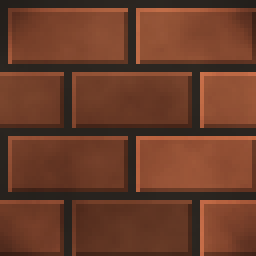

<!-- generated by "npm run docs" from the template schema: do not edit -->

# `bricks`

Staggered brick wall with mortar joints.



Own size: 64 × 64 pixels. Parameters marked **layout** are expressed at this size and scale with the patch; **detail** parameters are real pixels and never scale. See [Layout and detail](../concepts.md#layout-and-detail).

## Parameters

### General

| Parameter     | Type                            | Default                                        | Scale | Description                                           |
| ------------- | ------------------------------- | ---------------------------------------------- | ----- | ----------------------------------------------------- |
| `size`        | [width, height] of integers > 0 | `[64, 64]`                                     | —     | own size of the patch, in pixels                      |
| `brickWidth`  | integer ≥ 1                     | `32`                                           | —     | brick width, in pixels                                |
| `brickHeight` | integer ≥ 1                     | `16`                                           | —     | brick height, in pixels                               |
| `mortar`      | integer ≥ 0                     | `2`                                            | —     | mortar thickness, in pixels                           |
| `mortarColor` | CSS color                       | `"#2a2520"`                                    | —     | mortar color                                          |
| `colors`      | array of CSS colors, at least 2 | `["#3b1f16", "#6e3a26", "#8f5236", "#a8694a"]` | —     | brick colors, from darkest to lightest                |
| `variation`   | number in [0, 1]                | `0.25`                                         | —     | random brightness variation between bricks, in [0, 1] |

## Example

```json
{
  "$schema": "../../schemas/patch.schema.json",
  "template": "bricks",
  "size": [64, 64]
}
```
