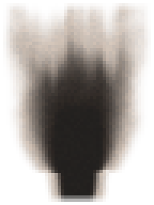

<!-- generated by "npm run docs" from the template schema: do not edit -->

# `burn`

Burn mark: soot and charred crust left on a wall by a fire. This template is an **overlay**: transparent by design, meant to be laid over another patch.



Category: [dungeon](../catalog.md#dungeon).

Own size: 48 × 64 pixels. Parameters marked **layout** are expressed at this size and scale with the patch; **detail** parameters are real pixels and never scale. See [Layout and detail](../concepts.md#layout-and-detail).

## Parameters

### General

| Parameter | Type                            | Default    | Scale  | Description                                                               |
| --------- | ------------------------------- | ---------- | ------ | ------------------------------------------------------------------------- |
| `size`    | [width, height] of integers > 0 | `[48, 64]` | —      | own size of the patch in pixels; layout values are expressed at this size |
| `margin`  | number ≥ 1                      | `3`        | detail | distance from the patch edges over which the mark fades out, in pixels    |

### `base`

Where the fire burned, against the wall.

| Parameter    | Type             | Default | Scale | Description                                                           |
| ------------ | ---------------- | ------- | ----- | --------------------------------------------------------------------- |
| `base.x`     | number in [0, 1] | `0.5`   | —     | where the fire stood, across the patch, in [0, 1]: 0.5 in the middle  |
| `base.y`     | number in [0, 1] | `0.85`  | —     | height of the fire, down the patch, in [0, 1]: 1 at the bottom edge   |
| `base.width` | number in [0, 1] | `0.35`  | —     | width of the mark where the fire stood, as a share of the patch width |

### `plume`

The soot rising from the fire.

| Parameter       | Type              | Default | Scale | Description                                                                               |
| --------------- | ----------------- | ------- | ----- | ----------------------------------------------------------------------------------------- |
| `plume.height`  | number in [0, 1]  | `0.9`   | —     | how high the soot rises, as a share of the room above the fire, in [0, 1]                 |
| `plume.spread`  | number in [0, 1]  | `1`     | —     | width of the mark at its top, as a share of the patch width, in [0, 1]                    |
| `plume.lean`    | number in [-1, 1] | `0`     | —     | draft pushing the smoke sideways, in [-1, 1]: negative to the left, positive to the right |
| `plume.tongues` | number in [0, 1]  | `0.5`   | —     | flame licks: vertical streaks of darker and lighter soot, in [0, 1]                       |

### `soot`

The soot deposit.

| Parameter       | Type             | Default     | Scale | Description                                                       |
| --------------- | ---------------- | ----------- | ----- | ----------------------------------------------------------------- |
| `soot.color`    | CSS color        | `"#100c0a"` | —     | soot color                                                        |
| `soot.opacity`  | number in [0, 1] | `0.85`      | —     | opacity of the densest soot, in [0, 1]                            |
| `soot.mottling` | number in [0, 1] | `0.5`       | —     | ragged outline and uneven soot, in [0, 1]: 0 gives a smooth plume |

### `char`

The crust where the flames licked the wall.

| Parameter     | Type             | Default     | Scale  | Description                                                                                |
| ------------- | ---------------- | ----------- | ------ | ------------------------------------------------------------------------------------------ |
| `char.color`  | CSS color        | `"#050404"` | —      | color of the charred crust                                                                 |
| `char.amount` | number in [0, 1] | `0.35`      | —      | share of the densest soot charred into a black crust, near the fire, in [0, 1]; 0 for none |
| `char.grain`  | number in [0, 1] | `0.2`       | detail | random brightness variation of the crust, in [0, 1]                                        |

### `singe`

The brown fringe of stone scorched by the heat, around the soot.

| Parameter        | Type             | Default     | Scale | Description                                                                          |
| ---------------- | ---------------- | ----------- | ----- | ------------------------------------------------------------------------------------ |
| `singe.color`    | CSS color        | `"#6b4424"` | —     | color of the singed stone                                                            |
| `singe.width`    | number in [0, 1] | `0.35`      | —     | how far the singed fringe reaches beyond the soot, as a share of the mark, in [0, 1] |
| `singe.strength` | number in [0, 1] | `0.6`       | —     | how brown the fringe turns, in [0, 1]; 0 for none                                    |

### `noise`

Noise shaping the outline and the soot.

| Parameter       | Type               | Default | Scale  | Description                                      |
| --------------- | ------------------ | ------- | ------ | ------------------------------------------------ |
| `noise.period`  | integer ≥ 1        | `5`     | layout | noise cells across the patch at the first octave |
| `noise.octaves` | integer in [1, 16] | `4`     | —      | number of noise octaves, each one twice as fine  |

## Usage

`burn` is an overlay: the mark a fire left on a wall, transparent elsewhere. Soot rises
from where the fire stood, `base`, and widens into a plume as it goes up, fading on its
way; near the fire the densest soot is charred into a black crust, and a fringe of brown,
singed stone surrounds it all. Lay it over a wall:

```json
{
  "size": [64, 128],
  "patches": [
    { "patch": { "template": "ashlar" }, "width": 100, "height": 100 },
    {
      "patch": { "template": "burn" },
      "x": 12.5,
      "y": 30,
      "width": 75,
      "height": 65,
      "wrap": false
    }
  ]
}
```

- The mark fades out over `margin` pixels before the edges of its patch, whatever its
  shape: keep the placement inside the texture, with `"wrap": false`, and the mark never
  reaches the texture edges.
- `plume.height` and `plume.spread` shape the soot, as shares of the patch;
  `plume.lean` bends it with a draft, `plume.tongues` draws the flame licks.
- `char.amount` 0 and a lower `soot.opacity` give old, faded soot; another
  `singe.color` gives the heat tint of metal. See
  [`examples/burn-variants`](../../examples/burn-variants).

## Example

```json
{
  "$schema": "../../schemas/patch.schema.json",
  "template": "burn",
  "size": [48, 64]
}
```
