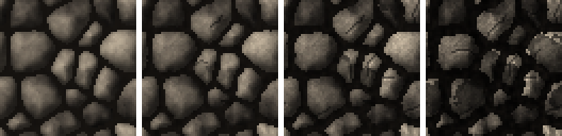

<!-- generated by "npm run docs" from the template schema: do not edit -->

# `cavewall`

Cave wall: a chaotic heap of rounded boulders of every size.


Category: [surfaces](../catalog.md#surfaces).

Own size: 64 × 64 pixels. Parameters marked **layout** are expressed at this size and scale with the patch; **detail** parameters are real pixels and never scale. See [Layout and detail](../concepts.md#layout-and-detail).

## Parameters

### General

| Parameter | Type                            | Default    | Scale | Description                                                                          |
| --------- | ------------------------------- | ---------- | ----- | ------------------------------------------------------------------------------------ |
| `size`    | [width, height] of integers > 0 | `[64, 64]` | —     | own size of the patch in pixels; layout values are expressed at this size            |
| `age`     | number in [0, 1]                | `0.3`      | —     | overall weathering, from 0 (new) to 1 (ruined): sets every wear parameter left unset |

### `stones`

Stones laid as the cells of a tileable Voronoi diagram.

| Parameter          | Type                            | Default  | Scale  | Description                                                                                                                                  |
| ------------------ | ------------------------------- | -------- | ------ | -------------------------------------------------------------------------------------------------------------------------------------------- |
| `stones.cells`     | [width, height] of integers ≥ 1 | `[4, 4]` | layout | number of stones across the patch: [columns, rows]; a heap scatters columns × rows stones                                                    |
| `stones.layout`    | string                          | `"heap"` | —      | grid: one stone per cell of a jittered grid, all of a similar size; heap: stones scattered at random, of every size, like boulders in a heap |
| `stones.variation` | number in [0, 1]                | `0.7`    | —      | heap only: spread of the stone sizes, in [0, 1]; 0 gives stones of a similar size                                                            |
| `stones.relief`    | number in [0, 1]                | `0.9`    | —      | roundness of the stones, in [0, 1]: 0 for flat faces, 1 for domes lit from the top-left and shadowed towards their crevices                  |
| `stones.jitter`    | number in [0, 1]                | `1`      | —      | grid only: irregularity of the stones, in [0, 1]: 0 lays them on a regular grid, 1 gives the most irregular shapes                           |
| `stones.stagger`   | number in [0, 1)                | `0`      | —      | grid only: shift of every other row, in fraction of a stone; 0.5 with no jitter gives hexagons; needs an even number of rows                 |

### `mortar`

Joints between stones.

| Parameter        | Type             | Default     | Scale  | Description                                                              |
| ---------------- | ---------------- | ----------- | ------ | ------------------------------------------------------------------------ |
| `mortar.size`    | integer ≥ 0      | `2`         | detail | joint thickness, in pixels                                               |
| `mortar.color`   | CSS color        | `"#15120f"` | —      | mortar color                                                             |
| `mortar.noise`   | number in [0, 1] | from `age`  | —      | brightness variation of the mortar, in [0, 1]                            |
| `mortar.erosion` | number in [0, 1] | from `age`  | —      | hollowed joints: darker, pitted mortar shadowed by the stones, in [0, 1] |

### `bevel`

Stone edges lit from the top-left.

| Parameter     | Type        | Default | Scale  | Description                                     |
| ------------- | ----------- | ------- | ------ | ----------------------------------------------- |
| `bevel.size`  | integer ≥ 0 | `0`     | detail | bevel width, in pixels                          |
| `bevel.light` | number ≥ 0  | `1.2`   | —      | brightness factor of the top and left edges     |
| `bevel.dark`  | number ≥ 0  | `0.7`   | —      | brightness factor of the bottom and right edges |

### `edges`

Irregularity of stone outlines.

| Parameter         | Type       | Default    | Scale  | Description                                           |
| ----------------- | ---------- | ---------- | ------ | ----------------------------------------------------- |
| `edges.roughness` | number ≥ 0 | from `age` | detail | maximum displacement of the stone outlines, in pixels |

### `cracks`

Cracks running across stones.

| Parameter       | Type                      | Default    | Scale  | Description                        |
| --------------- | ------------------------- | ---------- | ------ | ---------------------------------- |
| `cracks.ratio`  | number in [0, 1]          | from `age` | —      | ratio of cracked stones, in [0, 1] |
| `cracks.length` | [min, max] of numbers ≥ 0 | from `age` | detail | [min, max] crack length, in pixels |

### `erosion`

Stones worn down by time: uneven edges.

| Parameter       | Type       | Default    | Scale  | Description                                        |
| --------------- | ---------- | ---------- | ------ | -------------------------------------------------- |
| `erosion.edges` | number ≥ 0 | from `age` | detail | maximum depth worn into the stone edges, in pixels |

### `stains`

Dirt: streaks of rainwater and soot, grime.

| Parameter         | Type                      | Default    | Scale  | Description                                                |
| ----------------- | ------------------------- | ---------- | ------ | ---------------------------------------------------------- |
| `stains.ratio`    | number in [0, 1]          | from `age` | —      | chance of a streak running down from the top of each stone |
| `stains.length`   | [min, max] of numbers ≥ 0 | from `age` | layout | [min, max] streak length                                   |
| `stains.width`    | number ≥ 1                | from `age` | detail | streak width, in pixels                                    |
| `stains.darkness` | number in [0, 1]          | from `age` | —      | darkening at the top of a streak, in [0, 1]                |
| `stains.grime`    | number in [0, 1]          | from `age` | —      | blotchy darkening of the whole wall, in [0, 1]             |

### `spalling`

Flaked stone faces.

| Parameter        | Type                      | Default    | Scale  | Description                                              |
| ---------------- | ------------------------- | ---------- | ------ | -------------------------------------------------------- |
| `spalling.ratio` | number in [0, 1]          | from `age` | —      | ratio of stones with a flaked, recessed patch, in [0, 1] |
| `spalling.size`  | [min, max] of numbers ≥ 0 | from `age` | detail | [min, max] patch radius, in pixels                       |
| `spalling.depth` | number in [0, 1]          | from `age` | —      | darkening of the flaked patches, in [0, 1]               |

### `moss`

Moss growing along the top edges of the stones.

| Parameter       | Type                            | Default                                        | Scale  | Description                                                      |
| --------------- | ------------------------------- | ---------------------------------------------- | ------ | ---------------------------------------------------------------- |
| `moss.coverage` | number in [0, 1]                | `0`                                            | —      | share of the stone tops covered with moss, in [0, 1]; 0 for none |
| `moss.depth`    | number ≥ 0                      | `2`                                            | detail | thickness of the moss along the top edges, in pixels             |
| `moss.vines`    | number in [0, 1]                | `0.25`                                         | —      | chance of a vine hanging from each column of moss, in [0, 1]     |
| `moss.length`   | [min, max] of numbers ≥ 0       | `[2, 7]`                                       | detail | [min, max] length of the vines, in pixels                        |
| `moss.joints`   | number in [0, 1]                | `0.3`                                          | —      | moss in the joints where the stones are mossy, in [0, 1]         |
| `moss.palette`  | array of CSS colors, at least 2 | `["#17230f", "#2f441b", "#4f6d2c", "#86a24a"]` | —      | moss colors, from darkest to lightest                            |

### `stone`

Stone surface.

| Parameter                 | Type                            | Default                                        | Scale  | Description                                             |
| ------------------------- | ------------------------------- | ---------------------------------------------- | ------ | ------------------------------------------------------- |
| `stone.palette`           | array of CSS colors, at least 2 | `["#2b2723", "#4f4840", "#776d60", "#9d917f"]` | —      | stone colors, from darkest to lightest                  |
| `stone.contrast`          | number ≥ 0                      | `0.8`                                          | —      | spread of the surface noise over the palette            |
| `stone.shadeVariation`    | number in [0, 1]                | from `age`                                     | —      | random brightness variation between stones, in [0, 1]   |
| `stone.paletteShift`      | number in [0, 1]                | `0.25`                                         | —      | random shift of each stone along the palette, in [0, 1] |
| `stone.grain`             | number in [0, 1]                | from `age`                                     | detail | random brightness variation between pixels, in [0, 1]   |
| `stone.noise.period`      | integer ≥ 1                     | `6`                                            | layout | noise cells across the patch at the first octave        |
| `stone.noise.octaves`     | integer in [1, 16]              | `4`                                            | —      | number of noise octaves, each one twice as fine         |
| `stone.noise.persistence` | number in (0, 1]                | `0.6`                                          | —      | weight ratio between an octave and the previous one     |

## Anchors

| Anchor    | Points                                                              |
| --------- | ------------------------------------------------------------------- |
| `stones`  | top-left corner of the face of each stone, its bounding box         |
| `centers` | center of each stone                                                |
| `tops`    | top edge of each stone, straight above its center: where moss hangs |

## Usage

`cavewall` is a [`fieldstone`](fieldstone.md) wall with the defaults of a cave: a
chaotic heap of rounded boulders of every size, with dark crevices between them. Every
fieldstone parameter applies, its wear and its moss included.

- `stones.cells` gives the number of boulders, `[columns, rows]` multiplied:
  `[4, 4]` scatters 16 of them. `stones.variation` spreads their sizes: 1 mixes huge
  boulders with small stones, 0 gives stones of a similar size.
- `stones.relief` rounds them: each boulder is a dome lit from the top-left, darkening
  towards its crevices, its corners carved into pockets. Lower it for flatter stones.
- The boulders fill the patch and tile in both directions, like every wall.

## Aging

`age`, from 0 (new) to 1 (ruined), sets every wear parameter left unset. Values in
between are interpolated linearly between age 0, 0.3 (the default) and 1. Parameters set
explicitly always win: `{ "age": 0.8, "stains": { "ratio": 0 } }` is a ruined wall
without streaks. See [Aging](../concepts.md#aging).



Derived sizes in pixels are proportional to the height of the stones at own size, 16
pixels giving the values of `ashlar`. With its default parameters, `cavewall` derives:

| Parameter              | age 0   | age 0.3 | age 0.6       | age 1    |
| ---------------------- | ------- | ------- | ------------- | -------- |
| `edges.roughness`      | 0.3     | 0.8     | 1.06          | 1.4      |
| `cracks.ratio`         | 0       | 0.2     | 0.44          | 0.75     |
| `cracks.length`        | [3, 6]  | [5, 12] | [7.14, 18]    | [10, 26] |
| `stone.grain`          | 0.03    | 0.06    | 0.09          | 0.14     |
| `stone.shadeVariation` | 0.05    | 0.1     | 0.15          | 0.22     |
| `mortar.noise`         | 0.1     | 0.25    | 0.38          | 0.55     |
| `mortar.erosion`       | 0       | 0.2     | 0.46          | 0.8      |
| `erosion.edges`        | 0       | 0.5     | 1.36          | 2.5      |
| `stains.ratio`         | 0       | 0.15    | 0.39          | 0.7      |
| `stains.length`        | [4, 10] | [6, 16] | [8.57, 26.29] | [12, 40] |
| `stains.width`         | 1       | 2       | 2.43          | 3        |
| `stains.darkness`      | 0.15    | 0.25    | 0.36          | 0.5      |
| `stains.grime`         | 0       | 0.1     | 0.23          | 0.4      |
| `spalling.ratio`       | 0       | 0.08    | 0.26          | 0.5      |
| `spalling.size`        | [2, 3]  | [2, 5]  | [2.86, 7.14]  | [4, 10]  |
| `spalling.depth`       | 0.2     | 0.25    | 0.34          | 0.45     |

## Example

```json
{
  "$schema": "../../schemas/patch.schema.json",
  "template": "cavewall",
  "size": [64, 64]
}
```
