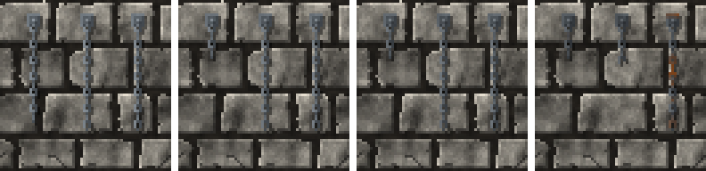

<!-- generated by "npm run docs" from the template schema: do not edit -->

# `chain`

Iron chain hanging from a wall plate, ending by chance with a manacle. This template is an **overlay**: transparent by design, meant to be laid over another patch.


Category: [dungeon](../catalog.md#dungeon).

Own size: 12 × 48 pixels. Parameters marked **layout** are expressed at this size and scale with the patch; **detail** parameters are real pixels and never scale. See [Layout and detail](../concepts.md#layout-and-detail).

## Parameters

### General

| Parameter | Type                            | Default    | Scale | Description                                                                          |
| --------- | ------------------------------- | ---------- | ----- | ------------------------------------------------------------------------------------ |
| `size`    | [width, height] of integers > 0 | `[12, 48]` | —     | own size of the patch: the chain hangs from its top, centered                        |
| `length`  | [min, max] of numbers in [0, 1] | `[0.4, 1]` | —     | [min, max] share of the height below the fixture the chain drops, picked at random   |
| `cuff`    | number in [0, 1]                | `0.4`      | —     | chance of a manacle at the end of the chain, in [0, 1]                               |
| `age`     | number in [0, 1]                | `0.3`      | —     | overall weathering, from 0 (new) to 1 (ruined): sets every wear parameter left unset |
| `rust`    | number in [0, 1]                | from `age` | —     | share of the chain rusted, in [0, 1]                                                 |
| `tarnish` | number in [0, 1]                | from `age` | —     | dulled, darkened metal, in [0, 1]                                                    |
| `broken`  | number in [0, 1]                | from `age` | —     | chance the chain has snapped: shorter, ending with an open link, its manacle lost    |

### `fixture`

Metal plate bolted to the wall, with an eye ring the chain hangs from.

| Parameter      | Type        | Default | Scale  | Description                       |
| -------------- | ----------- | ------- | ------ | --------------------------------- |
| `fixture.size` | integer ≥ 3 | `5`     | detail | side of the wall plate, in pixels |

### `link`

Links, alternately seen face on and edge on.

| Parameter     | Type        | Default | Scale  | Description                                            |
| ------------- | ----------- | ------- | ------ | ------------------------------------------------------ |
| `link.width`  | integer ≥ 2 | `3`     | detail | width of a link seen face on, in pixels                |
| `link.length` | integer ≥ 3 | `5`     | detail | length of a link, in pixels; links overlap by 2 pixels |

### `metal`

Iron of the chain, lit from the top-left.

| Parameter       | Type                            | Default                                        | Scale  | Description                                           |
| --------------- | ------------------------------- | ---------------------------------------------- | ------ | ----------------------------------------------------- |
| `metal.palette` | array of CSS colors, at least 2 | `["#2b2f33", "#474d53", "#687077", "#8f979e"]` | —      | metal colors, from darkest to lightest                |
| `metal.grain`   | number in [0, 1]                | `0.05`                                         | detail | random brightness variation between pixels, in [0, 1] |

### `shadow`

Shadow of the chain on the wall, the light coming from the top-left.

| Parameter        | Type             | Default | Scale  | Description                                                                                               |
| ---------------- | ---------------- | ------- | ------ | --------------------------------------------------------------------------------------------------------- |
| `shadow.offset`  | number ≥ 0       | `1`     | layout | shadow cast on the wall, to the bottom-right, in pixels at own size: it scales with the patch; 0 for none |
| `shadow.opacity` | number in [0, 1] | `0.45`  | —      | darkness of the shadow, in [0, 1]                                                                         |

## Anchors

| Anchor    | Points                                                  |
| --------- | ------------------------------------------------------- |
| `fixture` | center of the wall plate                                |
| `end`     | bottom of the chain, below its last link or its manacle |

## Usage

`chain` is an overlay: one iron chain, hanging from a plate bolted to the wall at the
top of the patch, centered. Place one patch per chain, with its own seed, wherever the
chains hang:

```json
{
  "size": [64, 64],
  "patches": [
    { "patch": { "template": "ashlar" }, "width": 100, "height": 100 },
    { "patch": { "template": "chain" }, "x": 20, "y": 8, "width": 18.75, "height": 75, "seed": 1 },
    { "patch": { "template": "chain" }, "x": 60, "y": 8, "width": 18.75, "height": 75, "seed": 2 }
  ]
}
```

- The chain drops a random share of the height below its plate, within `length`: its
  links, `link.width` by `link.length` pixels, are alternately seen face on, open in
  their middle, and edge on.
- `cuff` is the chance that it ends with a manacle, twice as wide as a link.
- It casts a shadow on the wall. As it ages, it rusts and tarnishes, and may have snapped
  (`broken`): shorter, ending with an open link, its manacle lost.
- The `fixture` anchor is the center of the plate, `end` the bottom of the chain.

## Aging

`age`, from 0 (new) to 1 (ruined), sets every wear parameter left unset. Values in
between are interpolated linearly between age 0, 0.3 (the default) and 1. Parameters set
explicitly always win: `{ "age": 0.8, "stains": { "ratio": 0 } }` is a ruined wall
without streaks. See [Aging](../concepts.md#aging).



With its default parameters, `chain` derives:

| Parameter | age 0 | age 0.3 | age 0.6 | age 1 |
| --------- | ----- | ------- | ------- | ----- |
| `rust`    | 0     | 0.08    | 0.24    | 0.45  |
| `tarnish` | 0     | 0.1     | 0.21    | 0.35  |
| `broken`  | 0     | 0.05    | 0.18    | 0.35  |

## Example

```json
{
  "$schema": "../../schemas/patch.schema.json",
  "template": "chain",
  "size": [12, 48]
}
```
