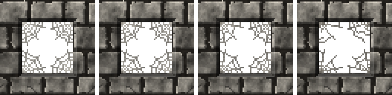

<!-- generated by "npm run docs" from the template schema: do not edit -->

# `cobweb`

Spider web in a corner, torn and dusty with age: anchor it on opening corners. This template is an **overlay**: transparent by design, meant to be laid over another patch.


Category: [natural](../catalog.md#natural).

Own size: 16 × 16 pixels. Parameters marked **layout** are expressed at this size and scale with the patch; **detail** parameters are real pixels and never scale. See [Layout and detail](../concepts.md#layout-and-detail).

## Parameters

### General

| Parameter | Type                            | Default      | Scale | Description                                                                                                                                       |
| --------- | ------------------------------- | ------------ | ----- | ------------------------------------------------------------------------------------------------------------------------------------------------- |
| `size`    | [width, height] of integers > 0 | `[16, 16]`   | —     | own size of the web, from its corner, in pixels                                                                                                   |
| `corner`  | string                          | `"top-left"` | —     | corner of the patch the web radiates from; leave it top-left when anchored with "mirror", which turns the web into the corner of its anchor point |
| `age`     | number in [0, 1]                | `0.3`        | —     | overall aging, from 0 (fresh) to 1 (abandoned): sets every wear parameter left unset                                                              |
| `torn`    | number in [0, 1]                | from `age`   | —     | share of the threads torn away, in [0, 1]                                                                                                         |
| `dust`    | number in [0, 1]                | from `age`   | —     | dust caught in the web, in [0, 1]: greyer threads and a matted sheet in the corner                                                                |

### `spokes`

Threads radiating from the corner.

| Parameter       | Type             | Default | Scale  | Description                                              |
| --------------- | ---------------- | ------- | ------ | -------------------------------------------------------- |
| `spokes.count`  | integer ≥ 1      | `3`     | layout | threads radiating from the corner, between the two walls |
| `spokes.jitter` | number in [0, 1] | `0.25`  | —      | random variation of their angles, in [0, 1]              |

### `rings`

Threads around the corner.

| Parameter      | Type             | Default | Scale  | Description                                                                            |
| -------------- | ---------------- | ------- | ------ | -------------------------------------------------------------------------------------- |
| `rings.count`  | integer ≥ 1      | `4`     | layout | threads around the corner, from wall to wall across the spokes                         |
| `rings.sag`    | number in [0, 1] | `0.25`  | —      | how much a thread sags towards the corner between two spokes, as a share of its length |
| `rings.jitter` | number in [0, 1] | `0.2`   | —      | random variation of their spacing, in [0, 1]                                           |

### `thread`

Threads, one pixel thick.

| Parameter      | Type             | Default     | Scale | Description                                                                                        |
| -------------- | ---------------- | ----------- | ----- | -------------------------------------------------------------------------------------------------- |
| `thread.color` | CSS color        | `"#bdbab2"` | —     | color of the threads                                                                               |
| `thread.alpha` | number in [0, 1] | `1`         | —     | alpha of the threads, in [0, 1]; below 1, they are translucent pixels, even over a cut-out opening |
| `thread.grain` | number in [0, 1] | `0.12`      | —     | random brightness variation between pixels, in [0, 1]                                              |

## Usage

`cobweb` is an overlay: a spider web radiating from the top-left corner of the patch,
transparent elsewhere. Anchor it on the `corners` of an [`opening`](opening.md), with
`mirror`, so that one placement fills any corner, each web growing into its own:

```json
{
  "size": [64, 64],
  "patches": [
    { "patch": { "template": "ashlar" }, "width": 100, "height": 100 },
    {
      "id": "window",
      "patch": { "template": "opening", "depth": 3 },
      "x": 18.75,
      "y": 18.75,
      "width": 62.5,
      "height": 62.5
    },
    {
      "patch": { "template": "cobweb", "age": 0.6 },
      "anchor": { "to": "window", "at": "corners", "ratio": 0.75, "mirror": true },
      "width": 25,
      "height": 25
    }
  ]
}
```

`only: [0, 1]` keeps the two top corners, `ratio` a random share of them.

- `spokes.count` threads radiate from the corner, between the two walls, and
  `rings.count` threads run around it, from wall to wall, sagging towards the corner
  between two spokes (`rings.sag`). Threads are one pixel thick at any size: a larger web
  has more room between its threads.
- The threads are opaque by default, so that they stay crisp over a cut-out opening, whose
  back is transparent; a `thread.alpha` below 1 makes them translucent pixels.
- As it ages, the web tears (`torn`: threads missing, spokes stopping short) and gathers
  `dust`: greyer threads, and a matted sheet filling the apex.

## Aging

`age`, from 0 (new) to 1 (ruined), sets every wear parameter left unset. Values in
between are interpolated linearly between age 0, 0.3 (the default) and 1. Parameters set
explicitly always win: `{ "age": 0.8, "stains": { "ratio": 0 } }` is a ruined wall
without streaks. See [Aging](../concepts.md#aging).



With its default parameters, `cobweb` derives:

| Parameter | age 0 | age 0.3 | age 0.6 | age 1 |
| --------- | ----- | ------- | ------- | ----- |
| `torn`    | 0     | 0.1     | 0.25    | 0.45  |
| `dust`    | 0     | 0.2     | 0.44    | 0.75  |

## Example

```json
{
  "$schema": "../../schemas/patch.schema.json",
  "template": "cobweb",
  "size": [16, 16]
}
```
