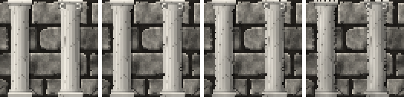

<!-- generated by "npm run docs" from the template schema: do not edit -->

# `column`

Marble column of a classical order: doric, ionic or tuscan. This template is an **overlay**: transparent by design, meant to be laid over another patch.


Category: [architecture](../catalog.md#architecture).

Own size: 16 × 64 pixels. Parameters marked **layout** are expressed at this size and scale with the patch; **detail** parameters are real pixels and never scale. See [Layout and detail](../concepts.md#layout-and-detail).

## Parameters

### General

| Parameter | Type                            | Default    | Scale  | Description                                                                                                                                    |
| --------- | ------------------------------- | ---------- | ------ | ---------------------------------------------------------------------------------------------------------------------------------------------- |
| `size`    | [width, height] of integers > 0 | `[16, 64]` | —      | own size of the column, capital and base included                                                                                              |
| `order`   | string                          | `"doric"`  | —      | doric: fluted, a flared capital under a square slab; ionic: fluted, a capital rolled into two volutes; tuscan: a plain shaft, a simple capital |
| `capital` | number ≥ 1                      | `7`        | layout | height of the capital, in pixels at own size                                                                                                   |
| `base`    | number ≥ 0                      | `5`        | layout | height of the base, in pixels at own size; 0 for none                                                                                          |
| `age`     | number in [0, 1]                | `0.3`      | —      | overall weathering, from 0 (new) to 1 (ruined): sets every wear parameter left unset                                                           |
| `grime`   | number in [0, 1]                | from `age` | —      | dirt darkening the column, rising from its foot, in [0, 1]                                                                                     |
| `chips`   | number in [0, 1]                | from `age` | —      | chipped edges, in [0, 1]: share of the outline broken away                                                                                     |
| `broken`  | number in [0, 1]                | from `age` | —      | chance the column is broken: its capital gone, the shaft ending in a jagged top                                                                |

### `shaft`

Shaft, round, lit from the left.

| Parameter      | Type             | Default | Scale  | Description                                                    |
| -------------- | ---------------- | ------- | ------ | -------------------------------------------------------------- |
| `shaft.width`  | number in [0, 1] | `0.7`   | —      | width of the shaft at its foot, as a share of the patch width  |
| `shaft.taper`  | number in [0, 1] | `0.1`   | —      | narrowing of the shaft at its top, as a share of its width     |
| `shaft.flutes` | integer ≥ 0      | `5`     | layout | grooves running down the visible half of the shaft; 0 for none |

### `marble`

Veined marble.

| Parameter         | Type                            | Default                                        | Scale | Description                                         |
| ----------------- | ------------------------------- | ---------------------------------------------- | ----- | --------------------------------------------------- |
| `marble.palette`  | array of CSS colors, at least 2 | `["#5e5a55", "#a39e95", "#d8d3c8", "#f1ede4"]` | —     | marble colors, from its veins to its lightest stone |
| `marble.veins`    | number ≥ 0                      | `3`                                            | —     | veins across the patch; 0 for none                  |
| `marble.contrast` | number in [0, 1]                | `0.5`                                          | —     | darkness of the veins, in [0, 1]                    |

### `shadow`

Shadow of the column on the wall, the light coming from the top-left.

| Parameter        | Type             | Default | Scale  | Description                                                                                               |
| ---------------- | ---------------- | ------- | ------ | --------------------------------------------------------------------------------------------------------- |
| `shadow.offset`  | number ≥ 0       | `1`     | layout | shadow cast on the wall, to the bottom-right, in pixels at own size: it scales with the patch; 0 for none |
| `shadow.opacity` | number in [0, 1] | `0.45`  | —      | darkness of the shadow, in [0, 1]                                                                         |

## Anchors

| Anchor   | Points                                                     |
| -------- | ---------------------------------------------------------- |
| `top`    | top-left corner of the capital, where an entablature rests |
| `center` | center of the column                                       |

## Usage

`column` is an overlay: a marble column, the whole patch being the column, capital and
base included, casting a shadow on the wall behind. Place it like a
[`beam`](beam.md), usually in pairs framing a doorway or an alcove, under an
[`entablature`](entablature.md):

```json
{
  "size": [64, 64],
  "patches": [
    { "patch": { "template": "ashlar" }, "width": 100, "height": 100 },
    { "patch": { "template": "column", "order": "ionic" }, "x": 6, "width": 25, "height": 100 },
    { "patch": { "template": "column", "order": "ionic" }, "x": 69, "width": 25, "height": 100 }
  ]
}
```

- `order` sets the capital: `doric`, a flared echinus under a square slab; `ionic`, a
  thin slab over two volutes; `tuscan`, a plain collar. `shaft.flutes` grooves the
  shaft, 0 for a plain one, and `shaft.taper` narrows it towards its top.
- The marble is veined (`marble.veins`, `marble.contrast`), and the shaft is lit from
  the left like a cylinder.
- Its shadow offset, like the chain's, is expressed at own size and scales with the column.
- As it ages, grime rises from its foot, its edges chip, and it may be broken: its capital
  gone, its shaft ending in a jagged top, for ruins.

## Aging

`age`, from 0 (new) to 1 (ruined), sets every wear parameter left unset. Values in
between are interpolated linearly between age 0, 0.3 (the default) and 1. Parameters set
explicitly always win: `{ "age": 0.8, "stains": { "ratio": 0 } }` is a ruined wall
without streaks. See [Aging](../concepts.md#aging).



With its default parameters, `column` derives:

| Parameter | age 0 | age 0.3 | age 0.6 | age 1 |
| --------- | ----- | ------- | ------- | ----- |
| `grime`   | 0     | 0.15    | 0.34    | 0.6   |
| `chips`   | 0     | 0.05    | 0.16    | 0.3   |
| `broken`  | 0     | 0       | 0.15    | 0.35  |

## Example

```json
{
  "$schema": "../../schemas/patch.schema.json",
  "template": "column",
  "size": [16, 64]
}
```
