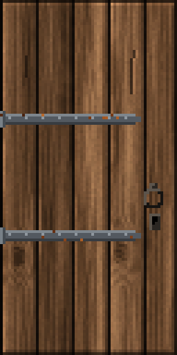
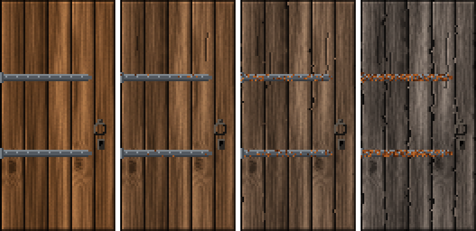

<!-- generated by "npm run docs" from the template schema: do not edit -->

# `door`

Door: single, double or lifting; wooden or metal, with iron bands and a handle.



Own size: 64 × 128 pixels. Parameters marked **layout** are expressed at this size and scale with the patch; **detail** parameters are real pixels and never scale. See [Layout and detail](../concepts.md#layout-and-detail).

## Parameters

### General

| Parameter  | Type                            | Default     | Scale | Description                                                                                                         |
| ---------- | ------------------------------- | ----------- | ----- | ------------------------------------------------------------------------------------------------------------------- |
| `size`     | [width, height] of integers > 0 | `[64, 128]` | —     | own size of the door, in pixels                                                                                     |
| `kind`     | string                          | `"single"`  | —     | single: one leaf; double: two leaves opening left and right; lift: a door going up into the ceiling, like in Doom   |
| `hinge`    | string                          | `"left"`    | —     | hinge side of a single door; its handle is on the other side                                                        |
| `material` | string                          | `"wood"`    | —     | wood, or full metal plates                                                                                          |
| `style`    | string                          | `"solid"`   | —     | wood only: rough, irregular planks; solid, tight planks running the whole height; fancy, a frame with raised panels |
| `age`      | number in [0, 1]                | `0.3`       | —     | overall weathering, from 0 (new) to 1 (ruined): passed to the wood or the metal, and rusting the iron               |

### `panels`

Raised panels of each leaf, in the fancy style.

| Parameter        | Type        | Default | Scale | Description              |
| ---------------- | ----------- | ------- | ----- | ------------------------ |
| `panels.columns` | integer ≥ 1 | `1`     | —     | columns of raised panels |
| `panels.rows`    | integer ≥ 1 | `3`     | —     | rows of raised panels    |

### `wood`

Wood of wooden doors.

| Parameter      | Type                            | Default                                        | Scale | Description                           |
| -------------- | ------------------------------- | ---------------------------------------------- | ----- | ------------------------------------- |
| `wood.palette` | array of CSS colors, at least 2 | `["#3a2412", "#5e3b1f", "#7d5230", "#9c6b40"]` | —     | wood colors, from darkest to lightest |

### `metal`

Metal of the plates of metal doors, and of the iron fittings.

| Parameter       | Type                            | Default                                        | Scale | Description                            |
| --------------- | ------------------------------- | ---------------------------------------------- | ----- | -------------------------------------- |
| `metal.palette` | array of CSS colors, at least 2 | `["#2b2f33", "#474d53", "#687077", "#8f979e"]` | —     | metal colors, from darkest to lightest |

### `bands`

Iron bands reinforcing the door, rusting with age.

| Parameter      | Type             | Default | Scale  | Description                                                                                                                     |
| -------------- | ---------------- | ------- | ------ | ------------------------------------------------------------------------------------------------------------------------------- |
| `bands.count`  | integer ≥ 0      | `2`     | —      | number of iron bands across each leaf; 0 for none                                                                               |
| `bands.width`  | integer ≥ 1      | `4`     | detail | band width, in pixels                                                                                                           |
| `bands.length` | number in [0, 1] | `0.8`   | —      | length of the bands from the hinge side, in fraction of the leaf width: strap hinges with a pointed end; 1 runs across the leaf |
| `bands.nails`  | boolean          | `true`  | —      | nails along the bands                                                                                                           |

### `handle`

Handle, on the opening side.

| Parameter        | Type      | Default     | Scale | Description                                            |
| ---------------- | --------- | ----------- | ----- | ------------------------------------------------------ |
| `handle.kind`    | string    | `"ring"`    | —     | ring pull, vertical bar, or none; lift doors have none |
| `handle.keyhole` | boolean   | `true`      | —     | a keyhole below the handle                             |
| `handle.color`   | CSS color | `"#2a2622"` | —     | color of the handle                                    |

## Anchors

| Anchor    | Points                       |
| --------- | ---------------------------- |
| `leaves`  | top-left corner of each leaf |
| `handles` | plate of each handle         |
| `center`  | center of the door           |

## Kinds, materials and fittings

A door fills its whole texture, and is always opaque.

- `kind`: `single`, one leaf opening from its `hinge` side (`left` or `right`);
  `double`, two leaves opening left and right; `lift`, a door going up into the
  ceiling like in Doom: horizontal planks, bands across, no handle.
- `material`: `wood`, drawn with the [`planks`](planks.md) engine, or `metal`, full
  metal plates drawn with the [`metal`](metal.md) engine.
- `style`, for wood: `rough`, irregular planks with wide gaps; `solid`, tight planks
  running the whole height; `fancy`, a frame with `panels.columns` × `panels.rows` raised
  panels on each leaf.
- `bands`: iron bands reinforcing the leaves. They start from the hinge side as strap
  hinges with a pointed end, `bands.length` of the leaf wide, with the knuckle of the
  hinge on the hinge edge; `"length": 1` runs them across the leaf, `"count": 0` removes
  them. They are nailed, and rust with age.
- `handle`: a `ring` pull or a vertical `bar` on the opening side, near the middle of a
  double door, with a `keyhole` below it.

```json
{
  "template": "door",
  "kind": "double",
  "style": "fancy",
  "panels": { "rows": 4 },
  "bands": { "count": 0 }
}
```

## Aging

`age`, from 0 (new) to 1 (ruined), is passed to the wood (`planks`) or to the metal
(`metal`) of the door, which weather as described on their pages, and rusts the iron
bands. The rough style adds 0.25 to the age of its wood.



## Example

```json
{
  "$schema": "../../schemas/patch.schema.json",
  "template": "door",
  "size": [64, 128]
}
```
