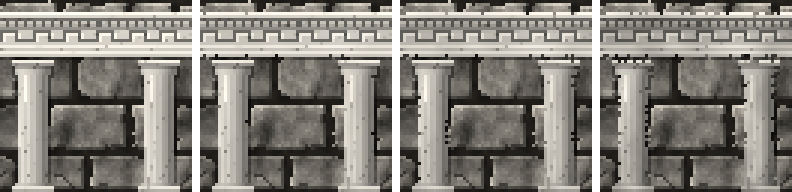

<!-- generated by "npm run docs" from the template schema: do not edit -->

# `entablature`

Classical entablature: cornice, carved frieze and architrave, in marble. This template is an **overlay**: transparent by design, meant to be laid over another patch.


Category: [architecture](../catalog.md#architecture).

Own size: 64 × 16 pixels. Parameters marked **layout** are expressed at this size and scale with the patch; **detail** parameters are real pixels and never scale. See [Layout and detail](../concepts.md#layout-and-detail).

## Parameters

### General

| Parameter | Type                            | Default    | Scale | Description                                                                          |
| --------- | ------------------------------- | ---------- | ----- | ------------------------------------------------------------------------------------ |
| `size`    | [width, height] of integers > 0 | `[64, 16]` | —     | own size of the entablature                                                          |
| `dentils` | boolean                         | `true`     | —     | a row of small blocks under the cornice                                              |
| `age`     | number in [0, 1]                | `0.3`      | —     | overall weathering, from 0 (new) to 1 (ruined): sets every wear parameter left unset |
| `grime`   | number in [0, 1]                | from `age` | —     | dirt darkening the marble under each projection, in [0, 1]                           |
| `chips`   | number in [0, 1]                | from `age` | —     | chipped edges, in [0, 1]: share of the outline broken away                           |
| `broken`  | number in [0, 1]                | from `age` | —     | chance a chunk has broken away from the bottom edge                                  |

### `layers`

Bands from top to bottom; their shares are normalized.

| Parameter           | Type             | Default | Scale | Description                                          |
| ------------------- | ---------------- | ------- | ----- | ---------------------------------------------------- |
| `layers.cornice`    | number in [0, 1] | `0.3`   | —     | share of the height of the cornice, on top           |
| `layers.frieze`     | number in [0, 1] | `0.45`  | —     | share of the height of the frieze                    |
| `layers.architrave` | number in [0, 1] | `0.25`  | —     | share of the height of the architrave, at the bottom |

### `frieze`

The middle band, carved.

| Parameter        | Type       | Default     | Scale  | Description                                                                                                                                                                                       |
| ---------------- | ---------- | ----------- | ------ | ------------------------------------------------------------------------------------------------------------------------------------------------------------------------------------------------- |
| `frieze.pattern` | string     | `"meander"` | —      | meander: running Greek-key hooks on a baseline, or the simple fret, a square wave, when the frieze is too low for hooks; triglyph: grooved blocks between metopes carrying a rosette; plain: none |
| `frieze.period`  | number > 0 | `10`        | layout | length of one motif, in pixels at own size; rounded so that the motifs fill the width                                                                                                             |

### `marble`

Veined marble.

| Parameter         | Type                            | Default                                        | Scale | Description                                         |
| ----------------- | ------------------------------- | ---------------------------------------------- | ----- | --------------------------------------------------- |
| `marble.palette`  | array of CSS colors, at least 2 | `["#5e5a55", "#a39e95", "#d8d3c8", "#f1ede4"]` | —     | marble colors, from its veins to its lightest stone |
| `marble.veins`    | number ≥ 0                      | `3`                                            | —     | veins across the patch; 0 for none                  |
| `marble.contrast` | number in [0, 1]                | `0.5`                                          | —     | darkness of the veins, in [0, 1]                    |

### `shadow`

Shadow of the entablature on the wall, the light coming from the top-left.

| Parameter        | Type             | Default | Scale  | Description                                                                                               |
| ---------------- | ---------------- | ------- | ------ | --------------------------------------------------------------------------------------------------------- |
| `shadow.offset`  | number ≥ 0       | `1`     | layout | shadow cast on the wall, to the bottom-right, in pixels at own size: it scales with the patch; 0 for none |
| `shadow.opacity` | number in [0, 1] | `0.45`  | —      | darkness of the shadow, in [0, 1]                                                                         |

## Anchors

| Anchor   | Points                                             |
| -------- | -------------------------------------------------- |
| `top`    | left end of the top edge, where something may rest |
| `bottom` | left end of the bottom edge, where columns meet it |

## Usage

`entablature` is an overlay: a horizontal band of marble, the whole patch being the band
and, in its last rows, its shadow on the wall below. Lay it across the top of a wall, or
over a pair of [`column`](column.md)s for a portico:

```json
{
  "size": [64, 64],
  "patches": [
    { "patch": { "template": "ashlar" }, "width": 100, "height": 100 },
    { "patch": { "template": "entablature" }, "y": 6, "width": 100, "height": 25 },
    { "patch": { "template": "column" }, "x": 6, "y": 31, "width": 22, "height": 69 },
    { "patch": { "template": "column" }, "x": 72, "y": 31, "width": 22, "height": 69 }
  ]
}
```

- From top to bottom: a cornice, lit on its top, over a soffit in deep shadow and a row
  of `dentils`; the frieze; the architrave, in steps. `layers` sets their shares of
  the height.
- `frieze.pattern` carves the frieze: `meander`, Greek-key hooks running on a
  baseline; `triglyph`, grooved blocks between metopes carrying a rosette; `plain`.
  The motifs, `frieze.period` long, fill the width exactly, so that the band tiles
  horizontally: placed across a whole texture, it runs on from one tile to the next.
- As it ages, grime gathers under the cornice, its edges chip, and a chunk may have
  broken away from its bottom edge (`broken`).

## Aging

`age`, from 0 (new) to 1 (ruined), sets every wear parameter left unset. Values in
between are interpolated linearly between age 0, 0.3 (the default) and 1. Parameters set
explicitly always win: `{ "age": 0.8, "stains": { "ratio": 0 } }` is a ruined wall
without streaks. See [Aging](../concepts.md#aging).



With its default parameters, `entablature` derives:

| Parameter | age 0 | age 0.3 | age 0.6 | age 1 |
| --------- | ----- | ------- | ------- | ----- |
| `grime`   | 0     | 0.15    | 0.34    | 0.6   |
| `chips`   | 0     | 0.04    | 0.13    | 0.25  |
| `broken`  | 0     | 0       | 0.21    | 0.5   |

## Example

```json
{
  "$schema": "../../schemas/patch.schema.json",
  "template": "entablature",
  "size": [64, 16]
}
```
