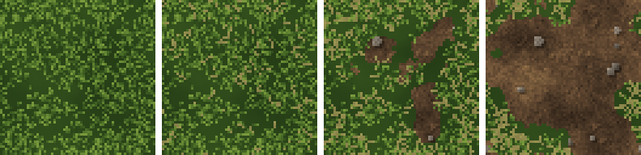

<!-- generated by "npm run docs" from the template schema: do not edit -->

# `grass`

Grass for floors: blades over a dark ground, worn to bare earth with age.


Category: [grounds](../catalog.md#grounds).

Own size: 64 × 64 pixels. Parameters marked **layout** are expressed at this size and scale with the patch; **detail** parameters are real pixels and never scale. See [Layout and detail](../concepts.md#layout-and-detail).

## Parameters

### General

| Parameter | Type                            | Default    | Scale  | Description                                                                               |
| --------- | ------------------------------- | ---------- | ------ | ----------------------------------------------------------------------------------------- |
| `size`    | [width, height] of integers > 0 | `[64, 64]` | —      | own size of the patch, in pixels                                                          |
| `patches` | number > 0                      | `3`        | layout | patches of lighter and darker grass, and of bare earth, across the patch                  |
| `age`     | number in [0, 1]                | `0.3`      | —      | overall wear, from 0 (lush) to 1 (trampled and dry): sets every wear parameter left unset |
| `bare`    | number in [0, 1]                | from `age` | —      | share of the ground worn down to bare earth, in [0, 1]                                    |
| `dryness` | number in [0, 1]                | from `age` | —      | share of the blades dried to straw, in [0, 1]                                             |

### `blades`

Blades of grass, seen from above, their tips catching the light.

| Parameter        | Type                            | Default                                        | Scale  | Description                             |
| ---------------- | ------------------------------- | ---------------------------------------------- | ------ | --------------------------------------- |
| `blades.density` | number ≥ 0                      | `360`                                          | —      | blades per 32 × 32 pixels               |
| `blades.length`  | [min, max] of numbers ≥ 1       | `[2, 4]`                                       | detail | [min, max] length of a blade, in pixels |
| `blades.palette` | array of CSS colors, at least 2 | `["#15240d", "#2b4519", "#4a6d27", "#7a9a3c"]` | —      | greens, from the roots to the lit tips  |

### `dirt`

Bare earth: blotches, clods and pebbles.

| Parameter       | Type                            | Default                                        | Scale  | Description                                           |
| --------------- | ------------------------------- | ---------------------------------------------- | ------ | ----------------------------------------------------- |
| `dirt.palette`  | array of CSS colors, at least 2 | `["#2e2217", "#4a3726", "#654b33", "#80623f"]` | —      | colors of the earth, from darkest to lightest         |
| `dirt.blotches` | number > 0                      | `4`                                            | layout | large blotches across the patch                       |
| `dirt.contrast` | number in [0, 1]                | `0.6`                                          | —      | spread of the blotches over the palette               |
| `dirt.clods`    | number ≥ 0                      | `8`                                            | —      | lighter lumps of earth per 32 × 32 pixels             |
| `dirt.pebbles`  | number ≥ 0                      | `3`                                            | —      | pebbles per 32 × 32 pixels                            |
| `dirt.grain`    | number in [0, 1]                | `0.14`                                         | detail | random brightness variation between pixels, in [0, 1] |
| `dirt.wetness`  | number in [0, 1]                | `0`                                            | —      | damp earth, darker, in [0, 1]                         |

### `flowers`

Small flowers strewn in the grass.

| Parameter         | Type                            | Default                             | Scale | Description                             |
| ----------------- | ------------------------------- | ----------------------------------- | ----- | --------------------------------------- |
| `flowers.density` | number ≥ 0                      | `0`                                 | —     | flowers per 32 × 32 pixels              |
| `flowers.colors`  | array of CSS colors, at least 1 | `["#ece6d2", "#e2c93c", "#b8466a"]` | —     | colors of the flowers, picked at random |

## Usage

`grass` is a ground, for floors: tufts of blades seen from above, dark at their roots and
lit at their tips, over a dark ground, in patches of lighter and darker green.

- As it ages, the grass wears down to patches of bare earth (`bare`), the blades thinning
  out at their edges, and dries to straw (`dryness`): a young lawn is lush, an old one
  mostly earth. Their earth is set by the `dirt` group, like [`dirt`](dirt.md).
- `flowers.density` strews small flowers of `flowers.colors`, never on bare earth.

```json
{ "template": "grass", "age": 0.6, "flowers": { "density": 4 } }
```

## Aging

`age`, from 0 (new) to 1 (ruined), sets every wear parameter left unset. Values in
between are interpolated linearly between age 0, 0.3 (the default) and 1. Parameters set
explicitly always win: `{ "age": 0.8, "stains": { "ratio": 0 } }` is a ruined wall
without streaks. See [Aging](../concepts.md#aging).



With its default parameters, `grass` derives:

| Parameter | age 0 | age 0.3 | age 0.6 | age 1 |
| --------- | ----- | ------- | ------- | ----- |
| `bare`    | 0.02  | 0.12    | 0.3     | 0.55  |
| `dryness` | 0     | 0.1     | 0.27    | 0.5   |

## Example

```json
{
  "$schema": "../../schemas/patch.schema.json",
  "template": "grass",
  "size": [64, 64]
}
```
