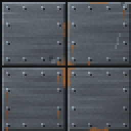
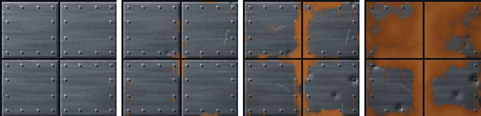

<!-- generated by "npm run docs" from the template schema: do not edit -->

# `metal`

Metal wall of riveted plates, rusting and dented with age.



Own size: 64 × 64 pixels. Parameters marked **layout** are expressed at this size and scale with the patch; **detail** parameters are real pixels and never scale. See [Layout and detail](../concepts.md#layout-and-detail).

## Parameters

### General

| Parameter   | Type                            | Default    | Scale | Description                                                                          |
| ----------- | ------------------------------- | ---------- | ----- | ------------------------------------------------------------------------------------ |
| `size`      | [width, height] of integers > 0 | `[64, 64]` | —     | own size of the patch in pixels; layout values are expressed at this size            |
| `age`       | number in [0, 1]                | `0.3`      | —     | overall weathering, from 0 (new) to 1 (ruined): sets every wear parameter left unset |
| `scratches` | number ≥ 0                      | from `age` | —     | scratches per 32 × 32 pixels                                                         |
| `tarnish`   | number in [0, 1]                | from `age` | —     | dulled, darkened metal, in [0, 1]                                                    |

### `rows`

Rows of plates.

| Parameter              | Type             | Default | Scale  | Description                                     |
| ---------------------- | ---------------- | ------- | ------ | ----------------------------------------------- |
| `rows.count`           | integer ≥ 1      | `2`     | layout | number of rows of plates                        |
| `rows.heightVariation` | number in [0, 1) | `0`     | layout | random height variation between rows, in [0, 1) |

### `blocks`

Plates within a row.

| Parameter               | Type                      | Default    | Scale  | Description                                                                                              |
| ----------------------- | ------------------------- | ---------- | ------ | -------------------------------------------------------------------------------------------------------- |
| `blocks.width`          | [min, max] of numbers > 0 | `[32, 32]` | layout | [min, max] plate width                                                                                   |
| `blocks.minJointOffset` | number ≥ 0                | `4`        | layout | minimum horizontal distance between a seam and the seams of adjacent rows (random bond only)             |
| `blocks.bond`           | string                    | `"stack"`  | —      | stack: equal plates, seams aligned; running: rows offset by half a plate; random: plates of random width |

### `panel`

A large stone slab: room for an inscription or a switch.

| Parameter       | Type        | Default  | Scale  | Description                                                                                              |
| --------------- | ----------- | -------- | ------ | -------------------------------------------------------------------------------------------------------- |
| `panel.enabled` | boolean     | `false`  | —      | adds a large stone slab to the wall, surrounded by mortar                                                |
| `panel.width`   | number > 0  | `40`     | layout | slab width, mortar included                                                                              |
| `panel.height`  | number > 0  | `32`     | layout | slab height, mortar included                                                                             |
| `panel.x`       | number ≥ 0  | centered | layout | left edge of the slab                                                                                    |
| `panel.y`       | number ≥ 0  | centered | layout | top edge of the slab                                                                                     |
| `panel.snap`    | boolean     | `true`   | —      | aligns the top and bottom of the slab on the nearest row joints, so that no row is cut into a thin strip |
| `panel.bevel`   | integer ≥ 0 | `2`      | detail | bevel width of the slab, in pixels                                                                       |
| `panel.shade`   | number ≥ 0  | `1.05`   | —      | brightness factor of the slab                                                                            |

### `seam`

Seams between plates.

| Parameter    | Type        | Default     | Scale  | Description               |
| ------------ | ----------- | ----------- | ------ | ------------------------- |
| `seam.size`  | integer ≥ 0 | `1`         | detail | seam thickness, in pixels |
| `seam.color` | CSS color   | `"#0e1012"` | —      | seam color                |

### `bevel`

Plate edges lit from the top-left.

| Parameter     | Type        | Default | Scale  | Description                                     |
| ------------- | ----------- | ------- | ------ | ----------------------------------------------- |
| `bevel.size`  | integer ≥ 0 | `1`     | detail | bevel width, in pixels                          |
| `bevel.light` | number ≥ 0  | `1.3`   | —      | brightness factor of the top and left edges     |
| `bevel.dark`  | number ≥ 0  | `0.65`  | —      | brightness factor of the bottom and right edges |

### `metal`

Metal surface.

| Parameter              | Type                            | Default                                        | Scale  | Description                                           |
| ---------------------- | ------------------------------- | ---------------------------------------------- | ------ | ----------------------------------------------------- |
| `metal.palette`        | array of CSS colors, at least 2 | `["#2b2f33", "#474d53", "#687077", "#8f979e"]` | —      | metal colors, from darkest to lightest                |
| `metal.sheen`          | number in [0, 1]                | `0.3`                                          | —      | sheen across each plate, lighter towards the top-left |
| `metal.brushed`        | number in [0, 1]                | `0.15`                                         | —      | horizontal brushed streaks, in [0, 1]                 |
| `metal.shadeVariation` | number in [0, 1]                | `0.08`                                         | —      | random brightness variation between plates, in [0, 1] |
| `metal.grain`          | number in [0, 1]                | `0.03`                                         | detail | random brightness variation between pixels, in [0, 1] |

### `rivets`

Rivets fixing the plates, lit from the top-left.

| Parameter        | Type        | Default | Scale  | Description                                            |
| ---------------- | ----------- | ------- | ------ | ------------------------------------------------------ |
| `rivets.enabled` | boolean     | `true`  | —      | rivets along the plate edges                           |
| `rivets.spacing` | integer ≥ 2 | `8`     | detail | distance between rivets along an edge, in pixels       |
| `rivets.inset`   | integer ≥ 0 | `2`     | detail | distance of the rivets from the plate edges, in pixels |

### `rust`

Rust.

| Parameter       | Type                            | Default                                        | Scale  | Description                                         |
| --------------- | ------------------------------- | ---------------------------------------------- | ------ | --------------------------------------------------- |
| `rust.coverage` | number in [0, 1]                | from `age`                                     | —      | share of the surface rusted, growing from the seams |
| `rust.palette`  | array of CSS colors, at least 2 | `["#3a1c0c", "#6b3314", "#9a4e1e", "#bf6e2e"]` | —      | rust colors, from darkest to lightest               |
| `rust.streaks`  | number in [0, 1]                | from `age`                                     | —      | ratio of rivets with a rust streak running down     |
| `rust.length`   | [min, max] of numbers ≥ 0       | from `age`                                     | detail | [min, max] length of the rust streaks, in pixels    |

### `dents`

Dents, shaded against the light.

| Parameter       | Type                      | Default    | Scale  | Description                       |
| --------------- | ------------------------- | ---------- | ------ | --------------------------------- |
| `dents.density` | number ≥ 0                | from `age` | —      | dents per 32 × 32 pixels          |
| `dents.size`    | [min, max] of numbers ≥ 0 | from `age` | detail | [min, max] dent radius, in pixels |

## Anchors

| Anchor        | Points                                                                |
| ------------- | --------------------------------------------------------------------- |
| `rows`        | left edge and top of the plate faces of each row, just below the seam |
| `plates`      | top-left corner of the face of each plate, row by row                 |
| `panel`       | top-left corner of the face of the panel, when enabled                |
| `panelCenter` | center of the face of the panel, when enabled                         |

## Plates, rivets and panel

`metal` lays plates like the stone walls lay stones: `rows` and `blocks` work the same
way, with a stack bond by default (`blocks.bond`: `stack`, `running` or `random`), and
thin seams (`seam.size`). Each plate has a soft sheen, lighter towards the top-left, and
brushed horizontal streaks.

Rivets are placed along the edges of every plate, every `rivets.spacing` pixels, and at
its corners. Like the other walls, `metal` has a `panel`: a larger plate, with its own
rivets, reported by the `panel` and `panelCenter` anchors.

As it ages, rust grows from the seams (`rust.coverage`) and runs down from rivets
(`rust.streaks`), the plates get dents, shaded against the light, and scratches, and the
metal dulls (`tarnish`). `rust.palette` sets the rust colors, `metal.palette` the metal
ones: a bronze or copper palette works too.

## Aging

`age`, from 0 (new) to 1 (ruined), sets every wear parameter left unset. Values in
between are interpolated linearly between age 0, 0.3 (the default) and 1. Parameters set
explicitly always win: `{ "age": 0.8, "stains": { "ratio": 0 } }` is a ruined wall
without streaks. See [Aging](../concepts.md#aging).



With its default parameters, `metal` derives:

| Parameter       | age 0  | age 0.3  | age 0.6       | age 1   |
| --------------- | ------ | -------- | ------------- | ------- |
| `rust.coverage` | 0      | 0.08     | 0.26          | 0.5     |
| `rust.streaks`  | 0      | 0.15     | 0.34          | 0.6     |
| `rust.length`   | [2, 4] | [3, 8]   | [4.29, 12.29] | [6, 18] |
| `dents.density` | 0      | 0.5      | 1.57          | 3       |
| `dents.size`    | [1, 2] | [1.5, 3] | [1.71, 3.86]  | [2, 5]  |
| `scratches`     | 0      | 0.5      | 1.36          | 2.5     |
| `tarnish`       | 0      | 0.1      | 0.21          | 0.35    |

## Example

```json
{
  "$schema": "../../schemas/patch.schema.json",
  "template": "metal",
  "size": [64, 64]
}
```
