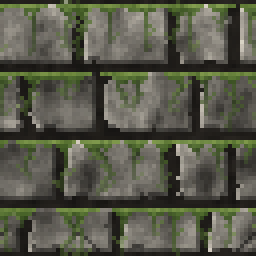

<!-- generated by "npm run docs" from the template schema: do not edit -->

# `moss`

Transparent overlay of greenish vines hanging from the top edge. This template is an **overlay**: transparent by design, meant to be laid over another patch.



Own size: 64 × 16 pixels. Parameters marked **layout** are expressed at this size and scale with the patch; **detail** parameters are real pixels and never scale. See [Layout and detail](../concepts.md#layout-and-detail).

## Parameters

### General

| Parameter | Type                            | Default    | Scale | Description                                                               |
| --------- | ------------------------------- | ---------- | ----- | ------------------------------------------------------------------------- |
| `size`    | [width, height] of integers > 0 | `[64, 16]` | —     | own size of the patch in pixels; layout values are expressed at this size |

### `vines`

Vines hanging from the top edge.

| Parameter         | Type                      | Default   | Scale  | Description                                                     |
| ----------------- | ------------------------- | --------- | ------ | --------------------------------------------------------------- |
| `vines.count`     | integer ≥ 0               | `9`       | layout | number of vines across the patch                                |
| `vines.length`    | [min, max] of numbers ≥ 0 | `[3, 16]` | layout | [min, max] vine length, clamped to the patch height             |
| `vines.sway`      | number ≥ 0                | `1.5`     | layout | maximum horizontal wander of a vine                             |
| `vines.thickness` | number ≥ 1                | `1`       | detail | vine width at the top, in pixels; vines taper towards their tip |

### `leaves`

Leaves sprouting from the vines.

| Parameter      | Type                      | Default  | Scale  | Description                                         |
| -------------- | ------------------------- | -------- | ------ | --------------------------------------------------- |
| `leaves.ratio` | number in [0, 1]          | `0.3`    | —      | chance of a leaf at each pixel of a vine, in [0, 1] |
| `leaves.size`  | [min, max] of numbers ≥ 0 | `[1, 2]` | detail | [min, max] leaf length, in pixels                   |

### `ledge`

Moss cushion along the top edge.

| Parameter        | Type             | Default | Scale  | Description                                                                    |
| ---------------- | ---------------- | ------- | ------ | ------------------------------------------------------------------------------ |
| `ledge.size`     | number ≥ 0       | `3`     | detail | maximum cushion thickness, in pixels                                           |
| `ledge.coverage` | number in [0, 1] | `0.5`   | —      | ratio of the edge covered by the cushion, in [0, 1]; vines always grow a clump |
| `ledge.clump`    | number ≥ 0       | `3`     | detail | half width of the clump at the top of each vine, in pixels                     |

### `moss`

Moss color.

| Parameter      | Type                            | Default                                        | Scale  | Description                                             |
| -------------- | ------------------------------- | ---------------------------------------------- | ------ | ------------------------------------------------------- |
| `moss.palette` | array of CSS colors, at least 2 | `["#17230f", "#2f441b", "#4f6d2c", "#86a24a"]` | —      | moss colors, from darkest to lightest                   |
| `moss.alpha`   | number in [0, 1]                | `0.9`                                          | —      | alpha of the moss, in [0, 1]                            |
| `moss.fade`    | number in [0, 1]                | `0.6`                                          | —      | alpha lost from the top of a vine to its tip, in [0, 1] |
| `moss.grain`   | number in [0, 1]                | `0.1`                                          | detail | random brightness variation between pixels, in [0, 1]   |

## Usage

`moss` is an overlay: it is transparent outside the moss, and meant to be anchored under
the joints of a wall, one patch per row of stones:

```jsonc
{
  "patch": "./patches/moss.json",
  "anchor": { "to": "wall", "at": "rows" },
  "width": 100,
  "height": 25,
}
```

As an overlay, it never hides the anchor points of the patches under it. See
[Anchors](../texture-files.md#anchors).

## Example

```json
{
  "$schema": "../../schemas/patch.schema.json",
  "template": "moss",
  "size": [64, 16]
}
```
