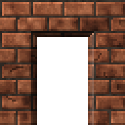

<!-- generated by "npm run docs" from the template schema: do not edit -->

# `opening`

Rectangular opening dug into the wall below, for windows, bars or arches. This template is an **overlay**: transparent by design, meant to be laid over another patch.



Own size: 32 × 32 pixels. Parameters marked **layout** are expressed at this size and scale with the patch; **detail** parameters are real pixels and never scale. See [Layout and detail](../concepts.md#layout-and-detail).

## Parameters

### General

| Parameter | Type                            | Default    | Scale  | Description                                                                                    |
| --------- | ------------------------------- | ---------- | ------ | ---------------------------------------------------------------------------------------------- |
| `size`    | [width, height] of integers > 0 | `[32, 32]` | —      | own size of the opening, reveals included                                                      |
| `depth`   | integer ≥ 0                     | `4`        | detail | width of the reveals, the inner faces of the cut, in pixels                                    |
| `open`    | array of strings                | `[]`       | —      | sides without a reveal, the opening running to the edge of the patch: ["bottom"] for a doorway |

### `reveals`

Inner faces of the cut: the wall below, shaded; from -1 (black) to 1 (white), the light coming from the top-left.

| Parameter         | Type              | Default | Scale | Description                                               |
| ----------------- | ----------------- | ------- | ----- | --------------------------------------------------------- |
| `reveals.top`     | number in [-1, 1] | `-0.6`  | —     | shading of the top reveal, in shadow                      |
| `reveals.left`    | number in [-1, 1] | `-0.45` | —     | shading of the left reveal, in shadow                     |
| `reveals.right`   | number in [-1, 1] | `0.2`   | —     | shading of the right reveal, lit                          |
| `reveals.bottom`  | number in [-1, 1] | `0.3`   | —     | shading of the bottom reveal (the sill), lit              |
| `reveals.falloff` | number in [0, 1]  | `0.2`   | —     | extra darkness of the reveals towards the back, in [0, 1] |

### `back`

Back of the opening.

| Parameter    | Type             | Default     | Scale | Description                                                                                      |
| ------------ | ---------------- | ----------- | ----- | ------------------------------------------------------------------------------------------------ |
| `back.mode`  | string           | `"cut"`     | —     | cut: erased, transparent in the texture; shade: the wall below, darkened; color: an opaque color |
| `back.shade` | number in [0, 1] | `0.7`       | —     | darkening of the wall below, in shade mode                                                       |
| `back.color` | CSS color        | `"#0a0806"` | —     | color of the back, in color mode                                                                 |

### `edges`

Irregularity of the outline.

| Parameter         | Type       | Default | Scale  | Description                                                   |
| ----------------- | ---------- | ------- | ------ | ------------------------------------------------------------- |
| `edges.roughness` | number ≥ 0 | `0`     | detail | maximum displacement of the outline of the opening, in pixels |

## Anchors

| Anchor          | Points                                                         |
| --------------- | -------------------------------------------------------------- |
| `opening`       | top-left corner of the back of the opening, inside the reveals |
| `openingCenter` | center of the opening                                          |

## Usage

`opening` is an overlay placed over a wall: the whole patch is the opening, placed and
sized like any patch, or anchored, on a `panel` slab for instance. It draws:

- **reveals**, the inner faces of the cut, `depth` pixels wide: the wall below, darkened
  or lightened (`reveals.*`, from -1 to 1), so that they are made of the wall's own
  material. With the light coming from the top-left, the top and left reveals are in
  shadow, the right and bottom ones lit;
- a **back**, depending on `back.mode`: `cut` erases the wall, leaving the texture
  transparent there (the PNG keeps its alpha, like the masked textures of Doom);
  `shade` darkens the wall for a shallow niche; `color` fills it with an opaque color.

`open` lists the sides without a reveal, where the opening runs to the edge of the patch:
`["bottom"]` for a doorway or an arch reaching the floor.

Patches drawn afterwards fill the hole: windows, bars, fences... Anchor them to
`opening` (top-left of the back) or `openingCenter`:

```json
{
  "size": [64, 128],
  "patches": [
    { "id": "wall", "patch": { "template": "bricks", "size": [64, 128], "rows": { "count": 16 } } },
    {
      "id": "door",
      "patch": { "template": "opening", "depth": 5, "open": ["bottom"] },
      "x": 18.75,
      "y": 25,
      "width": 62.5,
      "height": 75
    },
    {
      "patch": "./patches/bars.json",
      "anchor": { "to": "door", "at": "opening" }
    }
  ]
}
```

## Example

```json
{
  "$schema": "../../schemas/patch.schema.json",
  "template": "opening",
  "size": [32, 32]
}
```
