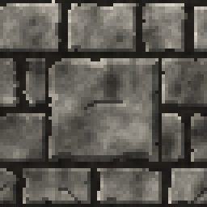
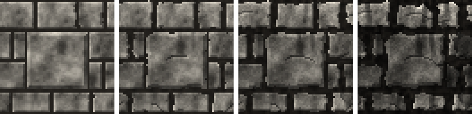

<!-- generated by "npm run docs" from the template schema: do not edit -->

# `panel`

Ashlar wall with a large stone slab, room for an inscription or a switch.



Own size: 64 × 64 pixels. Parameters marked **layout** are expressed at this size and scale with the patch; **detail** parameters are real pixels and never scale. See [Layout and detail](../concepts.md#layout-and-detail).

## Parameters

### General

| Parameter | Type                            | Default    | Scale | Description                                                                          |
| --------- | ------------------------------- | ---------- | ----- | ------------------------------------------------------------------------------------ |
| `size`    | [width, height] of integers > 0 | `[64, 64]` | —     | own size of the patch in pixels; layout values are expressed at this size            |
| `age`     | number in [0, 1]                | `0.3`      | —     | overall weathering, from 0 (new) to 1 (ruined): sets every wear parameter left unset |

### `rows`

Horizontal courses of stones.

| Parameter              | Type             | Default | Scale  | Description                                     |
| ---------------------- | ---------------- | ------- | ------ | ----------------------------------------------- |
| `rows.count`           | integer ≥ 1      | `4`     | layout | number of horizontal courses of stones          |
| `rows.heightVariation` | number in [0, 1) | `0.2`   | layout | random height variation between rows, in [0, 1) |

### `blocks`

Stones within a row.

| Parameter               | Type                      | Default    | Scale  | Description                                                                                                             |
| ----------------------- | ------------------------- | ---------- | ------ | ----------------------------------------------------------------------------------------------------------------------- |
| `blocks.width`          | [min, max] of numbers > 0 | `[14, 30]` | layout | [min, max] stone width                                                                                                  |
| `blocks.minJointOffset` | number ≥ 0                | `5`        | layout | minimum horizontal distance between a joint and the joints of adjacent rows (random bond only)                          |
| `blocks.bond`           | string                    | `"random"` | —      | random: stones of random width; running: equal bricks, rows offset by half a brick; stack: equal bricks, joints aligned |

### `panel`

A large stone slab: room for an inscription or a switch.

| Parameter       | Type        | Default  | Scale  | Description                                                                                              |
| --------------- | ----------- | -------- | ------ | -------------------------------------------------------------------------------------------------------- |
| `panel.enabled` | boolean     | `true`   | —      | adds a large stone slab to the wall, surrounded by mortar                                                |
| `panel.width`   | number > 0  | `36`     | layout | slab width, mortar included                                                                              |
| `panel.height`  | number > 0  | `30`     | layout | slab height, mortar included                                                                             |
| `panel.x`       | number ≥ 0  | centered | layout | left edge of the slab                                                                                    |
| `panel.y`       | number ≥ 0  | centered | layout | top edge of the slab                                                                                     |
| `panel.snap`    | boolean     | `true`   | —      | aligns the top and bottom of the slab on the nearest row joints, so that no row is cut into a thin strip |
| `panel.bevel`   | integer ≥ 0 | `2`      | detail | bevel width of the slab, in pixels                                                                       |
| `panel.shade`   | number ≥ 0  | `1.08`   | —      | brightness factor of the slab                                                                            |

### `mortar`

Joints between stones.

| Parameter        | Type             | Default     | Scale  | Description                                                              |
| ---------------- | ---------------- | ----------- | ------ | ------------------------------------------------------------------------ |
| `mortar.size`    | integer ≥ 0      | `2`         | detail | joint thickness, in pixels                                               |
| `mortar.color`   | CSS color        | `"#24211d"` | —      | mortar color                                                             |
| `mortar.noise`   | number in [0, 1] | from `age`  | —      | brightness variation of the mortar, in [0, 1]                            |
| `mortar.erosion` | number in [0, 1] | from `age`  | —      | hollowed joints: darker, pitted mortar shadowed by the stones, in [0, 1] |

### `bevel`

Stone edges lit from the top-left.

| Parameter     | Type        | Default | Scale  | Description                                     |
| ------------- | ----------- | ------- | ------ | ----------------------------------------------- |
| `bevel.size`  | integer ≥ 0 | `1`     | detail | bevel width, in pixels                          |
| `bevel.light` | number ≥ 0  | `1.3`   | —      | brightness factor of the top and left edges     |
| `bevel.dark`  | number ≥ 0  | `0.6`   | —      | brightness factor of the bottom and right edges |

### `edges`

Irregularity of stone outlines.

| Parameter         | Type       | Default    | Scale  | Description                                           |
| ----------------- | ---------- | ---------- | ------ | ----------------------------------------------------- |
| `edges.roughness` | number ≥ 0 | from `age` | detail | maximum displacement of the stone outlines, in pixels |

### `chips`

Broken stone corners.

| Parameter     | Type                      | Default    | Scale  | Description                        |
| ------------- | ------------------------- | ---------- | ------ | ---------------------------------- |
| `chips.ratio` | number in [0, 1]          | from `age` | —      | ratio of chipped stones, in [0, 1] |
| `chips.size`  | [min, max] of numbers ≥ 0 | from `age` | detail | [min, max] chip size, in pixels    |

### `cracks`

Cracks running across stones.

| Parameter       | Type                      | Default    | Scale  | Description                        |
| --------------- | ------------------------- | ---------- | ------ | ---------------------------------- |
| `cracks.ratio`  | number in [0, 1]          | from `age` | —      | ratio of cracked stones, in [0, 1] |
| `cracks.length` | [min, max] of numbers ≥ 0 | from `age` | detail | [min, max] crack length, in pixels |

### `erosion`

Stones worn down by time: rounded corners, uneven edges.

| Parameter         | Type       | Default    | Scale  | Description                                        |
| ----------------- | ---------- | ---------- | ------ | -------------------------------------------------- |
| `erosion.corners` | number ≥ 0 | from `age` | detail | radius of the rounded stone corners, in pixels     |
| `erosion.edges`   | number ≥ 0 | from `age` | detail | maximum depth worn into the stone edges, in pixels |

### `stains`

Dirt: streaks of rainwater and soot, grime.

| Parameter         | Type                      | Default    | Scale  | Description                                                |
| ----------------- | ------------------------- | ---------- | ------ | ---------------------------------------------------------- |
| `stains.ratio`    | number in [0, 1]          | from `age` | —      | chance of a streak running down from the top of each stone |
| `stains.length`   | [min, max] of numbers ≥ 0 | from `age` | layout | [min, max] streak length                                   |
| `stains.width`    | number ≥ 1                | from `age` | detail | streak width, in pixels                                    |
| `stains.darkness` | number in [0, 1]          | from `age` | —      | darkening at the top of a streak, in [0, 1]                |
| `stains.grime`    | number in [0, 1]          | from `age` | —      | blotchy darkening of the whole wall, in [0, 1]             |

### `spalling`

Flaked stone faces.

| Parameter        | Type                      | Default    | Scale  | Description                                              |
| ---------------- | ------------------------- | ---------- | ------ | -------------------------------------------------------- |
| `spalling.ratio` | number in [0, 1]          | from `age` | —      | ratio of stones with a flaked, recessed patch, in [0, 1] |
| `spalling.size`  | [min, max] of numbers ≥ 0 | from `age` | detail | [min, max] patch radius, in pixels                       |
| `spalling.depth` | number in [0, 1]          | from `age` | —      | darkening of the flaked patches, in [0, 1]               |

### `moss`

Moss growing along the top edges of the stones.

| Parameter       | Type                            | Default                                        | Scale  | Description                                                      |
| --------------- | ------------------------------- | ---------------------------------------------- | ------ | ---------------------------------------------------------------- |
| `moss.coverage` | number in [0, 1]                | `0`                                            | —      | share of the stone tops covered with moss, in [0, 1]; 0 for none |
| `moss.depth`    | number ≥ 0                      | `2`                                            | detail | thickness of the moss along the top edges, in pixels             |
| `moss.vines`    | number in [0, 1]                | `0.25`                                         | —      | chance of a vine hanging from each column of moss, in [0, 1]     |
| `moss.length`   | [min, max] of numbers ≥ 0       | `[2, 7]`                                       | detail | [min, max] length of the vines, in pixels                        |
| `moss.joints`   | number in [0, 1]                | `0.3`                                          | —      | moss in the joints where the stones are mossy, in [0, 1]         |
| `moss.palette`  | array of CSS colors, at least 2 | `["#17230f", "#2f441b", "#4f6d2c", "#86a24a"]` | —      | moss colors, from darkest to lightest                            |

### `stone`

Stone surface.

| Parameter                 | Type                            | Default                                        | Scale  | Description                                             |
| ------------------------- | ------------------------------- | ---------------------------------------------- | ------ | ------------------------------------------------------- |
| `stone.palette`           | array of CSS colors, at least 2 | `["#34322e", "#5a5751", "#7e7a72", "#a39e94"]` | —      | stone colors, from darkest to lightest                  |
| `stone.contrast`          | number ≥ 0                      | `0.9`                                          | —      | spread of the surface noise over the palette            |
| `stone.shadeVariation`    | number in [0, 1]                | from `age`                                     | —      | random brightness variation between stones, in [0, 1]   |
| `stone.paletteShift`      | number in [0, 1]                | `0.1`                                          | —      | random shift of each stone along the palette, in [0, 1] |
| `stone.grain`             | number in [0, 1]                | from `age`                                     | detail | random brightness variation between pixels, in [0, 1]   |
| `stone.noise.period`      | integer ≥ 1                     | `8`                                            | layout | noise cells across the patch at the first octave        |
| `stone.noise.octaves`     | integer in [1, 16]              | `4`                                            | —      | number of noise octaves, each one twice as fine         |
| `stone.noise.persistence` | number in (0, 1]                | `0.6`                                          | —      | weight ratio between an octave and the previous one     |

## Anchors

| Anchor        | Points                                                                  |
| ------------- | ----------------------------------------------------------------------- |
| `rows`        | left edge and top of the stone faces of each row, just below the mortar |
| `stones`      | top-left corner of the face of each stone, row by row                   |
| `panel`       | top-left corner of the face of the panel, when enabled                  |
| `panelCenter` | center of the face of the panel, when enabled                           |

## The slab

`panel` is the [`ashlar`](ashlar.md) engine with its slab enabled: a large stone surrounded
by mortar, the joints of the wall stopping at its border and the stones around it cut to
fit. Every wall has the `panel` parameters: `{ "panel": { "enabled": true } }` adds a slab
to `ashlar` or [`bricks`](bricks.md) too.

- `panel.x`, `panel.y`, `panel.width` and `panel.height` are layout values, mortar
  included: they scale with the patch. Without `x` or `y`, the slab is centered on that
  axis.
- `panel.snap` (on by default) moves the top and the bottom of the slab to the nearest row
  joints, so that no row is cut into a thin strip: the slab height may change to match
  whole rows. Set it to `false` to keep the exact height.
- The slab ages with the wall: `age` chips its corners, cracks it and stains it.

## Usage

The slab leaves room for an inscription, a switch or a sign, placed with the `panel` or
`panelCenter` anchors. An anchor places the top-left corner of each copy on its point:
to center a 16 × 16 switch on the slab of a 64 × 64 texture, shift it by half its size:

```jsonc
{
  "size": [64, 64],
  "patches": [
    { "id": "wall", "patch": { "template": "panel" }, "width": 100, "height": 100 },
    {
      "patch": "./patches/switch.json",
      "anchor": { "to": "wall", "at": "panelCenter", "offset": [-8, -8] },
      "width": 25,
      "height": 25,
    },
  ],
}
```

## Aging

`age`, from 0 (new) to 1 (ruined), sets every wear parameter left unset. Values in
between are interpolated linearly between age 0, 0.3 (the default) and 1. Parameters set
explicitly always win: `{ "age": 0.8, "stains": { "ratio": 0 } }` is a ruined wall
without streaks. See [Aging](../concepts.md#aging).



Derived sizes in pixels are proportional to the height of the stones at own size, 16
pixels giving the values of `ashlar`. With its default parameters, `panel` derives:

| Parameter              | age 0   | age 0.3 | age 0.6       | age 1    |
| ---------------------- | ------- | ------- | ------------- | -------- |
| `edges.roughness`      | 0.3     | 0.8     | 1.06          | 1.4      |
| `chips.ratio`          | 0       | 0.25    | 0.49          | 0.8      |
| `chips.size`           | [1, 2]  | [2, 4]  | [2.43, 5.71]  | [3, 8]   |
| `cracks.ratio`         | 0       | 0.2     | 0.44          | 0.75     |
| `cracks.length`        | [3, 6]  | [5, 12] | [7.14, 18]    | [10, 26] |
| `stone.grain`          | 0.03    | 0.06    | 0.09          | 0.14     |
| `stone.shadeVariation` | 0.05    | 0.1     | 0.15          | 0.22     |
| `mortar.noise`         | 0.1     | 0.25    | 0.38          | 0.55     |
| `mortar.erosion`       | 0       | 0.2     | 0.46          | 0.8      |
| `erosion.corners`      | 0       | 1       | 2.29          | 4        |
| `erosion.edges`        | 0       | 0.5     | 1.36          | 2.5      |
| `stains.ratio`         | 0       | 0.15    | 0.39          | 0.7      |
| `stains.length`        | [4, 10] | [6, 16] | [8.57, 26.29] | [12, 40] |
| `stains.width`         | 1       | 2       | 2.43          | 3        |
| `stains.darkness`      | 0.15    | 0.25    | 0.36          | 0.5      |
| `stains.grime`         | 0       | 0.1     | 0.23          | 0.4      |
| `spalling.ratio`       | 0       | 0.08    | 0.26          | 0.5      |
| `spalling.size`        | [2, 3]  | [2, 5]  | [2.86, 7.14]  | [4, 10]  |
| `spalling.depth`       | 0.2     | 0.25    | 0.34          | 0.45     |

## Example

```json
{
  "$schema": "../../schemas/patch.schema.json",
  "template": "panel",
  "size": [64, 64]
}
```
