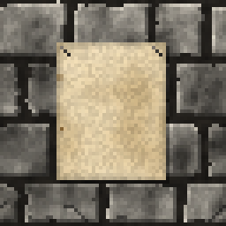
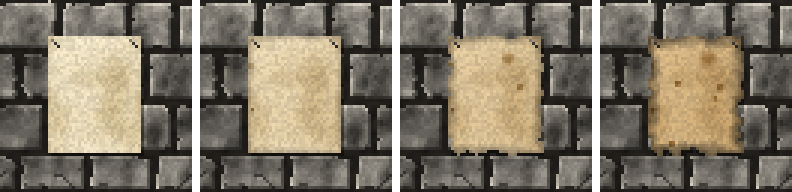

<!-- generated by "npm run docs" from the template schema: do not edit -->

# `parchment`

Sheet of parchment pinned on a wall, blank or aged, room for decals. This template is an **overlay**: transparent by design, meant to be laid over another patch.



Own size: 32 × 40 pixels. Parameters marked **layout** are expressed at this size and scale with the patch; **detail** parameters are real pixels and never scale. See [Layout and detail](../concepts.md#layout-and-detail).

## Parameters

### General

| Parameter   | Type                            | Default    | Scale  | Description                                                                        |
| ----------- | ------------------------------- | ---------- | ------ | ---------------------------------------------------------------------------------- |
| `size`      | [width, height] of integers > 0 | `[32, 40]` | —      | own size of the sheet, its shadow included                                         |
| `margin`    | integer ≥ 0                     | `3`        | detail | margin around the writing area, reported by the sheet anchor, in pixels            |
| `age`       | number in [0, 1]                | `0.3`      | —      | overall aging, from 0 (blank) to 1 (ancient): sets every wear parameter left unset |
| `yellowing` | number in [0, 1]                | from `age` | —      | paper turned yellow-brown, in [0, 1]                                               |

### `paper`

The paper.

| Parameter        | Type                            | Default                                        | Scale  | Description                                                  |
| ---------------- | ------------------------------- | ---------------------------------------------- | ------ | ------------------------------------------------------------ |
| `paper.palette`  | array of CSS colors, at least 2 | `["#b39d74", "#d2bf96", "#e6d9b8", "#f3ead3"]` | —      | paper colors, from darkest to lightest                       |
| `paper.contrast` | number ≥ 0                      | `0.5`                                          | —      | spread of the blotches over the palette                      |
| `paper.fiber`    | number in [0, 1]                | `0.08`                                         | detail | random brightness variation between pixels, the paper fibers |

### `shadow`

Shadow of the sheet on the wall, the light coming from the top-left.

| Parameter        | Type             | Default | Scale  | Description                                             |
| ---------------- | ---------------- | ------- | ------ | ------------------------------------------------------- |
| `shadow.offset`  | integer ≥ 0      | `1`     | detail | shadow cast on the wall, to the bottom-right, in pixels |
| `shadow.opacity` | number in [0, 1] | `0.45`  | —      | darkness of the shadow, in [0, 1]                       |

### `folds`

Creases of a sheet once folded.

| Parameter | Type        | Default | Scale | Description                     |
| --------- | ----------- | ------- | ----- | ------------------------------- |
| `folds.x` | integer ≥ 0 | `0`     | —     | number of vertical fold lines   |
| `folds.y` | integer ≥ 0 | `0`     | —     | number of horizontal fold lines |

### `pins`

Pins holding the sheet on the wall.

| Parameter      | Type        | Default     | Scale  | Description                                    |
| -------------- | ----------- | ----------- | ------ | ---------------------------------------------- |
| `pins.enabled` | boolean     | `true`      | —      | pins at the top corners                        |
| `pins.inset`   | integer ≥ 0 | `2`         | detail | distance of the pins from the edges, in pixels |
| `pins.color`   | CSS color   | `"#3a3632"` | —      | pin color                                      |

### `foxing`

Foxing: small brown age spots.

| Parameter        | Type                      | Default    | Scale  | Description                        |
| ---------------- | ------------------------- | ---------- | ------ | ---------------------------------- |
| `foxing.density` | number ≥ 0                | from `age` | —      | brown age spots per 32 × 32 pixels |
| `foxing.size`    | [min, max] of numbers ≥ 0 | from `age` | detail | [min, max] spot radius, in pixels  |

### `edges`

Edges of the sheet.

| Parameter         | Type             | Default    | Scale  | Description                                         |
| ----------------- | ---------------- | ---------- | ------ | --------------------------------------------------- |
| `edges.width`     | number ≥ 0       | from `age` | detail | width of the darkened edges, in pixels              |
| `edges.darkness`  | number in [0, 1] | from `age` | —      | darkening of the edges, in [0, 1]                   |
| `edges.roughness` | number ≥ 0       | from `age` | detail | maximum displacement of the torn outline, in pixels |

## Anchors

| Anchor        | Points                                                 |
| ------------- | ------------------------------------------------------ |
| `sheet`       | top-left corner of the writing area, inside the margin |
| `sheetCenter` | center of the sheet                                    |

## Usage

`parchment` is an overlay: a sheet pinned on a wall, placed and sized like any patch, or
anchored, on a `panel` slab for instance. The whole patch is the sheet and its shadow:
`shadow.offset` pixels are kept at the bottom and on the right for the shadow cast on the
wall, the light coming from the top-left.

The sheet is blank at `"age": 0`; as it ages, it yellows, gets foxing spots, darker
edges and a torn outline. `folds` adds the creases of a folded sheet, `pins` the pins
holding it.

It leaves room for decals, placed with its anchors: `sheet`, the top-left corner of the
writing area, inside the `margin`, and `sheetCenter`:

```json
{
  "size": [64, 64],
  "patches": [
    { "id": "wall", "patch": { "template": "panel" }, "width": 100, "height": 100 },
    {
      "id": "notice",
      "patch": { "template": "parchment", "size": [24, 20], "age": 0.6 },
      "anchor": { "to": "wall", "at": "panelCenter", "offset": [-12, -10] },
      "width": 37.5,
      "height": 31.25
    },
    { "patch": "./patches/decal.json", "anchor": { "to": "notice", "at": "sheet" } }
  ]
}
```

## Aging

`age`, from 0 (new) to 1 (ruined), sets every wear parameter left unset. Values in
between are interpolated linearly between age 0, 0.3 (the default) and 1. Parameters set
explicitly always win: `{ "age": 0.8, "stains": { "ratio": 0 } }` is a ruined wall
without streaks. See [Aging](../concepts.md#aging).



With its default parameters, `parchment` derives:

| Parameter         | age 0    | age 0.3  | age 0.6      | age 1    |
| ----------------- | -------- | -------- | ------------ | -------- |
| `yellowing`       | 0        | 0.25     | 0.49         | 0.8      |
| `foxing.density`  | 0        | 1.5      | 3.43         | 6        |
| `foxing.size`     | [0.5, 1] | [0.8, 2] | [0.89, 2.64] | [1, 3.5] |
| `edges.width`     | 1        | 2        | 2.86         | 4        |
| `edges.darkness`  | 0.05     | 0.2      | 0.35         | 0.55     |
| `edges.roughness` | 0.2      | 0.6      | 1.2          | 2        |

## Example

```json
{
  "$schema": "../../schemas/patch.schema.json",
  "template": "parchment",
  "size": [32, 40]
}
```
