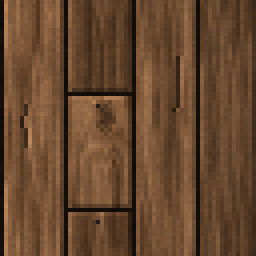
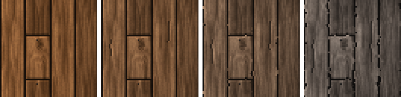

<!-- generated by "npm run docs" from the template schema: do not edit -->

# `planks`

Wall of vertical wooden planks of variable length.



Own size: 64 × 64 pixels. Parameters marked **layout** are expressed at this size and scale with the patch; **detail** parameters are real pixels and never scale. See [Layout and detail](../concepts.md#layout-and-detail).

## Parameters

### General

| Parameter    | Type                            | Default      | Scale | Description                                                                          |
| ------------ | ------------------------------- | ------------ | ----- | ------------------------------------------------------------------------------------ |
| `size`       | [width, height] of integers > 0 | `[64, 64]`   | —     | own size of the patch in pixels; layout values are expressed at this size            |
| `direction`  | string                          | `"vertical"` | —     | direction of the planks                                                              |
| `age`        | number in [0, 1]                | `0.3`        | —     | overall weathering, from 0 (new) to 1 (ruined): sets every wear parameter left unset |
| `weathering` | number in [0, 1]                | from `age`   | —     | wood turned silver-grey by the weather, in [0, 1]                                    |
| `grime`      | number in [0, 1]                | from `age`   | —     | blotchy darkening of the whole wall, in [0, 1]                                       |

### `lines`

Lines of planks across the patch, filling it exactly.

| Parameter              | Type             | Default | Scale  | Description                                                                                                                |
| ---------------------- | ---------------- | ------- | ------ | -------------------------------------------------------------------------------------------------------------------------- |
| `lines.count`          | integer ≥ 1      | `4`     | —      | number of lines of planks across the patch: columns of vertical planks, rows of horizontal ones; ignored when width is set |
| `lines.width`          | number > 0       | —       | layout | plank width, across the planks; when set, the lines are as many as this width fits in the patch                            |
| `lines.widthVariation` | number in [0, 1) | `0.1`   | layout | random width variation between lines, in [0, 1)                                                                            |

### `planks`

Planks within a line, filling it exactly.

| Parameter       | Type                            | Default    | Scale  | Description                                                                                                                                                                                 |
| --------------- | ------------------------------- | ---------- | ------ | ------------------------------------------------------------------------------------------------------------------------------------------------------------------------------------------- |
| `planks.length` | [min, max] of numbers in (0, 1] | `[0.3, 1]` | layout | [min, max] plank length, in fraction of the patch size along the planks (its height for vertical planks, its width for horizontal ones); [1, 1] gives planks running across the whole patch |

### `gap`

Gaps between planks.

| Parameter   | Type        | Default     | Scale  | Description                   |
| ----------- | ----------- | ----------- | ------ | ----------------------------- |
| `gap.size`  | integer ≥ 0 | `1`         | detail | gap between planks, in pixels |
| `gap.color` | CSS color   | `"#140d08"` | —      | gap color                     |

### `bevel`

Plank edges lit from the top-left.

| Parameter     | Type        | Default | Scale  | Description                                     |
| ------------- | ----------- | ------- | ------ | ----------------------------------------------- |
| `bevel.size`  | integer ≥ 0 | `1`     | detail | bevel width, in pixels                          |
| `bevel.light` | number ≥ 0  | `1.2`   | —      | brightness factor of the top and left edges     |
| `bevel.dark`  | number ≥ 0  | `0.7`   | —      | brightness factor of the bottom and right edges |

### `wood`

Wood surface.

| Parameter             | Type                            | Default                                        | Scale  | Description                                             |
| --------------------- | ------------------------------- | ---------------------------------------------- | ------ | ------------------------------------------------------- |
| `wood.palette`        | array of CSS colors, at least 2 | `["#3a2412", "#5e3b1f", "#7d5230", "#9c6b40"]` | —      | wood colors, from darkest to lightest                   |
| `wood.contrast`       | number ≥ 0                      | `0.8`                                          | —      | spread of the grain over the palette                    |
| `wood.grain`          | number > 0                      | `5`                                            | —      | number of grain streaks across a plank                  |
| `wood.shadeVariation` | number in [0, 1]                | `0.12`                                         | —      | random brightness variation between planks, in [0, 1]   |
| `wood.paletteShift`   | number in [0, 1]                | `0.12`                                         | —      | random shift of each plank along the palette, in [0, 1] |
| `wood.noise`          | number in [0, 1]                | `0.05`                                         | detail | random brightness variation between pixels, in [0, 1]   |

### `knots`

Knots in the wood.

| Parameter     | Type                      | Default    | Scale  | Description                                                  |
| ------------- | ------------------------- | ---------- | ------ | ------------------------------------------------------------ |
| `knots.ratio` | number in [0, 1]          | `0.25`     | —      | ratio of planks with a knot, in [0, 1]                       |
| `knots.size`  | [min, max] of numbers ≥ 0 | `[1.5, 3]` | detail | [min, max] knot radius, in pixels; the grain bends around it |

### `nails`

Nails at the ends of the planks.

| Parameter     | Type             | Default     | Scale  | Description                                          |
| ------------- | ---------------- | ----------- | ------ | ---------------------------------------------------- |
| `nails.ratio` | number in [0, 1] | `0.6`       | —      | chance of a nail at each end of a plank, in [0, 1]   |
| `nails.inset` | integer ≥ 0      | `2`         | detail | distance of the nails from the plank ends, in pixels |
| `nails.color` | CSS color        | `"#201c18"` | —      | nail color                                           |

### `splits`

Splits along the grain.

| Parameter       | Type                      | Default    | Scale  | Description                        |
| --------------- | ------------------------- | ---------- | ------ | ---------------------------------- |
| `splits.ratio`  | number in [0, 1]          | from `age` | —      | ratio of split planks, in [0, 1]   |
| `splits.length` | [min, max] of numbers ≥ 0 | from `age` | detail | [min, max] split length, in pixels |

### `edges`

Irregularity of plank outlines.

| Parameter         | Type       | Default    | Scale  | Description                                           |
| ----------------- | ---------- | ---------- | ------ | ----------------------------------------------------- |
| `edges.roughness` | number ≥ 0 | from `age` | detail | maximum displacement of the plank outlines, in pixels |

## Anchors

| Anchor   | Points                                                                                                             |
| -------- | ------------------------------------------------------------------------------------------------------------------ |
| `lines`  | start of each line of plank faces: top of each column of vertical planks, left of each row of horizontal ones      |
| `planks` | top-left corner of the face of each plank having ends, column by column; planks running the whole height have none |

## Layout

Planks are laid in **lines**: columns of vertical planks, or rows of horizontal ones with
`"direction": "horizontal"`.

- `lines.count` sets the number of lines across the patch, or `lines.width` a plank width,
  the lines being then as many as this width fits. `lines.widthVariation` gives the lines
  random widths; together they always fill the patch exactly, so the texture tiles.
- `planks.length` is the `[min, max]` length of the planks, in **fraction of the patch
  size along the planks**: its height for vertical planks, its width for horizontal ones.
  Each line is filled with planks of random length, the last one cut to fit, and shifted
  at random so that the plank ends of neighbour lines do not line up. Planks crossing an
  edge continue on the opposite one, so the texture tiles in both directions.
- `[1, 1]` gives planks running across the whole patch, without any end. A line that
  happens to hold a single plank has no end either.

Nails are only placed at plank ends. Knots bend the grain around them. Horizontal planks
are rendered like vertical ones, transposed: the lighting still comes from the top-left.

## Moss on planks

Anchor moss to `planks` to hang it under the plank ends, one patch as wide as a plank
(25% for 4 lines), with fewer vines, as a narrow moss patch keeps its vine count:

```json
{
  "patch": { "template": "moss", "vines": { "count": 3, "length": [2, 10] } },
  "anchor": { "to": "wall", "at": "planks", "ratio": 0.6 },
  "width": 25,
  "height": 25
}
```

Planks running across the whole patch have no end, and no `planks` anchor: anchor to
`lines` to hang moss from the top of the columns, or from each row of horizontal planks
(with `"width": 100`). See [`examples/plank-variants`](../../examples/plank-variants).

## Aging

`age`, from 0 (new) to 1 (ruined), sets every wear parameter left unset. Values in
between are interpolated linearly between age 0, 0.3 (the default) and 1. Parameters set
explicitly always win: `{ "age": 0.8, "stains": { "ratio": 0 } }` is a ruined wall
without streaks. See [Aging](../concepts.md#aging).



With its default parameters, `planks` derives:

| Parameter         | age 0  | age 0.3 | age 0.6       | age 1    |
| ----------------- | ------ | ------- | ------------- | -------- |
| `weathering`      | 0      | 0.15    | 0.39          | 0.7      |
| `splits.ratio`    | 0      | 0.2     | 0.41          | 0.7      |
| `splits.length`   | [4, 8] | [6, 16] | [8.57, 22.86] | [12, 32] |
| `edges.roughness` | 0.2    | 0.5     | 0.8           | 1.2      |
| `grime`           | 0      | 0.1     | 0.23          | 0.4      |

## Example

```json
{
  "$schema": "../../schemas/patch.schema.json",
  "template": "planks",
  "size": [64, 64]
}
```
