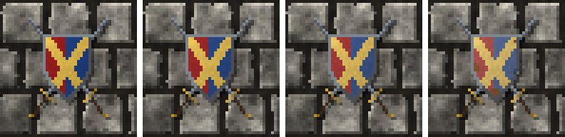

<!-- generated by "npm run docs" from the template schema: do not edit -->

# `shield`

Heraldic shield, maybe over two crossed swords, its paint fading with age. This template is an **overlay**: transparent by design, meant to be laid over another patch.


Category: [civilized](../catalog.md#civilized).

Own size: 24 × 32 pixels. Parameters marked **layout** are expressed at this size and scale with the patch; **detail** parameters are real pixels and never scale. See [Layout and detail](../concepts.md#layout-and-detail).

## Parameters

### General

| Parameter | Type                            | Default    | Scale | Description                                                                                    |
| --------- | ------------------------------- | ---------- | ----- | ---------------------------------------------------------------------------------------------- |
| `size`    | [width, height] of integers > 0 | `[24, 32]` | —     | own size of the shield, swords included                                                        |
| `shape`   | string                          | `"heater"` | —     | heater: a flat top, sides curving to a point; round: a disc; kite: a rounded top, a long point |
| `boss`    | boolean                         | `false`    | —     | a round metal boss in the middle of the shield                                                 |
| `swords`  | boolean                         | `false`    | —     | two swords crossed behind the shield, points up                                                |
| `age`     | number in [0, 1]                | `0.3`      | —     | overall weathering, from 0 (new) to 1 (ruined): sets every wear parameter left unset           |
| `fading`  | number in [0, 1]                | from `age` | —     | paint faded by light, in [0, 1]                                                                |
| `flaking` | number in [0, 1]                | from `age` | —     | paint flaked off, showing the wood, in [0, 1]                                                  |

### `field`

The painted field.

| Parameter         | Type                          | Default                  | Scale | Description                                                                                                                                     |
| ----------------- | ----------------------------- | ------------------------ | ----- | ----------------------------------------------------------------------------------------------------------------------------------------------- |
| `field.division`  | string                        | `"none"`                 | —     | how the field is split between its two tinctures: pale, left and right halves; fess, top and bottom; bend, along a diagonal; quarterly, in four |
| `field.tinctures` | [width, height] of CSS colors | `["#8c1c1c", "#1e3c7a"]` | —     | the two colors of the field; a plain field uses the first one                                                                                   |

### `charge`

The ordinary painted over the field.

| Parameter         | Type             | Default     | Scale | Description                                                            |
| ----------------- | ---------------- | ----------- | ----- | ---------------------------------------------------------------------- |
| `charge.ordinary` | string           | `"cross"`   | —     | a band painted over the field: a cross, a diagonal cross, a chevron... |
| `charge.color`    | CSS color        | `"#d6b04a"` | —     | color of the ordinary                                                  |
| `charge.width`    | number in [0, 1] | `0.2`       | —     | width of the ordinary, as a share of the shield width                  |

### `rim`

Metal rim around the shield.

| Parameter     | Type                            | Default                                        | Scale  | Description                                      |
| ------------- | ------------------------------- | ---------------------------------------------- | ------ | ------------------------------------------------ |
| `rim.width`   | integer ≥ 0                     | `1`                                            | detail | width of the metal rim, in pixels; 0 for none    |
| `rim.palette` | array of CSS colors, at least 2 | `["#2b2f33", "#474d53", "#687077", "#8f979e"]` | —      | metal colors of the rim, the boss and the blades |

### `shadow`

Shadow of the shield on the wall, the light coming from the top-left.

| Parameter        | Type             | Default | Scale  | Description                                                                                               |
| ---------------- | ---------------- | ------- | ------ | --------------------------------------------------------------------------------------------------------- |
| `shadow.offset`  | number ≥ 0       | `1`     | layout | shadow cast on the wall, to the bottom-right, in pixels at own size: it scales with the patch; 0 for none |
| `shadow.opacity` | number in [0, 1] | `0.45`  | —      | darkness of the shadow, in [0, 1]                                                                         |

### `dents`

Dents, shaded against the light.

| Parameter       | Type                      | Default    | Scale  | Description                       |
| --------------- | ------------------------- | ---------- | ------ | --------------------------------- |
| `dents.density` | number ≥ 0                | from `age` | —      | dents per 32 × 32 pixels          |
| `dents.size`    | [min, max] of numbers ≥ 0 | from `age` | detail | [min, max] dent radius, in pixels |

## Anchors

| Anchor   | Points                                                |
| -------- | ----------------------------------------------------- |
| `center` | center of the shield, where its boss or its charge is |

## Usage

`shield` is an overlay: a heraldic shield hung on a wall, the whole patch being the
shield, the swords crossed behind it if any, and its shadow.

```json
{
  "size": [48, 48],
  "patches": [
    { "patch": { "template": "ashlar", "size": [48, 48], "rows": { "count": 3 } } },
    {
      "patch": {
        "template": "shield",
        "size": [32, 40],
        "swords": true,
        "field": { "division": "pale" },
        "charge": { "ordinary": "saltire" }
      },
      "x": 16.7,
      "y": 8.3,
      "width": 66.7,
      "height": 83.3
    }
  ]
}
```

- `shape`: `heater`, a flat top and sides curving to a point; `round`, a disc, whatever
  the box; `kite`, a rounded top over a long point.
- `field.division` splits the field between its two `tinctures`: `pale` (left and
  right), `fess` (top and bottom), `bend` (along a diagonal) or `quarterly`.
  `charge.ordinary` paints a band over it in `charge.color`: `cross`, `saltire`,
  `chevron`, `bend`, `fess` or `pale`.
- A metal rim runs around it, `boss` adds a round boss in its middle, and `swords`
  crosses two swords behind it, points up: the shield then shrinks to leave them room.
- As it ages, its paint fades and flakes off down to the wood, and it gets dented.

## Aging

`age`, from 0 (new) to 1 (ruined), sets every wear parameter left unset. Values in
between are interpolated linearly between age 0, 0.3 (the default) and 1. Parameters set
explicitly always win: `{ "age": 0.8, "stains": { "ratio": 0 } }` is a ruined wall
without streaks. See [Aging](../concepts.md#aging).



With its default parameters, `shield` derives:

| Parameter       | age 0    | age 0.3 | age 0.6      | age 1    |
| --------------- | -------- | ------- | ------------ | -------- |
| `fading`        | 0        | 0.1     | 0.27         | 0.5      |
| `flaking`       | 0        | 0.08    | 0.26         | 0.5      |
| `dents.density` | 0        | 1       | 2.71         | 5        |
| `dents.size`    | [1, 1.5] | [1, 2]  | [1.21, 2.43] | [1.5, 3] |

## Example

```json
{
  "$schema": "../../schemas/patch.schema.json",
  "template": "shield",
  "size": [24, 32]
}
```
