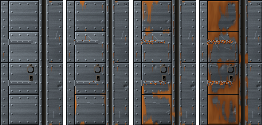

<!-- generated by "npm run docs" from the template schema: do not edit -->

# `slot`

Door slot: a dark recess between metal strips, where a sliding door disappears. This template is an **overlay**: transparent by design, meant to be laid over another patch.


Category: [architecture](../catalog.md#architecture).

Own size: 10 × 64 pixels. Parameters marked **layout** are expressed at this size and scale with the patch; **detail** parameters are real pixels and never scale. See [Layout and detail](../concepts.md#layout-and-detail).

## Parameters

### General

| Parameter   | Type                            | Default      | Scale | Description                                                                                        |
| ----------- | ------------------------------- | ------------ | ----- | -------------------------------------------------------------------------------------------------- |
| `size`      | [width, height] of integers > 0 | `[10, 64]`   | —     | own size of the slot: [width, length] for a vertical slot, [length, width] for a horizontal one    |
| `direction` | string                          | `"vertical"` | —     | vertical, for doors sliding sideways into the wall; horizontal, for doors lifting into the ceiling |
| `age`       | number in [0, 1]                | `0.3`        | —     | overall weathering, from 0 (new) to 1 (ruined): sets every wear parameter left unset               |
| `tarnish`   | number in [0, 1]                | from `age`   | —     | dulled, darkened metal, in [0, 1]                                                                  |

### `strips`

Metal strips lining both sides of the slot, lit from the top-left.

| Parameter        | Type                            | Default                                        | Scale  | Description                                                                                      |
| ---------------- | ------------------------------- | ---------------------------------------------- | ------ | ------------------------------------------------------------------------------------------------ |
| `strips.width`   | integer ≥ 1                     | `3`                                            | detail | width of each metal strip, in pixels: the gap takes the rest                                     |
| `strips.palette` | array of CSS colors, at least 2 | `["#2b2f33", "#474d53", "#687077", "#8f979e"]` | —      | metal colors, from darkest to lightest                                                           |
| `strips.brushed` | number in [0, 1]                | `0.12`                                         | —      | streaks along the strips, in [0, 1]                                                              |
| `strips.rivets`  | integer ≥ 0                     | `8`                                            | detail | distance between rivets along each strip, in pixels, adjusted so that the slot tiles; 0 for none |

### `inside`

The dark inside of the slot, where the door disappears.

| Parameter      | Type             | Default     | Scale | Description                                                           |
| -------------- | ---------------- | ----------- | ----- | --------------------------------------------------------------------- |
| `inside.color` | CSS color        | `"#15130f"` | —     | color of the inside of the slot                                       |
| `inside.light` | number in [0, 1] | `0.35`      | —     | light caught by the far side of the slot, facing the light, in [0, 1] |

### `rust`

Rust.

| Parameter       | Type                            | Default                                        | Scale  | Description                                      |
| --------------- | ------------------------------- | ---------------------------------------------- | ------ | ------------------------------------------------ |
| `rust.coverage` | number in [0, 1]                | from `age`                                     | —      | share of the strips rusted                       |
| `rust.palette`  | array of CSS colors, at least 2 | `["#3a1c0c", "#6b3314", "#9a4e1e", "#bf6e2e"]` | —      | rust colors, from darkest to lightest            |
| `rust.streaks`  | number in [0, 1]                | from `age`                                     | —      | ratio of rivets with a rust streak running down  |
| `rust.length`   | [min, max] of numbers ≥ 0       | from `age`                                     | detail | [min, max] length of the rust streaks, in pixels |

## Anchors

| Anchor   | Points                                         |
| -------- | ---------------------------------------------- |
| `gap`    | top-left corner of the gap, between the strips |
| `center` | center of the slot                             |

## Usage

`slot` is an overlay: the recess a sliding door disappears into as it opens, a dark gap
running from end to end between two riveted metal strips. The whole patch is the slot:
its width gives the width of the gap, the strips keeping theirs. Place it beside a
doorway, or on both sides of a double door:

```json
{
  "size": [64, 128],
  "patches": [
    { "patch": { "template": "metal", "size": [64, 128] } },
    { "patch": { "template": "door", "material": "metal" }, "x": 12.5, "width": 50, "height": 100 },
    { "patch": { "template": "slot", "size": [10, 128] }, "x": 62.5, "width": 15.6, "height": 100 }
  ]
}
```

- `direction`: `vertical` for doors sliding sideways into the wall, `horizontal` for
  doors lifting into the ceiling; a horizontal slot is a vertical one transposed, its
  lighting kept top-left: give it a `[length, width]` size.
- The light comes from the top-left: the inner edge of the left strip is in shadow, and
  the far side of the gap catches some light (`inside.light`), so that the slot looks deep.
- Rivets run along each strip every `strips.rivets` pixels, adjusted so that the slot
  tiles along its length: it can run across the whole height of a texture.
- As it ages, the strips rust, streaks running down from the rivets, and tarnish.

## Aging

`age`, from 0 (new) to 1 (ruined), sets every wear parameter left unset. Values in
between are interpolated linearly between age 0, 0.3 (the default) and 1. Parameters set
explicitly always win: `{ "age": 0.8, "stains": { "ratio": 0 } }` is a ruined wall
without streaks. See [Aging](../concepts.md#aging).



With its default parameters, `slot` derives:

| Parameter       | age 0  | age 0.3 | age 0.6       | age 1   |
| --------------- | ------ | ------- | ------------- | ------- |
| `rust.coverage` | 0      | 0.08    | 0.26          | 0.5     |
| `rust.streaks`  | 0      | 0.2     | 0.37          | 0.6     |
| `rust.length`   | [2, 4] | [3, 8]  | [4.29, 12.29] | [6, 18] |
| `tarnish`       | 0      | 0.1     | 0.21          | 0.35    |

## Example

```json
{
  "$schema": "../../schemas/patch.schema.json",
  "template": "slot",
  "size": [10, 64]
}
```
