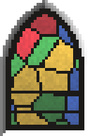

<!-- generated by "npm run docs" from the template schema: do not edit -->

# `stainedglass`

Stained glass window: pieces of colored glass held by lead, under an arch. This template is an **overlay**: transparent by design, meant to be laid over another patch.



Category: [civilized](../catalog.md#civilized).

Own size: 32 × 48 pixels. Parameters marked **layout** are expressed at this size and scale with the patch; **detail** parameters are real pixels and never scale. See [Layout and detail](../concepts.md#layout-and-detail).

## Parameters

### General

| Parameter | Type                            | Default    | Scale  | Description                                                                   |
| --------- | ------------------------------- | ---------- | ------ | ----------------------------------------------------------------------------- |
| `size`    | [width, height] of integers > 0 | `[32, 48]` | —      | own size of the patch in pixels; layout values are expressed at this size     |
| `depth`   | integer ≥ 0                     | `2`        | detail | width of the reveals around the window, the inner faces of the cut, in pixels |
| `frame`   | number ≥ 0                      | `2`        | detail | width of the lead frame along the outline, in pixels; 0 for none              |
| `bars`    | integer ≥ 0                     | `2`        | —      | horizontal iron bars across the window, below its arch                        |

### `reveals`

Inner faces of the cut: the wall below, shaded; from -1 (black) to 1 (white), the light coming from the top-left.

| Parameter         | Type              | Default | Scale | Description                                               |
| ----------------- | ----------------- | ------- | ----- | --------------------------------------------------------- |
| `reveals.top`     | number in [-1, 1] | `-0.6`  | —     | shading of the top reveal, in shadow                      |
| `reveals.left`    | number in [-1, 1] | `-0.45` | —     | shading of the left reveal, in shadow                     |
| `reveals.right`   | number in [-1, 1] | `0.2`   | —     | shading of the right reveal, lit                          |
| `reveals.bottom`  | number in [-1, 1] | `0.3`   | —     | shading of the bottom reveal (the sill), lit              |
| `reveals.falloff` | number in [0, 1]  | `0.2`   | —     | extra darkness of the reveals towards the back, in [0, 1] |

### `arch`

Arch closing the top of the window.

| Parameter    | Type             | Default     | Scale | Description                                                                                                                               |
| ------------ | ---------------- | ----------- | ----- | ----------------------------------------------------------------------------------------------------------------------------------------- |
| `arch.shape` | string           | `"pointed"` | —     | top of the window: flat, a rectangle; round, a semicircular or elliptical arch; pointed, a gothic arch of two arcs meeting at its apex    |
| `arch.rise`  | number in (0, 2] | —           | —     | height of the arch above its springing line, as a share of the width of the window; 0.5 for round arches, 0.8 for pointed ones by default |

### `cells`

Pieces of glass, laid as the cells of a Voronoi diagram.

| Parameter         | Type             | Default | Scale | Description                                                      |
| ----------------- | ---------------- | ------- | ----- | ---------------------------------------------------------------- |
| `cells.count`     | integer ≥ 1      | `16`    | —     | number of pieces of glass across the patch                       |
| `cells.variation` | number in [0, 1] | `0.3`   | —     | spread of the sizes of the pieces, in [0, 1]: 0 for pieces alike |

### `glass`

The colored glass.

| Parameter      | Type                            | Default                                        | Scale  | Description                                                     |
| -------------- | ------------------------------- | ---------------------------------------------- | ------ | --------------------------------------------------------------- |
| `glass.colors` | array of CSS colors, at least 2 | `["#b3202a", "#e0b030", "#2a4fb0", "#2f8a3a"]` | —      | colors of the pieces, each piece of one of them drawn at random |
| `glass.alpha`  | number in [0, 1]                | `0.85`                                         | —      | alpha of the glass, in [0, 1]: lower lets more of the back show |
| `glass.shade`  | number in [0, 1]                | `0.25`                                         | —      | random brightness variation between pieces, in [0, 1]           |
| `glass.light`  | number in [0, 1]                | `0.3`                                          | —      | light coming through the top of the window, in [0, 1]           |
| `glass.grain`  | number in [0, 1]                | `0.08`                                         | detail | random brightness variation between pixels, in [0, 1]           |

### `lead`

The lead holding the pieces.

| Parameter    | Type       | Default     | Scale  | Description                                                 |
| ------------ | ---------- | ----------- | ------ | ----------------------------------------------------------- |
| `lead.width` | number ≥ 0 | `1`         | detail | width of the lead between the pieces, in pixels; 0 for none |
| `lead.color` | CSS color  | `"#1c1a18"` | —      | color of the lead                                           |

## Usage

`stainedglass` is an overlay: a window of colored glass, transparent outside its arch.
Pieces of glass laid as the cells of a Voronoi diagram, each of a color of
`glass.colors`, are held by lead, inside a lead frame following the outline, crossed by
horizontal iron bars, set in shaded reveals. The window cuts its own hole: lay it on any
wall, and its translucent glass shows what lies behind the wall, not the stones:

```json
{
  "size": [64, 128],
  "patches": [
    { "patch": { "template": "ashlar" }, "width": 100, "height": 100 },
    {
      "patch": { "template": "stainedglass", "size": [36, 88] },
      "x": 21.875,
      "y": 12.5,
      "width": 56.25,
      "height": 68.75,
      "wrap": false
    }
  ]
}
```

- The patch is the whole window, its reveals included: `depth` pixels of the wall
  around the glass, shaded as by [`opening`](opening.md), 0 for glass flush with the wall.
- `arch.shape` is pointed by default, round or flat.
- `glass.alpha` sets how much of what lies behind shows through the glass;
  `cells.count` sets how many pieces, `bars` how many iron bars. See
  [`examples/stainedglass-variants`](../../examples/stainedglass-variants).

## Example

```json
{
  "$schema": "../../schemas/patch.schema.json",
  "template": "stainedglass",
  "size": [32, 48]
}
```
