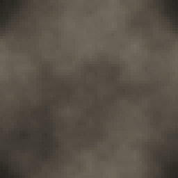

<!-- generated by "npm run docs" from the template schema: do not edit -->

# `stone`

Mottled rock surface made of Perlin noise.



Own size: 64 × 64 pixels. Parameters marked **layout** are expressed at this size and scale with the patch; **detail** parameters are real pixels and never scale. See [Layout and detail](../concepts.md#layout-and-detail).

## Parameters

### General

| Parameter | Type                            | Default                                        | Scale | Description                           |
| --------- | ------------------------------- | ---------------------------------------------- | ----- | ------------------------------------- |
| `size`    | [width, height] of integers > 0 | `[64, 64]`                                     | —     | own size of the patch, in pixels      |
| `colors`  | array of CSS colors, at least 2 | `["#1c1a17", "#4a443b", "#7a7064", "#a39888"]` | —     | rock colors, from darkest to lightest |

## Example

```json
{
  "$schema": "../../schemas/patch.schema.json",
  "template": "stone",
  "size": [64, 64]
}
```
