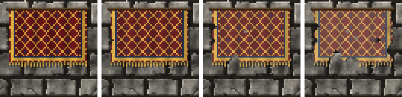

<!-- generated by "npm run docs" from the template schema: do not edit -->

# `tapestry`

Woven tapestry hanging from a rod: a patterned field, a border and a fringe. This template is an **overlay**: transparent by design, meant to be laid over another patch.


Category: [civilized](../catalog.md#civilized).

Own size: 64 × 40 pixels. Parameters marked **layout** are expressed at this size and scale with the patch; **detail** parameters are real pixels and never scale. See [Layout and detail](../concepts.md#layout-and-detail).

## Parameters

### General

| Parameter | Type                            | Default    | Scale  | Description                                                                       |
| --------- | ------------------------------- | ---------- | ------ | --------------------------------------------------------------------------------- |
| `size`    | [width, height] of integers > 0 | `[64, 40]` | —      | own size of the tapestry, its rod and its shadow included                         |
| `fringe`  | integer ≥ 0                     | `3`        | detail | length of the fringe hanging from a flat lower end, in pixels; 0 for none         |
| `age`     | number in [0, 1]                | `0.3`      | —      | overall aging, from 0 (new) to 1 (tattered): sets every wear parameter left unset |
| `fading`  | number in [0, 1]                | from `age` | —      | colors faded by light, in [0, 1]                                                  |
| `stains`  | number in [0, 1]                | from `age` | —      | coverage of the stains, in [0, 1]                                                 |
| `holes`   | number ≥ 0                      | from `age` | —      | moth holes per 32 × 32 pixels                                                     |

### `shape`

Shape of the banner.

| Parameter     | Type             | Default  | Scale  | Description                                                                                                      |
| ------------- | ---------------- | -------- | ------ | ---------------------------------------------------------------------------------------------------------------- |
| `shape.base`  | string           | `"flat"` | —      | lower end: flat; point, a triangle; swallowtail, forked like an oriflamme; tails, several points like a gonfalon |
| `shape.depth` | number in [0, 1] | `0.2`    | layout | height of the shaped lower end, in fraction of the tapestry height                                               |
| `shape.tails` | integer ≥ 1      | `3`      | —      | number of points of the tails base                                                                               |

### `fabric`

The fabric.

| Parameter      | Type             | Default     | Scale  | Description                                           |
| -------------- | ---------------- | ----------- | ------ | ----------------------------------------------------- |
| `fabric.color` | CSS color        | `"#5e1418"` | —      | color of the fabric                                   |
| `fabric.weave` | number in [0, 1] | `0.06`      | detail | random brightness variation between pixels, the weave |

### `border`

Stripes bordering the tapestry.

| Parameter        | Type            | Default                                                            | Scale  | Description                                                      |
| ---------------- | --------------- | ------------------------------------------------------------------ | ------ | ---------------------------------------------------------------- |
| `border.inset`   | integer ≥ 0     | `1`                                                                | detail | distance of the first stripe from the edge, in pixels            |
| `border.stripes` | array of object | `[{"color":"#c99a3a", "width":2}, {"color":"#1c2a4a", "width":1}]` | —      | stripes along the sides and the lower end, from the edge inwards |

### `pattern`

Pattern woven into the field, inside the border.

| Parameter        | Type                          | Default                  | Scale  | Description                                                                                                                                                 |
| ---------------- | ----------------------------- | ------------------------ | ------ | ----------------------------------------------------------------------------------------------------------------------------------------------------------- |
| `pattern.kind`   | string                        | `"lozenge"`              | —      | woven into the field: none; lozenge, a lattice of diamonds; checky, a checkerboard; semy, small crosses strewn on a staggered grid; stripes, vertical bands |
| `pattern.colors` | [width, height] of CSS colors | `["#c99a3a", "#1c2a4a"]` | —      | colors of the pattern: its lines, squares or motifs, and their dots                                                                                         |
| `pattern.period` | number > 0                    | `8`                      | layout | size of one repeat of the pattern, in pixels at own size                                                                                                    |

### `folds`

Soft vertical folds of the hanging fabric.

| Parameter     | Type             | Default | Scale  | Description                                  |
| ------------- | ---------------- | ------- | ------ | -------------------------------------------- |
| `folds.count` | number ≥ 0       | `5`     | layout | number of vertical folds across the tapestry |
| `folds.depth` | number in [0, 1] | `0.25`  | —      | shading of the folds, in [0, 1]              |

### `rod`

Rod the tapestry hangs from.

| Parameter      | Type        | Default     | Scale  | Description                                                 |
| -------------- | ----------- | ----------- | ------ | ----------------------------------------------------------- |
| `rod.enabled`  | boolean     | `true`      | —      | a rod across the top                                        |
| `rod.size`     | integer ≥ 1 | `2`         | detail | rod thickness, in pixels                                    |
| `rod.overhang` | integer ≥ 0 | `2`         | detail | length of the rod beyond each side of the fabric, in pixels |
| `rod.color`    | CSS color   | `"#4a3320"` | —      | rod color                                                   |

### `shadow`

Shadow of the tapestry on the wall, the light coming from the top-left.

| Parameter        | Type             | Default | Scale  | Description                                             |
| ---------------- | ---------------- | ------- | ------ | ------------------------------------------------------- |
| `shadow.offset`  | integer ≥ 0      | `1`     | detail | shadow cast on the wall, to the bottom-right, in pixels |
| `shadow.opacity` | number in [0, 1] | `0.4`   | —      | darkness of the shadow, in [0, 1]                       |

### `rips`

Torn edges.

| Parameter        | Type                      | Default    | Scale  | Description                                           |
| ---------------- | ------------------------- | ---------- | ------ | ----------------------------------------------------- |
| `rips.count`     | integer ≥ 0               | from `age` | —      | number of notches torn into the edges                 |
| `rips.depth`     | [min, max] of numbers ≥ 0 | from `age` | detail | [min, max] depth of the notches, in pixels            |
| `rips.roughness` | number ≥ 0                | from `age` | detail | maximum displacement of the frayed outline, in pixels |

## Anchors

| Anchor   | Points                                                              |
| -------- | ------------------------------------------------------------------- |
| `field`  | top-left corner of the field, inside the border, below the rod      |
| `emblem` | center of the field, above the shaped lower end: room for an emblem |

## Usage

`tapestry` is a [`banner`](banner.md) with the defaults of a tapestry: wide, flat,
patterned and fringed. Every banner parameter applies, and it ages the same way.

```json
{
  "size": [64, 64],
  "patches": [
    { "patch": { "template": "ashlar" }, "width": 100, "height": 100 },
    { "patch": { "template": "tapestry" }, "x": 6, "y": 8, "width": 88, "height": 62.5 }
  ]
}
```

- `pattern.kind` weaves the field: `lozenge`, a lattice of diamonds dotted in their
  middle; `checky`, a checkerboard; `semy`, small crosses strewn on a staggered grid;
  `stripes`, vertical bands; `none`. `pattern.colors` are its two colors, and
  `pattern.period` the size of one repeat, which scales with the tapestry.
- `fringe` threads hang every other pixel from the flat lower end, where the fabric above
  is whole; `border.stripes` frame the field, the first one giving the fringe its color.

## Aging

`age`, from 0 (new) to 1 (ruined), sets every wear parameter left unset. Values in
between are interpolated linearly between age 0, 0.3 (the default) and 1. Parameters set
explicitly always win: `{ "age": 0.8, "stains": { "ratio": 0 } }` is a ruined wall
without streaks. See [Aging](../concepts.md#aging).



With its default parameters, `tapestry` derives:

| Parameter        | age 0  | age 0.3 | age 0.6      | age 1  |
| ---------------- | ------ | ------- | ------------ | ------ |
| `fading`         | 0      | 0.1     | 0.27         | 0.5    |
| `stains`         | 0      | 0.1     | 0.23         | 0.4    |
| `rips.count`     | 0      | 1       | 3            | 6      |
| `rips.depth`     | [1, 2] | [2, 4]  | [2.43, 5.71] | [3, 8] |
| `rips.roughness` | 0.1    | 0.4     | 0.74         | 1.2    |
| `holes`          | 0      | 0       | 1.29         | 3      |

## Example

```json
{
  "$schema": "../../schemas/patch.schema.json",
  "template": "tapestry",
  "size": [64, 40]
}
```
