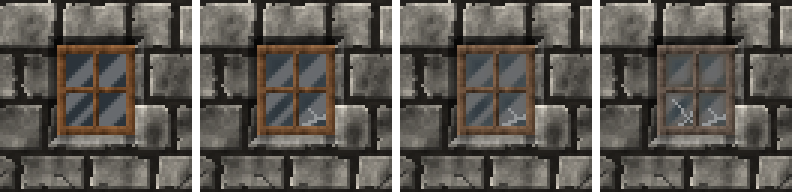

<!-- generated by "npm run docs" from the template schema: do not edit -->

# `window`

Glazed window: a wooden or metal frame around translucent panes of glass. This template is an **overlay**: transparent by design, meant to be laid over another patch.


Category: [civilized](../catalog.md#civilized).

Own size: 32 × 40 pixels. Parameters marked **layout** are expressed at this size and scale with the patch; **detail** parameters are real pixels and never scale. See [Layout and detail](../concepts.md#layout-and-detail).

## Parameters

### General

| Parameter    | Type                            | Default    | Scale | Description                                                                          |
| ------------ | ------------------------------- | ---------- | ----- | ------------------------------------------------------------------------------------ |
| `size`       | [width, height] of integers > 0 | `[32, 40]` | —     | own size of the window, frame included                                               |
| `age`        | number in [0, 1]                | `0.3`      | —     | overall weathering, from 0 (new) to 1 (ruined): sets every wear parameter left unset |
| `weathering` | number in [0, 1]                | from `age` | —     | wooden frame turned silver-grey by the weather, in [0, 1]                            |
| `tarnish`    | number in [0, 1]                | from `age` | —     | dulled, darkened metal, in [0, 1]                                                    |
| `dirt`       | number in [0, 1]                | from `age` | —     | grime on the glass, in [0, 1]: more opaque and brownish, heavier towards the corners |
| `cracked`    | number in [0, 1]                | from `age` | —     | ratio of cracked panes, in [0, 1]                                                    |
| `broken`     | number in [0, 1]                | from `age` | —     | ratio of broken panes, their glass gone but for shards along the frame, in [0, 1]    |

### `panes`

Glass panes, separated by the bars of the frame.

| Parameter       | Type        | Default | Scale  | Description             |
| --------------- | ----------- | ------- | ------ | ----------------------- |
| `panes.columns` | integer ≥ 1 | `2`     | layout | panes across the window |
| `panes.rows`    | integer ≥ 1 | `2`     | layout | panes down the window   |

### `frame`

Frame around and between the panes, its edges lit from the top-left.

| Parameter        | Type                            | Default                                        | Scale  | Description                                           |
| ---------------- | ------------------------------- | ---------------------------------------------- | ------ | ----------------------------------------------------- |
| `frame.material` | string                          | `"wood"`                                       | —      | material of the frame                                 |
| `frame.width`    | integer ≥ 1                     | `3`                                            | detail | width of the outer frame, in pixels                   |
| `frame.bars`     | integer ≥ 1                     | `2`                                            | detail | width of the bars between the panes, in pixels        |
| `frame.wood`     | array of CSS colors, at least 2 | `["#3a2412", "#5e3b1f", "#7d5230", "#9c6b40"]` | —      | wood colors, from darkest to lightest                 |
| `frame.metal`    | array of CSS colors, at least 2 | `["#2b2f33", "#474d53", "#687077", "#8f979e"]` | —      | metal colors, from darkest to lightest                |
| `frame.grain`    | number in [0, 1]                | `0.06`                                         | detail | random brightness variation between pixels, in [0, 1] |

### `glass`

Glass of the panes, translucent.

| Parameter             | Type                | Default     | Scale  | Description                                                              |
| --------------------- | ------------------- | ----------- | ------ | ------------------------------------------------------------------------ |
| `glass.color`         | CSS color           | `"#a8c4d0"` | —      | color of the glass                                                       |
| `glass.alpha`         | number in [0, 1]    | `0.15`      | —      | alpha of the glass, in [0, 1]                                            |
| `glass.streaks.count` | integer ≥ 0         | `2`         | —      | bright streaks across each pane                                          |
| `glass.streaks.color` | CSS color           | `"#ffffff"` | —      | color of the streaks                                                     |
| `glass.streaks.alpha` | number in [0, 1]    | `0.35`      | —      | alpha of the streaks, in [0, 1]                                          |
| `glass.streaks.width` | number ≥ 0          | `3`         | detail | width of the widest streak, in pixels                                    |
| `glass.streaks.blur`  | number ≥ 0          | `1.5`       | detail | softness of their edges, in pixels                                       |
| `glass.streaks.angle` | number in [-90, 90] | `45`        | —      | angle of the streaks from the vertical, in degrees: positive leans right |

### `shadow`

Shadow of the frame on the back of the opening, the light coming from the top-left; none by default.

| Parameter        | Type             | Default | Scale  | Description                                             |
| ---------------- | ---------------- | ------- | ------ | ------------------------------------------------------- |
| `shadow.offset`  | integer ≥ 0      | `0`     | detail | shadow cast on the wall, to the bottom-right, in pixels |
| `shadow.opacity` | number in [0, 1] | `0.45`  | —      | darkness of the shadow, in [0, 1]                       |

### `rust`

Rust.

| Parameter       | Type                            | Default                                        | Scale  | Description                                              |
| --------------- | ------------------------------- | ---------------------------------------------- | ------ | -------------------------------------------------------- |
| `rust.coverage` | number in [0, 1]                | from `age`                                     | —      | share of a metal frame rusted, spreading from its joints |
| `rust.palette`  | array of CSS colors, at least 2 | `["#3a1c0c", "#6b3314", "#9a4e1e", "#bf6e2e"]` | —      | rust colors, from darkest to lightest                    |
| `rust.streaks`  | number in [0, 1]                | from `age`                                     | —      | ratio of rivets with a rust streak running down          |
| `rust.length`   | [min, max] of numbers ≥ 0       | from `age`                                     | detail | [min, max] length of the rust streaks, in pixels         |

## Anchors

| Anchor    | Points                                                                                 |
| --------- | -------------------------------------------------------------------------------------- |
| `panes`   | top-left corner of each pane, row by row                                               |
| `corners` | corners of each pane, as corner points: top-left, top-right, bottom-left, bottom-right |
| `center`  | center of the window                                                                   |

## Usage

`window` is an overlay: a glazed window, the whole patch being the window and its frame.
Lay it over an [`opening`](opening.md), anchored on the back of the opening, like
[`bars`](bars.md):

```json
{
  "size": [64, 64],
  "patches": [
    { "patch": { "template": "ashlar" }, "width": 100, "height": 100 },
    {
      "id": "hole",
      "patch": { "template": "opening", "depth": 3 },
      "x": 25,
      "y": 18.75,
      "width": 50,
      "height": 56.25
    },
    {
      "patch": { "template": "window", "size": [26, 30] },
      "anchor": { "to": "hole", "at": "opening" },
      "width": 40.6,
      "height": 46.9
    }
  ]
}
```

- The frame, `frame.width` pixels around the window and `frame.bars` between the panes,
  is `wood` or `metal`: its stiles run the whole height, its rails and transoms cross
  between them, the grain following each member, and its edges are lit from the top-left.
  `panes.columns` × `panes.rows` panes fill it, 2 × 2 by default.
- The glass is translucent: `glass.alpha`, 15% by default, crossed by
  `glass.streaks.count` bright reflections per pane, blurred diagonal streaks at 35%.
  Over a cut-out opening, whose back is transparent, the glass stays translucent pixels in
  the texture, showing what the engine draws behind it; the images of this page use an
  opening with a dark back instead, so that the glass shows.
- As it ages, a wooden frame weathers silver-grey and a metal one rusts, streaks running
  down from the joints; the glass gets dirty, more opaque and brownish towards the corners
  of the panes; panes crack (`cracked`), or break (`broken`): their glass is gone but
  for jagged shards along the frame.
- `panes` anchors the top-left corner of each pane, `corners` the corners of each pane,
  as corner points: a [`cobweb`](cobweb.md) anchored on them with `mirror` grows in the
  corners of the panes.

## Aging

`age`, from 0 (new) to 1 (ruined), sets every wear parameter left unset. Values in
between are interpolated linearly between age 0, 0.3 (the default) and 1. Parameters set
explicitly always win: `{ "age": 0.8, "stains": { "ratio": 0 } }` is a ruined wall
without streaks. See [Aging](../concepts.md#aging).



With its default parameters, `window` derives:

| Parameter       | age 0  | age 0.3 | age 0.6       | age 1   |
| --------------- | ------ | ------- | ------------- | ------- |
| `weathering`    | 0      | 0.1     | 0.31          | 0.6     |
| `dirt`          | 0      | 0.15    | 0.39          | 0.7     |
| `cracked`       | 0      | 0.1     | 0.23          | 0.4     |
| `broken`        | 0      | 0.03    | 0.17          | 0.35    |
| `rust.coverage` | 0      | 0.05    | 0.24          | 0.5     |
| `rust.streaks`  | 0      | 0.2     | 0.37          | 0.6     |
| `rust.length`   | [2, 4] | [3, 8]  | [4.29, 12.29] | [6, 18] |
| `tarnish`       | 0      | 0.1     | 0.21          | 0.35    |

## Example

```json
{
  "$schema": "../../schemas/patch.schema.json",
  "template": "window",
  "size": [32, 40]
}
```
