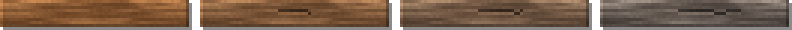

<!-- generated by "npm run docs" from the template schema: do not edit -->

# `woodbeam`

Wooden support beam, horizontal or vertical: a sawn timber or a round log. This template is an **overlay**: transparent by design, meant to be laid over another patch.


Category: [architecture](../catalog.md#architecture).

Own size: 64 × 10 pixels. Parameters marked **layout** are expressed at this size and scale with the patch; **detail** parameters are real pixels and never scale. See [Layout and detail](../concepts.md#layout-and-detail).

## Parameters

### General

| Parameter    | Type                            | Default        | Scale | Description                                                                                                                  |
| ------------ | ------------------------------- | -------------- | ----- | ---------------------------------------------------------------------------------------------------------------------------- |
| `size`       | [width, height] of integers > 0 | `[64, 10]`     | —     | own size of the beam, its shadow included: [length, thickness] for a horizontal beam, [thickness, length] for a vertical one |
| `direction`  | string                          | `"horizontal"` | —     | direction of the beam                                                                                                        |
| `profile`    | string                          | `"squared"`    | —     | squared: a sawn timber, flat with bevelled edges; log: a round log, shaded across its thickness                              |
| `age`        | number in [0, 1]                | `0.3`          | —     | overall weathering, from 0 (new) to 1 (ruined): sets every wear parameter left unset                                         |
| `weathering` | number in [0, 1]                | from `age`     | —     | wood turned silver-grey by the weather, in [0, 1]                                                                            |
| `grime`      | number in [0, 1]                | from `age`     | —     | blotchy darkening of the whole wall, in [0, 1]                                                                               |

### `bevel`

Edges of a squared beam lit from the top-left; a log has none.

| Parameter     | Type        | Default | Scale  | Description                                     |
| ------------- | ----------- | ------- | ------ | ----------------------------------------------- |
| `bevel.size`  | integer ≥ 0 | `1`     | detail | bevel width, in pixels                          |
| `bevel.light` | number ≥ 0  | `1.2`   | —      | brightness factor of the top and left edges     |
| `bevel.dark`  | number ≥ 0  | `0.7`   | —      | brightness factor of the bottom and right edges |

### `wood`

Wood surface.

| Parameter             | Type                            | Default                                        | Scale  | Description                                             |
| --------------------- | ------------------------------- | ---------------------------------------------- | ------ | ------------------------------------------------------- |
| `wood.palette`        | array of CSS colors, at least 2 | `["#3a2412", "#5e3b1f", "#7d5230", "#9c6b40"]` | —      | wood colors, from darkest to lightest                   |
| `wood.contrast`       | number ≥ 0                      | `0.8`                                          | —      | spread of the grain over the palette                    |
| `wood.grain`          | number > 0                      | `5`                                            | —      | number of grain streaks across a plank                  |
| `wood.shadeVariation` | number in [0, 1]                | `0.12`                                         | —      | random brightness variation between planks, in [0, 1]   |
| `wood.paletteShift`   | number in [0, 1]                | `0.12`                                         | —      | random shift of each plank along the palette, in [0, 1] |
| `wood.noise`          | number in [0, 1]                | `0.05`                                         | detail | random brightness variation between pixels, in [0, 1]   |

### `knots`

Knots in the wood.

| Parameter     | Type                      | Default    | Scale  | Description                                                  |
| ------------- | ------------------------- | ---------- | ------ | ------------------------------------------------------------ |
| `knots.ratio` | number in [0, 1]          | `0.25`     | —      | ratio of planks with a knot, in [0, 1]                       |
| `knots.size`  | [min, max] of numbers ≥ 0 | `[1.5, 3]` | detail | [min, max] knot radius, in pixels; the grain bends around it |

### `shadow`

Shadow of the beam on the wall, the light coming from the top-left.

| Parameter        | Type             | Default | Scale  | Description                                             |
| ---------------- | ---------------- | ------- | ------ | ------------------------------------------------------- |
| `shadow.offset`  | integer ≥ 0      | `1`     | detail | shadow cast on the wall, to the bottom-right, in pixels |
| `shadow.opacity` | number in [0, 1] | `0.45`  | —      | darkness of the shadow, in [0, 1]                       |

### `splits`

Splits along the grain.

| Parameter       | Type                      | Default    | Scale  | Description                        |
| --------------- | ------------------------- | ---------- | ------ | ---------------------------------- |
| `splits.ratio`  | number in [0, 1]          | from `age` | —      | ratio of split planks, in [0, 1]   |
| `splits.length` | [min, max] of numbers ≥ 0 | from `age` | detail | [min, max] split length, in pixels |

## Anchors

| Anchor   | Points                      |
| -------- | --------------------------- |
| `start`  | top-left corner of the beam |
| `center` | center of the beam          |

## Usage

`woodbeam` is the wooden counterpart of the metal [`beam`](beam.md): an overlay, the whole
patch being the beam and its shadow, made of the wood of [`planks`](planks.md), a single
plank running its whole length. Posts and a cap frame the galleries of a mine, an alcove or
a door:

```json
{
  "size": [64, 128],
  "patches": [
    { "patch": { "template": "cavewall", "size": [64, 128] } },
    {
      "patch": { "template": "woodbeam", "direction": "vertical", "size": [10, 112] },
      "x": 6,
      "y": 10,
      "width": 15.625,
      "height": 87.5
    },
    {
      "patch": { "template": "woodbeam", "direction": "vertical", "size": [10, 112] },
      "x": 78.5,
      "y": 10,
      "width": 15.625,
      "height": 87.5
    },
    {
      "patch": { "template": "woodbeam", "size": [64, 11] },
      "x": 0,
      "y": 4,
      "width": 100,
      "height": 8.6
    }
  ]
}
```

- `direction`: a vertical beam is a horizontal one transposed, so that its lighting stays
  top-left; give it a `[thickness, length]` size.
- `profile`: `squared`, a sawn timber, its edges bevelled (`bevel`); `log`, a round
  log, lit above its middle and dark below.
- `wood` and `knots` are those of `planks`. As it ages, the wood turns silver-grey,
  splits along the grain and gets grimy, like planks; its outline stays straight. See
  [`examples/woodbeam-variants`](../../examples/woodbeam-variants).

## Aging

`age`, from 0 (new) to 1 (ruined), sets every wear parameter left unset. Values in
between are interpolated linearly between age 0, 0.3 (the default) and 1. Parameters set
explicitly always win: `{ "age": 0.8, "stains": { "ratio": 0 } }` is a ruined wall
without streaks. See [Aging](../concepts.md#aging).



With its default parameters, `woodbeam` derives:

| Parameter       | age 0  | age 0.3 | age 0.6       | age 1    |
| --------------- | ------ | ------- | ------------- | -------- |
| `weathering`    | 0      | 0.15    | 0.39          | 0.7      |
| `splits.ratio`  | 0      | 0.2     | 0.41          | 0.7      |
| `splits.length` | [4, 8] | [6, 16] | [8.57, 22.86] | [12, 32] |
| `grime`         | 0      | 0.1     | 0.23          | 0.4      |

## Example

```json
{
  "$schema": "../../schemas/patch.schema.json",
  "template": "woodbeam",
  "size": [64, 10]
}
```
